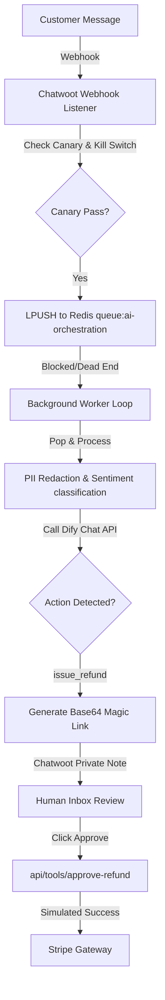
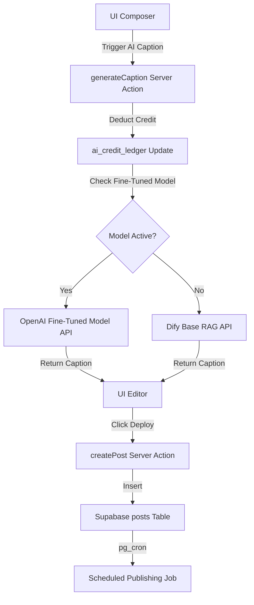
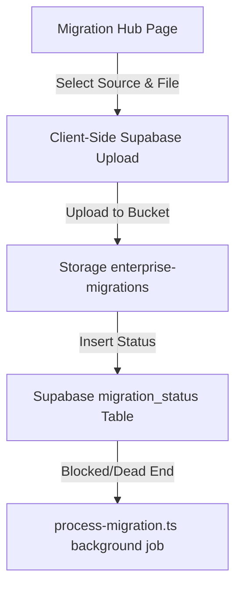

# Critical Business Flow Analysis

This document traces the three primary business workflows of the Nexus Social platform, mapping their components, execution paths, failure points, and integration readiness.

---

## Flow 1: AI-Driven Customer Service & HITL Refund Loop

This flow handles inbound customer queries, processes them via Dify RAG, and prompts humans for approval when financial transactions (refunds) are requested.

### Flow Breakdown & Blockers:
1.  **Ingestion (PASS):** Inbound webhooks are received by `/api/webhooks/chatwoot-ai/route.ts` and pushed to Redis.
2.  **Job Queueing (FAIL):** The message sits in the Redis queue indefinitely because there is **no queue listener active** on the background worker. The execution chain breaks here.
3.  **RAG & Intent Detection (FAIL):** Dify chat messages API is called with the global `DIFY_API_KEY`, completely ignoring multi-tenant workspace configurations and leaking RAG contexts.
4.  **HITL Refund Approval (FAIL):** The magic link token is created using plain base64 without any cryptographic signature, enabling URL spoofing. The refund execution itself is mocked.

---

## Flow 2: Social Media Post Creation & AI Caption Generation

This flow allows agency users to draft posts, generate brand-aligned captions using AI, and schedule them for publication.

### Flow Breakdown & Blockers:
1.  **AI Caption Generation (FAIL):** Deducts credits from `ai_credit_ledger` using a non-atomic read-then-write sequence, which is vulnerable to race conditions under concurrent clicks.
2.  **Fine-Tuning fallback (FAIL):** If the workspace attempts to trigger fine-tuning, the action `ai-finetune.ts` fails because it checks user session on `supabaseAdmin` (always null).
3.  **Post Creation (PASS):** `createPost` successfully writes to the Supabase database and inserts logs into the `audit_logs` table.
4.  **Publishing Scheduler (FAIL):** The `pg_cron` extension is scheduled in `phase1_setup.sql`. However, it queries the `posts` table using scheduled times. Because the database contains no core `workspaces` table, database initializations fail on standard environments, causing the cron setup to crash.

---

## Flow 3: Enterprise Data Migration Hub

This flow allows large enterprise clients to upload bulk historical data from legacy systems like Sprout Social or Hootsuite.

### Flow Breakdown & Blockers:
1.  **File Upload (FAIL):** The client application tries to upload the file to `enterprise-migrations`. Because this storage bucket is never created in any SQL setup schema, the frontend throws a `bucket not found` error.
2.  **Job Processing (FAIL):** If the file is successfully uploaded (manually created bucket), the database inserts a record into `migration_status`. However, the background job `process-migration.ts` (which parses the file in chunks and updates the tables) is dead code and never executed.
