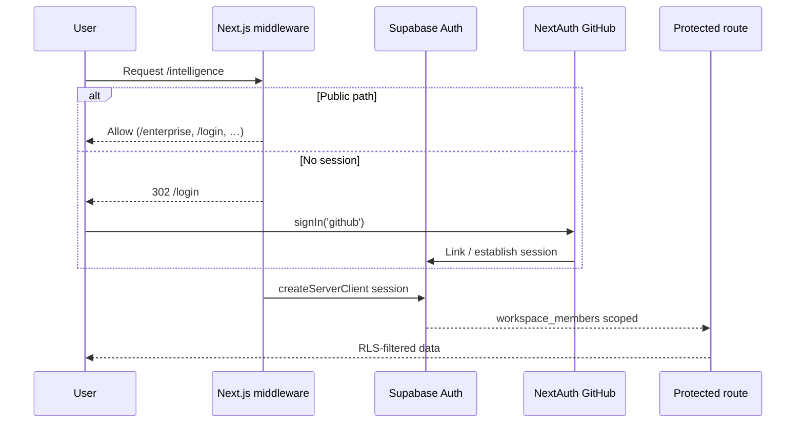
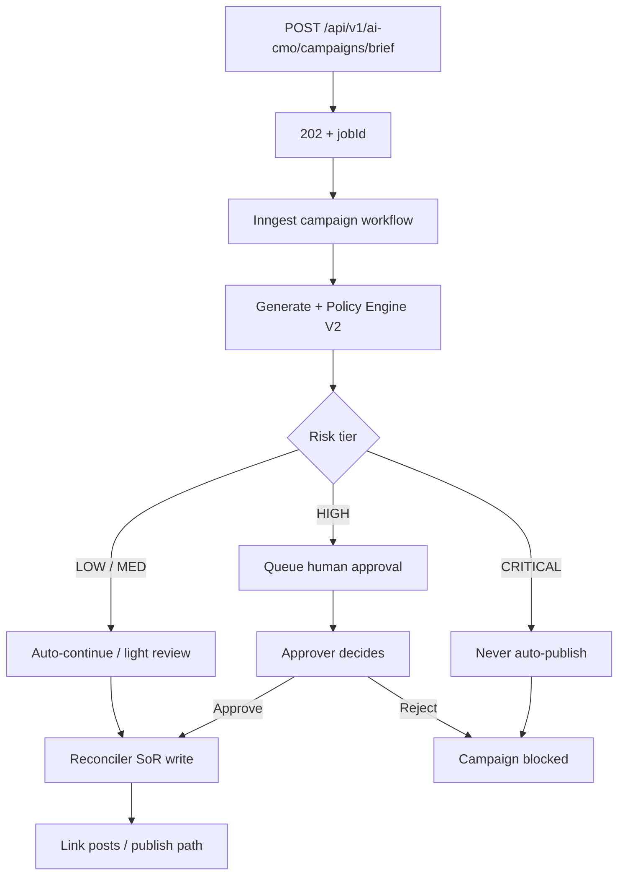
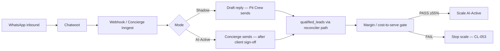
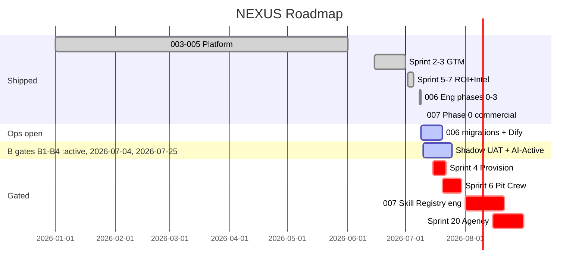

# NEXUS Platform — Product Requirements Document (PRD)

**Document ID:** NEXUS-PRD-001  
**Version:** 2.0.0  
**Status:** Living specification — reflects codebase as of 2026-07-10  
**HEAD:** `0eaa5d5` on `main`  
**Prod:** https://nexussocial.tech  
**Constitution:** v1.5.1  
**Authority:** [CONSTITUTION.md](../CONSTITUTION.md) + Speckit clarifications win on conflict; this PRD supersedes sprint prompts and PRD 1.0.1

> **Split-file index (navigation):** topic files under [`docs/prd/`](./prd/README.md)  
> **Status tracker:** [`docs/prd/PRD-STATUS.md`](./prd/PRD-STATUS.md)  
> **QA results:** [`docs/prd/QA-RESULTS.md`](./prd/QA-RESULTS.md)  
> **This file is authoritative** for product requirements as of v2.0.0 — split files are navigation aids and must not diverge without updating this document.

**Repository:** `waleedhewalla78-sudo/NEXUS` · branch `main` · commit `0eaa5d5`  
**Application root:** `nexus-social-app/`

---

## Split-file navigation index

| # | Topic | File |
|---|-------|------|
| — | **Index** | [prd/README.md](./prd/README.md) |
| — | **PRD Status** | [prd/PRD-STATUS.md](./prd/PRD-STATUS.md) |
| — | **QA Results** | [prd/QA-RESULTS.md](./prd/QA-RESULTS.md) |
| 1 | Product Vision & Scope | [prd/01-product-vision-scope.md](./prd/01-product-vision-scope.md) |
| 2 | Problem & Business Context | [prd/02-problem-business-context.md](./prd/02-problem-business-context.md) |
| 3 | Goals & Success Metrics | [prd/03-goals-success-metrics.md](./prd/03-goals-success-metrics.md) |
| 4 | User Personas & Workflows | [prd/04-user-personas-workflows.md](./prd/04-user-personas-workflows.md) |
| 5 | Use Cases | [prd/05-use-cases.md](./prd/05-use-cases.md) |
| 6 | Functional Requirements | [prd/06-functional-requirements.md](./prd/06-functional-requirements.md) |
| 7 | Feature Specifications | [prd/07-feature-specifications.md](./prd/07-feature-specifications.md) |
| 8 | Business Scenarios | [prd/08-business-scenarios.md](./prd/08-business-scenarios.md) |
| 9 | UI & Navigation | [prd/09-ui-navigation.md](./prd/09-ui-navigation.md) |
| 10 | Auth, Roles & Permissions | [prd/10-auth-roles-permissions.md](./prd/10-auth-roles-permissions.md) |
| 11 | Reports & Dashboards | [prd/11-reports-dashboards.md](./prd/11-reports-dashboards.md) |
| 12 | Integration Requirements | [prd/12-integration-requirements.md](./prd/12-integration-requirements.md) |
| 13 | Technical Architecture | [prd/13-technical-architecture.md](./prd/13-technical-architecture.md) |
| 14 | Competitive Context | [prd/14-competitive-context.md](./prd/14-competitive-context.md) |
| 15 | Data & Privacy | [prd/15-data-privacy.md](./prd/15-data-privacy.md) |
| 16 | Implementation Roadmap | [prd/16-implementation-roadmap.md](./prd/16-implementation-roadmap.md) |
| 17 | Risks & Mitigation | [prd/17-risks-mitigation.md](./prd/17-risks-mitigation.md) |
| 18 | Assumptions & Constraints | [prd/18-assumptions-constraints.md](./prd/18-assumptions-constraints.md) |
| 19 | Appendices | [prd/19-appendices.md](./prd/19-appendices.md) |

---

## Table of Contents

1. [Product Vision & Scope](#1-product-vision--scope)
2. [Problem Statement & Business Context](#2-problem-statement--business-context)
3. [Goals & Success Metrics](#3-goals--success-metrics)
4. [User Personas & Workflows](#4-user-personas--workflows)
5. [Use Cases](#5-use-cases)
6. [Functional Requirements](#6-functional-requirements)
7. [Feature Specifications](#7-feature-specifications)
8. [Business Scenarios](#8-business-scenarios)
9. [User Interface & Navigation](#9-user-interface--navigation)
10. [Authorization, Roles & Permissions](#10-authorization-roles--permissions)
11. [Reports & Dashboards](#11-reports--dashboards)
12. [Integration Requirements](#12-integration-requirements)
13. [Technical Architecture](#13-technical-architecture)
14. [Competitive Context](#14-competitive-context)
15. [Data & Privacy](#15-data--privacy)
16. [Implementation Roadmap](#16-implementation-roadmap)
17. [Risks & Mitigation](#17-risks--mitigation)
18. [Assumptions & Constraints](#18-assumptions--constraints)
19. [Appendices](#19-appendices)

---

## Document Control

| Field | Value |
|-------|-------|
| Product name | NEXUS (Nexus Social / Diligent AI enterprise skin) |
| Business model | Agency-led Diligent AI — high-touch pilots; retainers ~$3k pilot → $5k/mo (**STK-010** — confirm pricing band) |
| Primary market | MENA enterprise B2B (UAE PDPL, Egypt DPL; locales `ar-SA` / `en-US`) |
| Deployment | Hostinger VPS · Docker GHCR image · Supabase SoR |
| Overall verdict | **CONDITIONAL PRODUCTION** — Agency + Intelligence + Conversational eng complete; human/ops gates open; **pre-revenue** |

### Stakeholder decisions required (do not assume)

| ID | Decision needed | Owner | Blocks |
|----|-----------------|-------|--------|
| **STK-001** | Executive names on UAT sign-off (B3) | Leadership | Production certification |
| **STK-002** | Meta App Review submission timing (B1) | Product | FB/IG live publish |
| **STK-003** | Langfuse vs OTel-only observability (A-GATE-002) | Architecture | Full LLM eval UI |
| **STK-004** | Agency hierarchy migration `000014` apply (A-GATE-003) | Leadership | Sprint 20 |
| **STK-005** | Sprint 6 unlock — Client #1 payment received | Commercial | Pit Crew `/admin` |
| **STK-006** | Sprint 4 unlock — signed pilot + `CLIENT_NAME/SLUG/DOMAIN` | Commercial | Provision CLI |
| **STK-007** | Intelligence import persistence vs ephemeral JSON (OQ-005) | Product | Intelligence retention |
| **STK-008** | Calendar export scope — content pieces only vs drafts (OQ-006) | Product | Calendar export |
| **STK-009** | Data retention periods (policy) | Product | Privacy policy |
| **STK-010** | Confirm retainer pricing (~$3k pilot → $5k/mo) and Strategy Audit band (USD 15–35k) | Founder / Commercial | Commercial offers |
| **STK-011** | Named wedge account for conversational pilot (override CL-050 default?) | Founder | 006 Shadow UAT |
| **STK-012** | Dify publish + Shadow → AI-Active client sign-off | Ops / Client | 006 live cutover |
| **STK-013** | Unlock Feature 007 eng (CL-055) — paying pilot or signed Strategy Audit | Commercial | Skill Registry T010+ |

---

## Executive Summary

NEXUS (marketed as **Diligent AI** for enterprise) is an **AI-native autonomous revenue operating system** for MENA B2B. It is operated as an **agency-led, product-enabled** platform—not self-serve SaaS for pilots.

### Verdict (2026-07-10)

| Dimension | Status |
|-----------|--------|
| **Product verdict** | **CONDITIONAL PRODUCTION** |
| **Engineering** | Agency + Intelligence + Conversational (006) eng complete |
| **Ops / human gates** | B1–B4, A-GATE-002/003/005 open |
| **Commercial** | **Pre-revenue** — no paid Client #1; Sprint 4/6 gated |
| **007** | Phase 0 commercial pack ✅; eng **locked** CL-055 (GH #36–#39) |

### Track status

| Track | Status | Notes |
|-------|--------|-------|
| **003** Production baseline | ✅ | OAuth, publish, worker, webhooks, Stripe |
| **004** 9-agent mesh (8 + Concierge) | ✅ T001–T058 | V1.0 locked; Concierge via 006 |
| **005** Revenue / GTM | ✅ S18–19 | Sprint 20 🔒 A-GATE-003 |
| **006** Conversational Revenue Loop | ✅ Eng phases 0–3 | Ops finish open (see below) |
| **007** Skill Registry | ✅ Phase 0 commercial | Eng gated CL-055 |

### 006 ops finish (open — not eng)

| Item | Current state |
|------|---------------|
| Migration `20260721_cost_to_serve_snapshots` | **MISSING** on target DB (apply via SQL Editor / `db:apply-006`) |
| Dify publish | Unpublished — `npm run ai:verify` **exit 2** (A-GATE-005) |
| Shadow UAT | Open — human |
| Hermes | **SKIPPED** (founder direction) |

### Tests (2026-07-10)

| Check | Result |
|-------|--------|
| `/api/health` | Overall **healthy** (local: redis/worker reported down) |
| Playwright E2E | **23/23** |
| k6 load | **714/714** checks · **0%** fail |

### What is blocked or not built

| Item | Gate |
|------|------|
| Sprint 4 provision CLI | Signed pilot (CL-033 / STK-006) |
| Sprint 6 Pit Crew `/admin` + margins | Client #1 payment (CL-036 / STK-005) |
| Meta FB/IG live publish | B1 App Review (STK-002) |
| Sprint 20 agency hierarchy | A-GATE-003 / `000014` (STK-004) |
| Feature 007 Skill Registry eng | CL-055 (STK-013) |
| Native GA4/Meta/WhatsApp sync workers | CL-038 (out of scope) |

---

## 1. Product Vision & Scope

### 1.1 Vision

NEXUS is an **AI-native autonomous revenue operating system** for MENA enterprise marketing. It combines:

- **Omnichannel social publishing** (Facebook, Instagram, LinkedIn, X)
- A **9-agent AI CMO mesh** (Strategic Brain, Creator, Judge, Compliance, Radar, Finance, Quant, Sentinel + **Concierge**)
- **ABM intent scoring**, CRM closed-loop attribution, and FinOps cost governance
- **Enterprise GTM** (public landing, inbound leads, Meta Lead Ads webhook)
- **Intelligence funnel** (CSV/webhook ingest → executive AI briefs)
- **Conversational revenue loop** (WhatsApp inbound qualify → Chatwoot HITL → qualified leads → margin gate)
- **Skill Registry (planned)** — versioned SKILL.md packs on L6.5 (Phase 0 sell-now; eng gated)

Sold and operated as **Diligent AI** — an agency that deploys the mesh for clients; not self-serve multi-tenant SaaS for pilots.

### 1.2 In scope (shipped or code-complete on `main` @ `0eaa5d5`)

| Track | Scope | Version / Sprint | Eng status |
|-------|-------|------------------|------------|
| **003 — Real Integrations** | OAuth, encrypted tokens, publish adapters, worker, analytics, Chatwoot inbox AI, webhooks, Stripe billing hooks | Sprints 1–11 | ✅ |
| **004 — AI CMO Enterprise** | Async campaigns (202+polling), Inngest mesh, policy engine, approvals, FinOps ledger, memory (PG+Qdrant), 8 agents | Sprint 12+ · T001–T058 | ✅ |
| **005 — Revenue loop** | ABM dashboard, playbook activation, HubSpot/Salesforce webhooks, attribution export, MENA compliance, control plane | Sprints 18–19 | ✅ |
| **Enterprise skin** | Feature flags, `/enterprise` landing, `enterprise_leads`, internal leads dashboard | Sprint 2 | ✅ |
| **GTM integrations** | LinkedIn OAuth, Meta Lead Ads webhook, `/settings/integrations` | Sprint 3 | ✅ code; secrets partial |
| **Pilot ROI simulation** | `generate:pilot-report` CLI | Sprint 5 | ✅ |
| **Intelligence** | CSV ingest, anomaly detection, briefing agent, `/intelligence` feed, weekly Inngest cron | Sprint 7 | ✅ code; DB ops may lag |
| **006 — Conversational Revenue Loop** | `mena_conversational_v1`, Concierge Shadow/AI-Active, qualified leads, cost-to-serve, Chatwoot HITL, margin gate | Phases 0–3 | ✅ eng; ops open |
| **007 — Skill Registry (Phase 0)** | Strategy Audit commercial pack (EN/AR offer + delivery checklist); Speckit + GH #36–#39 | Phase 0 | ✅ commercial only |
| **QA harness** | `qa:enterprise` + Playwright + k6 | Continuous | ✅ local green (see tests) |

### 1.3 Explicitly out of scope

| Item | Reason | Reference |
|------|--------|-----------|
| Native GA4 / Meta Ads / WhatsApp **sync workers** | 8GB RAM; funnel model | CL-038 |
| TikTok / Snapchat live publish | Enum stub only | FR-P01 |
| Self-serve pilot onboarding UI | High-touch agency | CL-033 / CL-034 |
| Pit Crew `/admin` + margin dashboard **before payment** | Payment-gated | CL-036 |
| `provision-pilot-client.ts` before signed pilot | Sales-gated | CL-033 |
| Sprint 20 agency switcher / client portal | A-GATE-003 / `000014` | CL-029 |
| **007 Skill Registry engineering** (tables, Inngest, agent wiring) | Eng gated until paying pilot / first-release | **CL-055** |
| **33-module Marketing OS rebuild** | Three flagships only | **CL-056** |
| Parallel mid-market WhatsApp SDR product | One Diligent AI motion | **CL-048** |
| Second Pit Crew console for 006 | Reuse Chatwoot | **CL-049** |
| Standalone Claude/React artifact apps | Native APIs only | CL-006-001 |
| Modify `campaign-workflow.ts` / `reconciler.ts` | Regression boundary | CL-030 |
| Intelligence charts / PDF V1 | Text-only V1 | CL-040 |
| Dify as orchestrator | Inngest orchestrates | Constitution §2 |
| Direct SoR writes from agents | Reconciler-only | Constitution §2 |

### 1.4 Scope evolution

| Era | Change | Why |
|-----|--------|-----|
| 003 baseline | Real OAuth + publish | Production credibility |
| 004 additive | AI CMO mesh (8 agents) | Enterprise AI without 003 regression |
| 005 revenue | ABM + CRM attribution | Prove closed-won revenue |
| Sprint 2–3 | Enterprise skin + Lead Ads | GTM while B1 pending |
| Sprint 4/6 deferral | Provision / Pit Crew gated | Agency-led; revenue before tools |
| Sprint 7 | CSV funnel + briefs | 2-week realism; no native sync |
| 006 eng 0–3 | Concierge + conversational loop | Inbound WhatsApp qualify (CL-051 independent of B1) |
| 007 Phase 0 | Strategy Audit sell pack | Cash before Skill Registry eng (CL-055) |
| Infra pivot | GHCR pre-built images | Faster VPS deploy |

---

## 2. Problem Statement & Business Context

### 2.1 Problems addressed

| Problem | User pain | NEXUS response |
|---------|-----------|----------------|
| Tool fatigue | 8–12 disconnected martech tools | Single workspace SoR + AI mesh + attribution |
| Ungoverned AI | Hallucinations; MENA compliance risk | Policy tiers LOW→CRITICAL; HITL; locale-aware profiles |
| Data leakage | Shadow AI blurs tenants | Supabase RLS on every tenant table |
| Unprovable ROI | Impressions vs pipeline | CRM mirror + `attribution_reports` + pilot report CLI |
| Slow onboarding | Weeks to configure | High-touch provision — 60s target (S4/S6 when unlocked) |
| Integration trap | Native connectors take months | CSV upload + webhooks → AI brief (CL-038) |
| Conversational gap | Inbound WhatsApp unmanaged | 006 Concierge + Chatwoot (Shadow → AI-Active) |

### 2.2 Business model (current)

| Element | Current state | Flag |
|---------|---------------|------|
| Motion | Agency-led Diligent AI (DFY) | CL-048 — one motion only |
| Pilot | High-touch; ~$3k | **STK-010** confirm |
| Retainer | ~$5k/mo target Client #1 | **STK-010** confirm; **Not achieved** |
| Strategy Audit (007 Phase 0) | Manual DFY; band USD 15–35k | **STK-010** / V7-2 confirm |
| Margin rule | ≥55% gross / client | CL-053; FAIL = stop scale |
| LLM budget | Target &lt;$15/mo per pilot workspace | Assumption A-05 |
| Pilot slots | Capital-efficient; founder-operated | Pre-revenue |

### 2.3 Market

| Attribute | Value |
|-----------|-------|
| Geography | MENA B2B (UAE, Egypt, GCC) |
| Buyer | Enterprise CMO / RevOps |
| Compliance | UAE PDPL, Egypt DPL, GDPR flags |
| Locales | `en-US` UI primary; `ar-SA` content + conversational dialect profile |

---

## 3. Goals & Success Metrics

### 3.1 Business goals

| Goal | Metric | Target | Current status (2026-07-10) |
|------|--------|--------|------------------------------|
| G1 — Prove pilot ROI | Pipeline influenced ($) | ≥$150k per pilot | Script ready; not run on paid prod WS |
| G2 — Convert to retainer | Monthly retainer | $5,000/mo Client #1 | **Not achieved** (pre-revenue) |
| G3 — GTM lead capture | Qualified inbound leads/mo | ≥1 from `/enterprise` | Endpoint live |
| G4 — Gross margin | `(retainer − llm) / retainer` | ≥55% | Sprint 6 dashboard blocked; 006 cost-to-serve eng ✅ |
| G5 — Production readiness | Section B + architecture gates | B1–B6 + A-GATE close | B5/B6 local PASS; B1–B4 open |
| G6 — Conversational loop | Shadow UAT → AI-Active | Client sign-off + margin PASS | Eng ✅; ops open |
| G7 — Strategy Audit | Paid Phase 0 audits | ≥1 signed (unlocks CL-055 path) | Pack ready; V7-1 prospect ⬜ |

### 3.2 Engineering KPIs (measured)

| KPI | Command / check | Acceptance | Current (2026-07-10) |
|-----|-----------------|------------|----------------------|
| Health | `GET /api/health` | Overall healthy | ✅ healthy (local redis/worker down) |
| Playwright E2E | `npm run test:e2e` | ≥23 pass | ✅ **23/23** |
| k6 smoke | `npm run load-test` | &lt;5% fail | ✅ **714/714** checks · **0%** fail |
| Unit tests | `npm run test:unit` | ≥250 on feature sprints | See latest harness — do not invent |
| Schema 003 | `npm run schema:verify` | 18/18 | Unknown until re-run — flag |
| Schema 004 | `npm run schema:verify:004` | 11/11 | Unknown until re-run — flag |
| Dify | `npm run ai:verify` | exit 0 | ❌ **exit 2** (unpublished) |
| 006 tables | `verify-006-tables.ts` | `cost_to_serve_snapshots` present | ❌ migration **MISSING** |

### 3.3 Production-ready acceptance (all must be true)

1. Human gates B1–B4 closed (or explicitly waived in writing)
2. A-GATE-005 Dify published **or** documented OpenRouter-only fallback
3. 006 migrations `20260720` + `20260721` applied where conversational pilot is live
4. Playwright 23/23 and k6 0% fail on staging/prod URL (not only local)
5. `UAT-SIGNOFF-RESULTS.md` executive sign-off (STK-001 / B3)
6. Meta App Review approved **if** FB/IG publish is required for the pilot

### 3.4 Open gates

| ID | Gate | Status |
|----|------|--------|
| B1 | Meta App Review | ⬜ Open |
| B2 | Live OAuth UAT T053–T056 | ⬜ Open |
| B3 | Executive sign-off | 🟡 Eng signed; exec pending |
| B4 | Production secrets vault | ⬜ Open |
| B5 | Staging automated gates | ✅ PASS local |
| B6 | Staging E2E / k6 | ✅ PASS local (23 E2E; 714/714 k6) |
| A-GATE-002 | Langfuse vs OTel | ⬜ Open |
| A-GATE-003 | Agency `000014` | ⬜ Open — **do not apply** |
| A-GATE-005 | Dify publish | ⬜ Operator (exit 2) |

---

## 4. User Personas & Workflows

### 4.1 Personas

| ID | Persona | Role | Primary goals | Current pain |
|----|---------|------|---------------|--------------|
| P1 | **Agency Founder** | Operator, sales, delivery | Close pilots, prove ROI, ≥55% margin | Manual ops; VPS/Hermes lag; pre-revenue |
| P2 | **Enterprise CMO** | Economic buyer | Pipeline influence, compliant campaigns, briefs | Needs board-ready narrative |
| P3 | **Marketing Operator** | Campaign manager | Schedule posts, run AI campaigns | Tool switching |
| P4 | **Compliance** | Risk approver | Block CRITICAL; MENA dialect/MSA rules | Ungoverned AI risk |
| P5 | **RevOps** | CRM owner | Closed-won sync, attribution | CRM disconnected without OAuth |
| P6 | **Inbound prospect** | `/enterprise` visitor | Book demo / leave lead | SaaS signup friction (intentional) |
| P7 | **SDR / AE** | Lead qualifier | View leads, update status | Scattered inbound |
| P8 | **Pit Crew** | Chatwoot operator (006) | HITL replies in Shadow; escalate | No second console (CL-049) |
| P9 | **Conversation Designer** | 006 dialect / flows | Tune `mena_conversational_v1`; review samples | V1–V3 human samples open |

### 4.2 Core workflows (mermaid)

#### Auth (session + GitHub)



#### Campaign approval (policy by risk tier)



#### Conversational inbound (006 Concierge)



### 4.3 Workflow notes

| Workflow | Actor | Current state |
|----------|-------|---------------|
| Publish social post | P3 | ✅ Active (Meta FB/IG gated B1) |
| AI CMO campaign | P3 | ✅ Active (Dify path degraded until publish) |
| Enterprise lead capture | P6 | ✅ Active |
| Intelligence brief | P2 | ✅ Code; DB migration may lag prod |
| Conversational qualify | P8/P9 | ✅ Eng; Shadow UAT open |
| Pit Crew provision | P1 | 🔒 CL-036 |
| Strategy Audit delivery | P1 | ✅ Manual Phase 0 (no platform eng) |

---

## 5. Use Cases

| ID | Actor | Name | Status | Success criteria |
|----|-------|------|--------|------------------|
| UC-001 | P3 | Publish omnichannel post | Active | Post `published`; analytics enqueued |
| UC-002 | P3 | Run AI CMO campaign | Active | `ai_cmo_campaigns.status = completed` |
| UC-003 | P6 | Submit `/enterprise` lead | Active | Row `source=website_form`, `status=new` |
| UC-004 | Meta | Lead Ads webhook | Active | Visible in `/enterprise/leads` |
| UC-005 | P2 | Generate intelligence brief | Active | `intelligence_briefs.status=ready` (needs tables) |
| UC-006 | P1/P3 | Connect LinkedIn OAuth | Active | Token in social connections / vault |
| UC-007 | P3 | Activate ABM playbook | Active | `abm_playbook_runs` row |
| UC-008 | P1 | Generate pilot ROI report | Active | Summary + SoR data; run on VPS host |
| UC-009 | P5 | CRM closed-won sync | Active | `crm_activity_mirror` updated |
| UC-010 | P1 | Provision client via Pit Crew | **BLOCKED** | CL-036 — not implemented |
| UC-011 | P8 | Shadow Mode HITL reply | Eng ✅ / UAT ⬜ | Draft in Chatwoot; human sends |
| UC-012 | P8/P2 | Flip to AI-Active | Ops ⬜ | Client sign-off recorded |
| UC-013 | P1 | Deliver Strategy Audit (manual) | Phase 0 ✅ | EN/AR pack; no Skill Registry code |

---

## 6. Functional Requirements

### 6.1 Authentication & workspace

| ID | Requirement | Validation |
|----|-------------|------------|
| FR-AUTH-01 | Supabase session on non-public routes | Redirect `/login` |
| FR-AUTH-02 | GitHub OAuth via `signIn('github')` | `/api/auth/[...nextauth]` |
| FR-AUTH-03 | Public: `/enterprise`, `/login`, `/setup`, `/approve/*`, `/p/*` | `isPublicPath` |
| FR-AUTH-04 | Rate limit 100 req/min/IP | `429` |
| FR-WS-01 | Data scoped by `workspace_id` (RLS) | Cross-tenant blocked |
| FR-WS-02 | Membership via `workspace_members` | owner/admin/member |
| FR-WS-03 | Workspace switcher when SaaS UI on | Visible |
| FR-WS-04 | Workspace bootstrap when SaaS UI off | Enterprise skin |

### 6.2 Social publish (003)

| ID | Requirement |
|----|-------------|
| FR-PUB-01 | Publish FB, IG, LinkedIn, X |
| FR-PUB-02 | Encrypted OAuth tokens |
| FR-PUB-03 | Meta gated on App Review (B1) |
| FR-PUB-04 | TikTok/Snap enum skip (FR-P01) |
| FR-PUB-05 | Calendar schedule + worker |

### 6.3 AI CMO mesh (004)

| ID | Requirement |
|----|-------------|
| FR-AI-01 | Campaign → 202 + jobId |
| FR-AI-02 | Inngest function groups (8-agent mesh + Concierge via 006) |
| FR-AI-03 | Policy tier LOW/MED/HIGH/CRITICAL |
| FR-AI-04 | CRITICAL never auto-publishes |
| FR-AI-05 | Budget cap blocks campaign |
| FR-AI-06 | Cost ledger per campaign |
| FR-AI-07 | Dify → OpenRouter fallback |
| FR-AI-08 | CL-030 frozen workflow/reconciler |

### 6.4 ABM / CRM (005)

| ID | Requirement |
|----|-------------|
| FR-ABM-01 | Intent scores per workspace |
| FR-ABM-02 | Playbook activate → 202 |
| FR-ABM-03 | Attribution unique per month/channel |
| FR-ABM-04 | CRM closed-won webhooks |
| FR-ABM-05 | Executive attribution export |

### 6.5 GTM (Sprint 2–3)

| ID | Requirement |
|----|-------------|
| FR-GTM-01 | `ENABLE_SaaS_UI` hides chrome |
| FR-GTM-02 | `ENABLE_ENTERPRISE_LANDING` gates `/enterprise` |
| FR-GTM-03 | Inbound public, 5/min/IP |
| FR-GTM-04 | Required: email, firstName |
| FR-GTM-05 | Internal leads GET session-only |
| FR-GTM-06 | Meta Lead Ads HMAC |
| FR-GTM-07 | Lead source enum: `website_form`, `whatsapp`, `meta_ads`, `referral` |
| FR-GTM-08 | Lead status enum: `new`, `contacted`, `qualified`, `closed_won`, `closed_lost` |

### 6.6 Intelligence (Sprint 7)

| ID | Requirement |
|----|-------------|
| FR-INT-01 | CSV ≥2 rows |
| FR-INT-02 | Anomaly &gt;20% swings |
| FR-INT-03 | Brief via OpenRouter + fallback |
| FR-INT-04 | Weekly Mon 09:00 UTC cron |
| FR-INT-05 | Manual POST `/intelligence/brief` |
| FR-INT-06 | Feed chronological merge |
| FR-INT-07 | Writes via `ingest-raw.ts` only (CL-039) |

### 6.7 Compliance & MENA

| ID | Requirement |
|----|-------------|
| FR-COMP-01 | Compliance profile API |
| FR-COMP-02 | Locales `en-US`, `ar-SA` |
| FR-COMP-03 | Policy per `data_region` |
| FR-COMP-04 | `mena_v1` = MSA publish; `mena_conversational_v1` = dialect + CRITICAL retained (CL-054) |

### 6.8 Conversational loop (006) — FR-080–FR-092

| Phase | IDs | Eng status | Ops status |
|-------|-----|------------|------------|
| 0 De-risk | FR-080 profile, FR-081 cost-to-serve, FR-082 verification | ✅ | Migration `20260721` **MISSING** |
| 1 Concierge Shadow | FR-083–FR-086 | ✅ | Shadow UAT open |
| 2 Escalation + AI-Active | FR-087–FR-089 | ✅ | Client sign-off required |
| 3 Close loop + Margin | FR-090–FR-092 | ✅ eng | Case study + margin PASS open |

**NFR-020–023:** Additive only (CL-030); cloud LLM only; RLS on new tables; inbound-first WhatsApp (CL-051 independent of B1).

### 6.9 Skill Registry (007) — FR-100–FR-107

| ID | Requirement | Phase | Status |
|----|-------------|-------|--------|
| FR-100 | Sell Strategy Audit as manual DFY | 0 | ✅ Pack EN/AR |
| FR-101 | Versioned skills + workspace scope + RLS | 1 | ❌ Gated CL-055 |
| FR-102 | Skills via Inngest `SKILL_REQUESTED` (202+poll) | 1 | ❌ Gated |
| FR-103 | Policy Engine V2 before reconciler write | 1 | ❌ Gated |
| FR-104 | FinOps cost centers (`skill.*`) | 1 | ❌ Gated |
| FR-105 | Brand Voice → Creator + Concierge | 2 | ❌ Gated |
| FR-106 | GEO governed audit artifacts | 3 | ❌ Gated |
| FR-107 | MCP connectors reuse OAuth vault | 3 | ❌ Gated |

### 6.10 Business rules

| Rule | Description |
|------|-------------|
| BR-01 | Approval by risk tier, not LLM confidence |
| BR-02 | SoR via reconciler/domain services only |
| BR-03 | `DEMO_ANALYTICS_ENABLED=false` in prod |
| BR-04 | Margin alert &lt;55% (Sprint 6 UI; 006 cost model eng) |
| BR-05 | No self-serve pilot signup |
| BR-06 | Inbound leads → default/first workspace |
| BR-07 | One Diligent AI GTM motion (CL-048) |
| BR-08 | Chatwoot is Pit Crew surface for 006 (CL-049) |
| BR-09 | Margin FAIL → stop scale (CL-053) |

---

## 7. Feature Specifications

### 7.1 Feature index

| Feature | Priority | Introduced | Status | Gate / deps |
|---------|----------|------------|--------|-------------|
| Omnichannel publish | Must | 003 | ✅ Shipped | OAuth, worker, Redis |
| AI CMO mesh (8 agents) | Must | 004 | ✅ T001–T058 | Inngest, Dify/OpenRouter |
| Concierge (9th agent) | Must | 006 | ✅ Eng | Shadow UAT; Dify publish |
| Policy + approvals | Must | 004 | ✅ Shipped | Policy engine |
| FinOps ledger | Must | 004 | ✅ Shipped | `ai_cmo_cost_ledger` |
| Cost-to-serve snapshots | Must | 006 | ✅ Eng / ❌ DB | Migration `20260721` |
| ABM dashboard | Must | 005 | ✅ Shipped | Intent scores |
| CRM attribution | Must | 005 | ✅ Shipped | Webhooks |
| Enterprise landing + leads | Must | Sprint 2 | ✅ Code | Flags, migration |
| LinkedIn OAuth | Must | Sprint 3 | ✅ Code | Prod secrets (B4) |
| Meta Lead Ads | Must | Sprint 3 | ✅ Code | HMAC secret |
| HubSpot OAuth | Should | Section B | ✅ Shipped | Dev app |
| Intelligence feed + briefs | Must | Sprint 7 | ✅ Code | Migration `20260715` |
| Pilot report CLI | Must | Sprint 5 | ✅ Shipped | ABM seed |
| Strategy Audit pack | Must | 007 Phase 0 | ✅ Commercial | No eng |
| Skill Registry runtime | Must | 007 Phase 1+ | 🔒 | CL-055 |
| Pit Crew admin | Must | Sprint 6 | 🔒 | CL-036 |
| Provision pilot CLI | Must | Sprint 4 | 🔒 | CL-033 |
| Meta FB/IG publish | Must | 003 | ⬜ | B1 |
| TikTok/Snap publish | Nice | FR-P01 | ❌ Deferred | — |
| Intelligence PDF | Nice | S7-P2 | ❌ Backlog | CL-040 |
| Sprint 20 agency | Should | 004/005 | 🔒 | A-GATE-003 |

### 7.2 Detailed features

| ID | Purpose | Acceptance | Version |
|----|---------|------------|---------|
| F-001 | Intelligence Feed | CSV→ingest→brief→copy; filters; badges | Sprint 7 |
| F-002 | Enterprise landing | Hero + form→201; no chrome | Sprint 2 |
| F-003 | `generate:pilot-report` | Default $150k pipeline sim; margin % | Sprint 5; VPS host |
| F-004 | HubSpot OAuth | Connect/disconnect; deal sync | Section B |
| F-005 | Pit Crew Console | POST provision; `/admin/margins` | **PLANNED** CL-036 |
| F-006 | Concierge Shadow/AI-Active | Chatwoot HITL; qualified_leads; margin gate | 006 eng ✅ |
| F-007 | Strategy Audit DFY | Manual delivery checklist EN/AR | 007 Phase 0 ✅ |

---

## 8. Business Scenarios

| ID | Name | Status / gap |
|----|------|--------------|
| BS-01 | Land enterprise pilot | Target; Steps 3–4 blocked (no signed client); report script ready |
| BS-02 | Weekly intelligence delivery | Live capability; prod DB may lag |
| BS-03 | Meta ad lead → sales follow-up | Active; webhook &lt;2s; no duplicate `leadgen_id` |
| BS-04 | Compliance block HIGH-risk campaign | Active; 0 CRITICAL auto-publish |
| BS-05 | Agency scale Client #2 | **BLOCKED** — CL-036 payment not received |
| BS-06 | Conversational WhatsApp pilot | Eng ✅; Shadow UAT + Dify + migration open |
| BS-07 | Sell Strategy Audit | Pack ready; prospect V7-1 ⬜; unlocks CL-055 path |

**BS-01 success metrics:** Influenced deal story; ≥55% margin; qualitative NPS.  
**BS-06 success metrics:** Shadow UAT pass; AI-Active only after sign-off; margin PASS before scale.  
**BS-07 success metrics:** ≥1 paid audit (USD 15–35k band — **STK-010**).

---

## 9. User Interface & Navigation

### 9.1 Information architecture

| Surface | Routes |
|---------|--------|
| **Public** | `/enterprise`, `/login`, `/approve/[token]` |
| **SaaS UI** (`ENABLE_SaaS_UI=true`) | `/`, `/intelligence`, `/analytics`, `/calendar`, `/posts/create`, `/inbox`, `/reputation`, `/automations/builder`, `/ai-cmo/*`, `/enterprise/leads`, `/settings/*` |
| **Enterprise skin** (`ENABLE_SaaS_UI=false`) | `/intelligence`, `/enterprise/leads`, `/settings/integrations`, `/ai-cmo/control-plane` |
| **Default route (CL-041)** | `/` → `/intelligence` when SaaS UI off |
| **Pit Crew (006)** | Chatwoot (not a second Nexus `/admin` console) |
| **Pit Crew (Sprint 6)** | `/admin` — **not built** (CL-036) |

### 9.2 Navigation behavior

| Element | SaaS UI | Enterprise skin |
|---------|---------|-----------------|
| Sidebar title | Nexus Social | Nexus Enterprise |
| Workspace switcher | Visible | Hidden |
| Global search | Visible | Hidden |
| Onboarding tour | Enabled | **Disabled** |

### 9.3 Key forms

| Screen | Fields / columns |
|--------|------------------|
| `/enterprise` lead | firstName*, lastName, email*, company, message |
| `/enterprise/leads` | Name · Email · Company · Source · Status · Date |
| `/intelligence` | Date from/to, Upload CSV, Generate Brief, Webhook URL, feed cards |
| Brief wizard | role, domain, coreObjective, targetRole, market, artifactType (all required) |

---

## 10. Authorization, Roles & Permissions

### 10.1 Auth layers

| Layer | Mechanism | Scope |
|-------|-----------|-------|
| Primary session | Supabase `createServerClient` | App routes |
| Social OAuth | `/api/oauth/{platform}/*` | Publish (Meta/LI/X/FB) |
| NextAuth | GitHub provider | Sign-in |
| API key | Workspace keys | Campaign API |
| Service role | `SUPABASE_SERVICE_ROLE_KEY` | Scripts, webhooks, inbound |
| Admin secret | `x-admin-secret` | **Planned** Sprint 6 |

### 10.2 Workspace roles (ACTIVE via `workspace_members`)

| Role | Capabilities | Restrictions |
|------|--------------|--------------|
| **owner** | Full access; billing | No assign-owner via invite UI |
| **admin** | Invite, role change, export | No ownership transfer |
| **member** | Standard operator | No role/export changes |

### 10.3 Agency roles (NOT active)

| Role | Status |
|------|--------|
| `tenant_admin` | `000014` draft only — **do not apply** |
| `agency_admin` | Not applied (A-GATE-003) |
| `workspace_operator` | Not applied |

### 10.4 Security controls

CSP (`default-src 'self'`), HSTS 2-year, webhook HMAC (Chatwoot, Meta, HubSpot), token encryption, E2E bypass `x-e2e-test` **non-prod only**.

---

## 11. Reports & Dashboards

### 11.1 Dashboard inventory

| Screen | Audience | Key metrics | Source | Status |
|--------|----------|-------------|--------|--------|
| `/` | Operator | Workspace summary | SoR | ✅ |
| `/analytics` | Operator | Engagement, reach | Analytics sync | ✅ |
| `/analytics/ai-performance` | Operator | Agent performance | `ai_cmo_*` | ✅ |
| `/ai-cmo/abm` | CMO | Intent scores | `account_intent_scores` | ✅ |
| `/ai-cmo/attribution` | CMO, Founder | Revenue, touches | `attribution_reports` | ✅ |
| `/ai-cmo/control-plane` | Operator | Agent health | Control plane API | ✅ |
| `/ai-cmo/approvals` | Compliance | Pending queue | Approvals API | ✅ |
| `/intelligence` | CMO | Briefs, anomalies | `intelligence_*` | ✅ code |
| `/enterprise/leads` | AE, Founder | Lead pipeline | `enterprise_leads` | ✅ |
| Cost-to-serve (006) | Founder | Margin snapshots | `cost_to_serve_snapshots` | Eng ✅ / table **MISSING** |
| `/admin/margins` | Founder | Gross margin % | Planned Sprint 6 | 🔒 CL-036 |

### 11.2 Exported reports

Attribution export (API/CSV), Audit PDF, Calendar HTML, Pilot summary (console), Intelligence brief (clipboard), Strategy Audit (manual Phase 0).

### 11.3 FinOps metrics

Token spend/campaign (`ai_cmo_cost_ledger`), monthly LLM/workspace, ROAS; &lt;55% margin alert (S6 UI + CL-053 stop-scale).

---

## 12. Integration Requirements

### 12.1 External systems (current)

| System | Role | Status |
|--------|------|--------|
| **Supabase** | SoR + Auth + RLS | ✅ Primary |
| **Redis** | Streams, heartbeat, worker | Required; may be down locally |
| **Inngest** | Orchestration (not Dify) | ✅ Cloud |
| **Chatwoot** | Inbox AI + 006 Pit Crew HITL | ✅ |
| **Dify** | LLM runtime (not orchestrator) | Key OK; **unpublished** exit 2 |
| **OpenRouter** | LLM fallback | Required for briefs/fallback |
| **Meta / LinkedIn / X / FB OAuth** | Social publish | Secrets partial; B1 for Meta publish |
| **HubSpot / Salesforce** | CRM webhooks + OAuth | ✅ code |
| **Qdrant** | Vector memory | ✅ path present |
| **Stripe** | Billing webhooks | ✅ hooks |
| **NextAuth GitHub** | Sign-in | Secrets (B4) |
| **GHCR** | Docker image deploy | ✅ |

### 12.2 Representative API catalog

| Endpoint | Method | Auth | Purpose |
|----------|--------|------|---------|
| `/api/health` | GET | Public | Liveness |
| `/api/v1/enterprise/leads/inbound` | POST | Public (5/min/IP) | Lead capture |
| `/api/v1/enterprise/leads` | GET | Session | List leads |
| `/api/v1/enterprise/leads/meta-ads` | GET/POST | HMAC | Meta Lead Ads |
| `/api/v1/intelligence/ingest` | POST | Session | CSV/JSON |
| `/api/v1/intelligence/feed` | GET | Session | Unified feed |
| `/api/v1/intelligence/brief` | POST | Session | Manual brief |
| `/api/v1/ai-cmo/campaigns/brief` | POST | Session/API key | Start campaign |
| `/api/v1/ai-cmo/campaigns/jobs/{jobId}` | GET | Session | Poll job |
| `/api/v1/ai-cmo/abm/accounts` | GET | Session | ABM list |
| `/api/v1/ai-cmo/abm/accounts/{id}/activate` | POST | Session | Playbook |
| `/api/v1/ai-cmo/attribution` | GET | Session | Attribution |
| `/api/oauth/{linkedin,hubspot,meta}/*` | GET | OAuth | Platform connect |
| `/api/integrations/crm/webhook/{hubspot,salesforce}` | POST | HMAC/Sig | CRM |
| `/api/webhooks/chatwoot-ai` | POST | HMAC | Inbox AI / Concierge path |
| `/api/webhooks/stripe` | POST | Stripe sig | Billing |
| `/api/inngest` | GET/POST | Inngest signing | Jobs |
| `/api/auth/[...nextauth]` | * | NextAuth | GitHub |

**LinkedIn redirect URI (exact):** `https://nexussocial.tech/api/oauth/linkedin/callback`

### 12.3 Performance

Campaign API 202 + poll 2–5s; inbound 5/min/IP; middleware 100/min/IP; k6 0% fail (714/714 local); Docker ~3GB RAM budget on 8GB VPS; LLM circuit breaker → OpenRouter fallback.

---

## 13. Technical Architecture

### 13.1 Stack

| Layer | Technology |
|-------|------------|
| App | Next.js 16, React, Tailwind, next-intl |
| SoR | Supabase PostgreSQL + RLS |
| Events | Redis Streams + `src/bin/worker.ts` |
| Orchestration | Inngest (Dify is **runtime only**) |
| LLM | Dify → OpenRouter (Ollama = dev only) |
| Vectors | Qdrant |
| Tests | Vitest, Playwright, k6 |
| Deploy | GitHub Actions → GHCR → Docker Compose on Hostinger VPS |

### 13.2 Architectural principles

| Principle | Rule |
|-----------|------|
| SoR / SoI | Reconciler-only SoR writes |
| Dify | Runtime only — not orchestrator |
| Events | Redis Streams + worker |
| Multi-tenant | RLS mandatory |
| CL-030 | Frozen `campaign-workflow.ts` / `reconciler.ts` |
| 006 additive | No parallel orchestration stack |
| 007 (future) | L6.5 Skill Registry embeds into existing agents (CL-057) |

### 13.3 Infrastructure

| Component | Spec |
|-----------|------|
| Image | `ghcr.io/waleedhewalla78-sudo/nexus-social-app:latest` |
| Container | `nexus-social-prod` |
| Port | `127.0.0.1:3000:3000` |
| Env | `/opt/platform/.env.production` |
| Note | Standalone image **excludes `scripts/`** — run CLIs on VPS host from git clone |
| Hermes | **SKIPPED** for 006 finish (founder direction) |

### 13.4 Agent mesh

| Agent | Track | Status |
|-------|-------|--------|
| Strategic Brain, Creator, Judge, Compliance, Radar, Finance, Quant, Sentinel | 004 | ✅ Mesh shipped (some deferred depth per 004 lock) |
| **Concierge** | 006 | ✅ Eng (Shadow/AI-Active) |

### 13.5 Security architecture status

RLS ✅ · Encrypted tokens ✅ · SSRF-safe outbound ✅ · Webhook signatures ✅ · `verifyEnv()` ✅ · Pentest deferred · Langfuse pending A-GATE-002.

### 13.6 Scalability target

5k workspaces, 500 agencies, 99.9% uptime (target — **not measured in production**). Bottleneck = 8GB VPS single container; mitigation = circuit breakers.

---

## 14. Competitive Context

### 14.1 Feature comparison

| Capability | NEXUS | HubSpot MC | Hootsuite | Jasper | Mutiny |
|------------|-------|------------|-----------|--------|--------|
| Multi-agent AI orchestration | ✅ 8+Concierge | Partial | ❌ | Content only | ❌ |
| Social publish (FB/IG/LI/X) | ✅ | Partial | ✅ | ❌ | ❌ |
| ABM intent scoring | ✅ | ✅ | ❌ | ❌ | ✅ |
| CRM closed-loop attribution | ✅ | ✅ Native | ❌ | ❌ | Partial |
| Policy/compliance tiers | ✅ CRITICAL | Basic | ❌ | ❌ | ❌ |
| MENA locale (ar-SA/en-US) | ✅ | Partial | ❌ | ❌ | ❌ |
| Conversational WhatsApp qualify | ✅ 006 eng | Partial | ❌ | ❌ | ❌ |
| Database RLS as feature | ✅ | SaaS isolation | SaaS | SaaS | SaaS |
| Native GA4 connector | ❌ CSV funnel | ✅ | Partial | ❌ | ✅ |
| Self-serve enterprise onboarding | ❌ High-touch | ✅ | ✅ | ✅ | ✅ |
| Agency margin tracking | 🔒 S6 / 006 model | ❌ | ❌ | ❌ | ❌ |
| Per-campaign token FinOps | ✅ | ❌ | ❌ | Partial | ❌ |
| Meta Lead Ads webhook | ✅ | ✅ | ❌ | ❌ | ❌ |
| Executive AI briefs from CSV | ✅ | Partial | ❌ | ❌ | ❌ |
| Skill Registry / Strategy Audit | Phase 0 sell | Partial | ❌ | ❌ | ❌ |

### 14.2 Positioning

**Category:** Agency revenue OS / AI marketing operations — not a generic scheduler nor a full marketing cloud.

| Vs | Differentiation |
|----|-----------------|
| Hootsuite | AI mesh + attribution + compliance |
| Jasper | Publish loop + governance + CRM proof |
| HubSpot MC | Agency delivery + MENA + multi-agent governance at lower TCO |
| Mutiny | Content generation + social publish + FinOps |

### 14.3 Intentional trade-offs

Sacrifice native GA4/Meta sync, self-serve onboarding, marketing cloud breadth, TikTok/Snap day-1 → gain 8GB compliance, faster sprints, governed AI + attribution depth + conversational loop.

---

## 15. Data & Privacy

### 15.1 Data collection

| Category | Examples | Store |
|----------|----------|-------|
| Identity | Supabase Auth users | Auth + `workspace_members` |
| OAuth tokens | Social / CRM | Encrypted vault |
| Campaign content | Pieces, posts | `ai_cmo_*`, `posts` |
| Lead PII | Enterprise + qualified leads | `enterprise_leads`, 006 tables |
| Intelligence | CSV JSONB | `intelligence_ingests` |
| CRM | Deals / activities | `crm_activity_mirror` |
| Cost | Token + cost-to-serve | `ai_cmo_cost_ledger`, `cost_to_serve_snapshots` |
| Audit | Policy, reconciler | `audit_logs` |

### 15.2 Compliance frameworks

| Framework | Status |
|-----------|--------|
| GDPR | Policy flags; admin export; regional tenant |
| UAE PDPL | MENA compliance profile in settings |
| Egypt DPL | Constitution reference |
| Meta App Review | Required for FB/IG publish (B1) |

### 15.3 Privacy safeguards

RLS mandatory · PII scrubber (memory ingestion) · secrets never in repo/logs · demo analytics off in prod · admin-only export · retention **STK-009 TBD**.

### 15.4 Data deletion

Team member removal via `team-management.ts`; full tenant delete **underspecified — manual Supabase**.

### 15.5 Intelligence handling

Raw CSV in `intelligence_ingests`; no native GA4 API; brief text copy-only V1 (no PDF — CL-040). Persistence long-term vs ephemeral = **STK-007 / OQ-005**.

---

## 16. Implementation Roadmap

### 16.1 Phase timeline

| Phase | Sprints / track | Deliverable | Status |
|-------|-----------------|-------------|--------|
| Foundation | 003 / 1–11 | Real integrations | ✅ |
| AI CMO | 004 / 12–17 · T001–T058 | 8-agent mesh | ✅ |
| Revenue loop | 005 / 18–19 | ABM, CRM, MENA | ✅ |
| Enterprise GTM | Sprint 2–3 | Skin, leads, OAuth | ✅ code; ops partial |
| Lighthouse | Sprint 4 | Provision CLI | 🔒 Sales |
| Prove ROI | Sprint 5 | Pilot report | ✅ |
| Scale delivery | Sprint 6 | Pit Crew | 🔒 Payment |
| Intelligence | Sprint 7 | Feed + briefs | ✅ code |
| Conversational | 006 phases 0–3 | Concierge loop | ✅ eng; ops open |
| Skill Registry | 007 Phase 0 | Strategy Audit pack | ✅ commercial |
| Skill Registry eng | 007 Phase 1+ | 3 flagships | 🔒 CL-055 |
| Agency hierarchy | Sprint 20 | Switcher / portal | 🔒 A-GATE-003 |
| Production gates | B1–B6 + A-GATEs | Human + staging | 🟡 |

### 16.2 Gantt (as of 2026-07-10)



### 16.3 Commit / HEAD reference

| Era | Reference |
|-----|-----------|
| **PRD 2.0.0 HEAD** | `0eaa5d5` on `main` |
| 005 S18–19 | `72f7b91` |
| Sprint 2 | `3e795f2` |
| Sprint 3 | `60f7109` |
| Sprint 5 | `e38d6f6` |
| Sprint 7 | `ebd6222` |
| QA harness (historical) | `befc0c3` |
| Constitution | v1.5.1 (2026-07-10) |
| 007 issues | GH #36–#39 |

### 16.4 Resources

| Role | Responsibility |
|------|----------------|
| Founder/PM | Sales, pilot PDF, Strategy Audit, client delivery |
| Engineering | `main` implementation (no 007 eng until CL-055) |
| Hermes | VPS deploy — **SKIPPED** for 006 finish |
| QA | UAT, Playwright, k6, Shadow UAT |
| Leadership | A-GATE-002/003, exec sign-off B3 |
| Conversation Designer | Dialect samples V1–V3 |
| Pit Crew | Chatwoot HITL |

### 16.5 Current blockers

| Blocker | Unlocks |
|---------|---------|
| Client #1 not paid | Sprint 6 (CL-036) |
| No signed pilot | Sprint 4 (CL-033) |
| `20260721_cost_to_serve_snapshots` MISSING | 006 margin ops |
| Dify unpublished (exit 2) | A-GATE-005 / Concierge LLM path |
| Shadow UAT incomplete | AI-Active |
| B1 Meta App Review | FB/IG publish |
| B4 secrets incomplete | Full OAuth/LLM |
| CL-055 not unlocked | 007 eng (do **not** start) |
| A-GATE-003 | Sprint 20 |

### 16.6 Operator P0 checklist (ops — not eng)

- [ ] Apply `20260720` + `20260721` (cost_to_serve_snapshots)
- [ ] Publish Dify app → `npm run ai:verify` exit 0
- [ ] Complete Shadow UAT → client sign-off
- [ ] Inject remaining prod secrets (B4)
- [ ] Live OAuth UAT T053–T056 (B2)
- [ ] Meta App Review (B1) if FB/IG required
- [ ] Executive sign-off (B3 / STK-001)
- [ ] Close pilot sale / Strategy Audit → unlock CL-055 / Sprint 4–6

**Do not:** start Feature 007 engineering; apply `000014`; build Pit Crew before payment.

---

## 17. Risks & Mitigation

### 17.1 Risk register

| Risk | Severity | Likelihood | Mitigation |
|------|----------|------------|------------|
| Prod DB migrations lag code (incl. 006) | High | High | Apply `20260715` / `20260720` / `20260721`; verify scripts |
| Dify unpublished blocks LLM path | High | High | Publish (A-GATE-005) or document OpenRouter-only |
| Meta publish blocked long-term | High | Med | Lead Ads + LinkedIn; WA qualify independent (CL-051) |
| 8GB RAM if native sync built | High | Low | CL-038 funnel model |
| Pilot doesn't convert / pre-revenue | High | Med | Sprint 5 ROI PDF; Strategy Audit Phase 0 |
| Scope creep to 33 modules | High | Med | CL-056 three flagships only |
| Parallel SDR product distraction | Med | Med | CL-048 one motion |
| LLM provider outage | Med | Med | Dify → OpenRouter fallback |
| Cross-tenant data leak | Critical | Low | RLS + schema verify |
| Founder onboarding bottleneck | Med | High | Sprint 6 after payment only |
| Hermes skipped → ops debt | Med | High | Explicit finish-line ops pack; founder owns |
| Executive sign-off delay | Med | Med | `UAT-SIGNOFF-RESULTS.md` |
| Premature 007 eng | High | Med | CL-055 hard gate |

### 17.2 Risk IDs

| ID | Risk | Owner |
|----|------|-------|
| R-OPS-01 | Intelligence / 006 migrations not applied | Operator |
| R-OPS-02 | Dify unpublished (exit 2) | Operator |
| R-OPS-03 | Hermes skipped — deploy lag | Founder |
| R-QA-01 | Harness flake / local-only green | Engineering |
| R-COM-01 | No paid Client #1 | Commercial |
| R-COM-02 | No signed pilot for S4 | Commercial |
| R-COM-03 | Strategy Audit prospect unset (V7-1) | Commercial |
| R-SEC-01 | B4 prod secrets incomplete | DevOps |
| R-PROD-01 | B1 Meta blocks FB/IG publish | Product |
| R-SCOPE-01 | 007 eng before CL-055 | Leadership |

---

## 18. Assumptions & Constraints

### 18.1 Assumptions

| ID | Assumption |
|----|------------|
| A-01 | Supabase remains primary SoR |
| A-02 | Single VPS sufficient through Client #3 |
| A-03 | Pilot clients accept GitHub OAuth login |
| A-04 | MENA clients can export GA4 as CSV |
| A-05 | OpenRouter or fallback acceptable for briefs |
| A-06 | Founder operates as agency principal |
| A-07 | `nexussocial.tech` is canonical prod domain |
| A-08 | English primary UI; Arabic content + conversational dialect supported |
| A-09 | Chatwoot remains Pit Crew surface for 006 (CL-049) |
| A-10 | Pricing ~$3k pilot → $5k/mo pending **STK-010** confirmation |

### 18.2 Technical constraints

| ID | Constraint |
|----|------------|
| C-01 | 8GB RAM — no heavy background sync workers |
| C-02 | CL-030 — frozen campaign workflow / reconciler |
| C-03 | Docker standalone excludes maintenance scripts |
| C-04 | TypeScript strict — no `any` on public surfaces |
| C-05 | New npm deps require explicit approval |
| C-06 | `test:unit` ≥250 passed on feature sprints |
| C-07 | Inngest Cloud signing keys required for prod jobs |
| C-08 | Redis + worker required for publish/analytics |
| C-09 | Cloud LLM only on prod VPS (no Ollama) — NFR-021 |
| C-10 | Do not apply `000014` without A-GATE-003 |

### 18.3 Business constraints

| ID | Constraint |
|----|------------|
| B-01 | Agency-led — no self-serve pilot UI |
| B-02 | Payment before Pit Crew (CL-036) |
| B-03 | Sales before provision script (CL-033) |
| B-04 | DeepSeek / LLM ≥55% gross margin rule (CL-053) |
| B-05 | Capital efficient — one-founder operator model |
| B-06 | Do not apply migration `000014` without A-GATE-003 |
| B-07 | No 007 eng before CL-055 |
| B-08 | Three flagships only for Skill Registry (CL-056) |

### 18.4 Clarifications CL-048 – CL-056 (must-hold)

| ID | Topic | Decision |
|----|-------|----------|
| **CL-048** | GTM | One Diligent AI enterprise motion — no parallel mid-market SDR product |
| **CL-049** | Pit Crew UI | Reuse Chatwoot; no second console in 006 |
| **CL-050** | Wedge | Prefer existing enterprise ABM demo (telecom/banking) for first E2E |
| **CL-051** | Meta gate | Inbound WhatsApp qualify independent of FB/IG publish App Review |
| **CL-052** | Sequencing | Concierge build only after staging + committed conversational pilot *(founder authorized eng start 2026-07-09; V1–V4 + Dify remain parallel ops)* |
| **CL-053** | Margin | ≥55% gross margin/client; FAIL = stop scale |
| **CL-054** | Profiles | `mena_v1` = MSA publish; `mena_conversational_v1` = dialect replies + CRITICAL retained |
| **CL-055** | 007 eng gate | No Skill Registry tables/Inngest until first-release progress + paying pilot; Phase 0 commercial OK |
| **CL-056** | Scope | Registry pattern + **3 flagships** (Voice, Strategy Audit, GEO) — defer 30+ modules |

Related: **CL-057** — embed skills into existing agents; MCP reuses OAuth vault (not a rebuild).

### 18.5 Immutable boundaries (constitution)

- Reconciler-only SoR writes  
- Dify runtime only — Inngest orchestrates  
- Approval by risk tier, not confidence  
- Zero regression on 003 publish/OAuth when touched  
- Full Do-NOT list: [CONSTITUTION.md](../CONSTITUTION.md) §11  

---

## 19. Appendices

### Appendix A — Glossary

| Term | Definition |
|------|------------|
| ABM | Account-Based Marketing |
| Agency-Led | Founder-operated delivery; not self-serve SaaS |
| A-GATE | Architecture / leadership gate |
| CL-* | Speckit clarification / change lock |
| Concierge | 9th mesh agent — conversational qualify (006) |
| Diligent AI | Enterprise GTM brand skin |
| FinOps | Token cost + budget governance |
| GHCR | GitHub Container Registry |
| GTM | Go-to-market — landing, leads, integrations |
| HITL | Human-in-the-loop |
| Hermes | VPS operator deploy persona (skipped for 006 finish) |
| Inngest | Workflow engine / orchestrator |
| L6.5 | Skill Registry layer between agents and reconciler (007) |
| MENA | Middle East & North Africa |
| Mesh | 8-agent AI CMO pipeline + Concierge |
| Pit Crew | Chatwoot operators (006) or future `/admin` (Sprint 6) |
| RLS | Row-Level Security |
| Section B | Production human gates B1–B6 |
| Shadow Mode | Concierge drafts; human sends via Chatwoot |
| SoI / SoR | System of Intelligence / System of Record |
| Speckit | Spec-driven development cycle |
| STK-* | Stakeholder decision required |
| Strategy Audit | 007 Phase 0 manual DFY offer |

### Appendix B — Version changelog

| Version | Date | HEAD | Change |
|---------|------|------|--------|
| 1.0.0 | 2026-07-04 | `befc0c3` | Initial consolidated PRD + split index |
| 1.0.1 | 2026-07-05 | `befc0c3` | Executive summary; status alignment |
| **2.0.0** | **2026-07-10** | **`0eaa5d5`** | Reflects 006 eng complete + 007 Phase 0; CONDITIONAL PRODUCTION verdict; CL-048–056; tests 23/23 + 714/714; ops finish open; supersedes 1.0.1 |

### Appendix C — Open questions / STK list

| ID | Question | Owner | Status |
|----|----------|-------|--------|
| STK-001 | Exec UAT sign-off names (B3) | Leadership | 🟡 |
| STK-002 | Meta App Review timing (B1) | Product | ⬜ |
| STK-003 | Langfuse vs OTel (A-GATE-002) | Architecture | ⬜ |
| STK-004 | Apply `000014`? (A-GATE-003) | Leadership | ⬜ Do not apply |
| STK-005 | Client #1 payment (CL-036) | Commercial | ⬜ |
| STK-006 | Signed pilot details (CL-033) | Commercial | ⬜ |
| STK-007 / OQ-005 | Intelligence import persistence | Product | ⬜ |
| STK-008 / OQ-006 | Calendar export scope | Product | ⬜ |
| STK-009 | Retention periods | Product | ⬜ |
| STK-010 | Pricing confirmation ($3k→$5k; Audit 15–35k) | Founder | ⬜ |
| STK-011 | Wedge account name (CL-050 default OK?) | Founder | 🟡 Default set |
| STK-012 | Shadow → AI-Active sign-off | Ops / Client | ⬜ |
| STK-013 | CL-055 unlock | Commercial | ⬜ |
| V7-1 | Named Strategy Audit prospect | Commercial | ⬜ |
| V7-2 | Confirm Audit pricing band | Founder | ⬜ |
| V7-3 | Paying pilot workspace ID | Ops | ⬜ |
| V1–V3 | 006 sample/BSP/Meta confirm | Ops | ⬜ |

### Appendix D — Data model summary

| Domain | Tables | Notes |
|--------|--------|-------|
| Tenancy | `workspaces`, `workspace_members`, `tenants` | Active roles owner/admin/member |
| Social | `posts`, `workspace_social_connections` | Encrypted tokens |
| AI CMO | `ai_cmo_campaigns`, `ai_cmo_content_pieces`, `ai_cmo_cost_ledger` | Reconciler writes |
| ABM | `account_intent_scores`, `abm_playbook_runs` | 005 |
| CRM | `crm_activity_mirror` | HubSpot/SFDC |
| Attribution | `attribution_reports` | Exportable |
| Enterprise | `enterprise_leads` | GTM |
| Intelligence | `intelligence_ingests`, `intelligence_briefs` | CL-039 write path |
| 006 | `qualified_leads`, cost-to-serve snapshots | `20260721` **MISSING** on some envs |
| Agency (draft) | via `000014` | **Do not apply** |
| 007 (planned) | `skills`, `skill_versions`, `skill_runs` | Gated CL-055 |

**Entity relationships (summary):**

```
workspaces 1──* workspace_members *──1 users
workspaces 1──* enterprise_leads
workspaces 1──* account_intent_scores
workspaces 1──* ai_cmo_campaigns 1──* ai_cmo_content_pieces
workspaces 1──* crm_activity_mirror
workspaces 1──* attribution_reports
workspaces 1──* intelligence_ingests
workspaces 1──* intelligence_briefs
workspaces 1──* ai_cmo_cost_ledger
workspaces 1──* qualified_leads          (006)
workspaces 1──* cost_to_serve_snapshots  (006 — migration may be missing)
```

**Key migrations:**

| Migration | Purpose | Status note |
|-----------|---------|-------------|
| `000001`–`000010` | 003 baseline | Applied (baseline) |
| `000011`–`000012` | 004 AI CMO | Applied (baseline) |
| `20260705_enterprise_leads.sql` | Enterprise leads | May lag prod |
| `20260715_intelligence_feed.sql` | Intelligence | May lag prod |
| `20260720` + `20260721` | Feature 006 | `cost_to_serve_snapshots` **MISSING** |
| `000014` | Agency hierarchy | **Do not apply** |

### Appendix E — Error handling notes

| Scenario | HTTP / exit | Operator action |
|----------|-------------|-----------------|
| No session | 302 | Redirect `/login` |
| Invalid lead payload | 400 | Fix validation fields |
| Rate limited | 429 | Wait / backoff |
| Schema cache miss | 500 | Apply migration + `NOTIFY pgrst, 'reload schema'` |
| Meta bad signature | 403 | Check `META_WEBHOOK_SECRET` |
| Budget exceeded | Job fail | Adjust FinOps cap |
| LLM / Dify failure | Fallback or exit 2 | Publish Dify or use OpenRouter-only |
| `ai:verify` exit 2 | — | Publish workflow in Dify Studio (A-GATE-005) |
| Missing `cost_to_serve_snapshots` | Verify script fail | Apply `20260721` |
| No ABM for pilot report | exit 1 | `seed:abm-demo` |
| Redis/worker down | Health partial | Start Redis + worker (local common) |

### Appendix F — Testing reference

| Command | Purpose |
|---------|---------|
| `npm run verify:program` | Program gate |
| `npm run test:unit` | Unit suite |
| `npm run test:e2e` | Playwright (23/23 as of 2026-07-10) |
| `npm run load-test` | k6 (714/714 · 0% fail as of 2026-07-10) |
| `npm run qa:enterprise:report` | Enterprise harness |
| `npm run ai:verify` | Dify publish gate |
| `npm run db:apply-006` | Apply 006 migrations |
| `npx tsx scripts/verify-006-tables.ts` | Verify 006 tables |

### Appendix G — Related documents

| Document | Path |
|----------|------|
| Constitution | [`CONSTITUTION.md`](../CONSTITUTION.md) |
| PRD status | [`prd/PRD-STATUS.md`](./prd/PRD-STATUS.md) |
| Gates remaining | [`GATES-REMAINING.md`](./GATES-REMAINING.md) |
| Feature 006 Speckit | [`specs/006-conversational-revenue-loop/`](../specs/006-conversational-revenue-loop/) |
| Feature 007 Speckit | [`specs/007-skill-registry/`](../specs/007-skill-registry/) |
| Clarifications (program) | [`specs/000-nexus-program/clarifications.md`](../../specs/000-nexus-program/clarifications.md) |
| Ops Dify publish | [`OPS-DIFY-PUBLISH.md`](./OPS-DIFY-PUBLISH.md) |
| UAT sign-off | [`UAT-SIGNOFF-RESULTS.md`](./UAT-SIGNOFF-RESULTS.md) |

---

*End of NEXUS-PRD-001 v2.0.0 — Living specification as of 2026-07-10 · HEAD `0eaa5d5` · Constitution v1.5.1*
