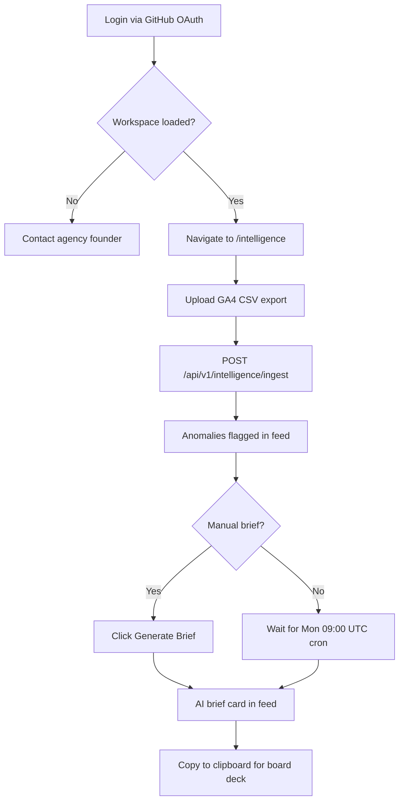
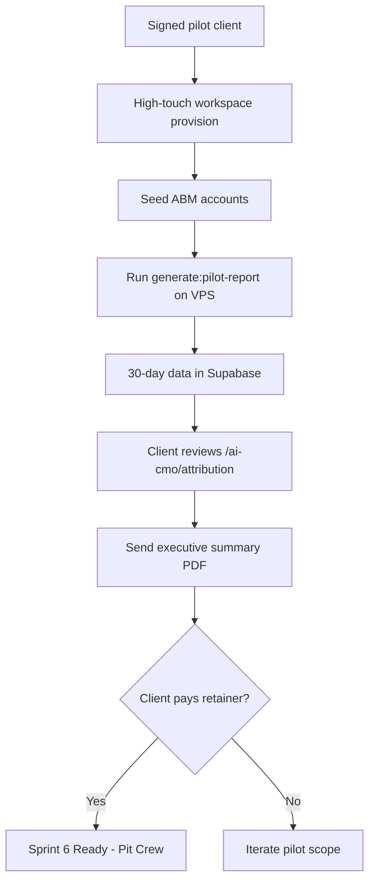
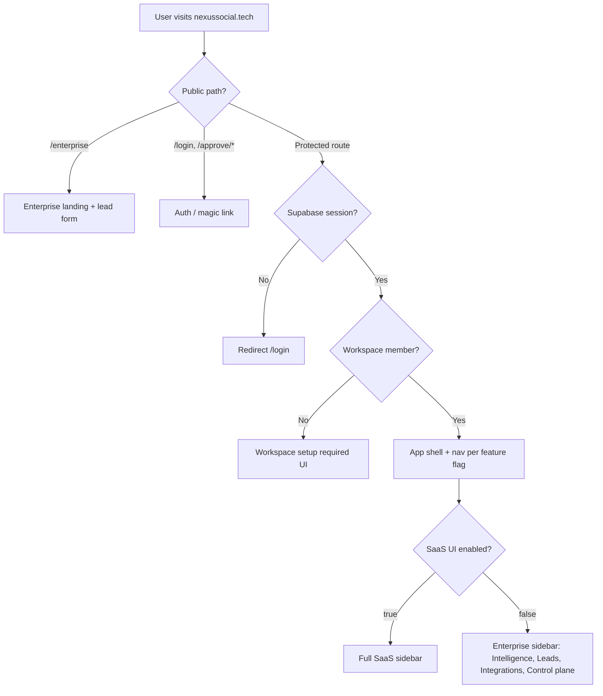
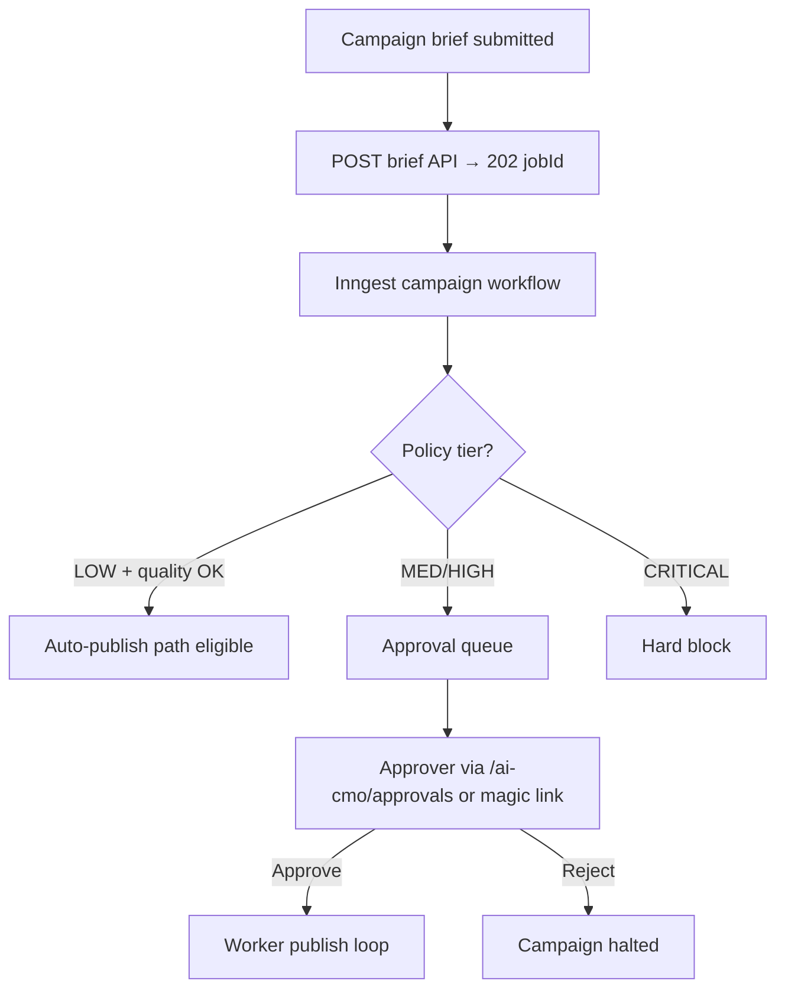
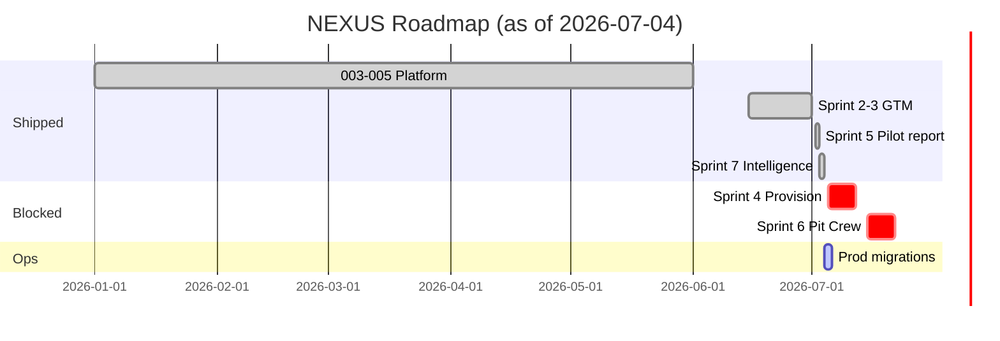

# NEXUS Platform — Product Requirements Document (PRD)

**Document ID:** NEXUS-PRD-001  
**Version:** 1.0.1  
**Status:** Living specification — reflects codebase as of 2026-07-05  

> **Split documentation (recommended):** Use the topic files under **[`docs/prd/`](./prd/README.md)** for navigation.  
> **Status tracker:** [`docs/prd/PRD-STATUS.md`](./prd/PRD-STATUS.md)  
> **QA results:** [`docs/prd/QA-RESULTS.md`](./prd/QA-RESULTS.md)

**Authority:** Supersedes scattered sprint prompts where conflicts exist; [CONSTITUTION.md](../CONSTITUTION.md) and [clarifications.md](../../specs/000-nexus-program/clarifications.md) win on conflict  
**Repository:** `waleedhewalla78-sudo/NEXUS` · branch `main` · commit `befc0c3`  
**Production URL:** https://nexussocial.tech  
**Application root:** `nexus-social-app/`

---

## Table of Contents (split files)

| # | Topic | File |
|---|-------|------|
| — | **Index** | [prd/README.md](./prd/README.md) |
| — | **PRD Status** | [prd/PRD-STATUS.md](./prd/PRD-STATUS.md) |
| — | **QA Results** | [prd/QA-RESULTS.md](./prd/QA-RESULTS.md) |
| 1 | Product Vision & Scope | [prd/01-product-vision-scope.md](./prd/01-product-vision-scope.md) |
| 2 | Problem & Business Context | [prd/02-problem-business-context.md](./prd/02-problem-business-context.md) |
| 3 | Goals & Success Metrics | [prd/03-goals-success-metrics.md](./prd/03-goals-success-metrics.md) |
| 4 | User Personas & Workflows | [prd/04-user-personas-workflows.md](./prd/04-user-personas-workflows.md) |
| 5 | Use Cases | [prd/05-use-cases.md](./prd/05-use-cases.md) |
| 6 | Functional Requirements | [prd/06-functional-requirements.md](./prd/06-functional-requirements.md) |
| 7 | Feature Specifications | [prd/07-feature-specifications.md](./prd/07-feature-specifications.md) |
| 8 | Business Scenarios | [prd/08-business-scenarios.md](./prd/08-business-scenarios.md) |
| 9 | UI & Navigation | [prd/09-ui-navigation.md](./prd/09-ui-navigation.md) |
| 10 | Auth, Roles & Permissions | [prd/10-auth-roles-permissions.md](./prd/10-auth-roles-permissions.md) |
| 11 | Reports & Dashboards | [prd/11-reports-dashboards.md](./prd/11-reports-dashboards.md) |
| 12 | Integration Requirements | [prd/12-integration-requirements.md](./prd/12-integration-requirements.md) |
| 13 | Technical Architecture | [prd/13-technical-architecture.md](./prd/13-technical-architecture.md) |
| 14 | Competitive Context | [prd/14-competitive-context.md](./prd/14-competitive-context.md) |
| 15 | Data & Privacy | [prd/15-data-privacy.md](./prd/15-data-privacy.md) |
| 16 | Implementation Roadmap | [prd/16-implementation-roadmap.md](./prd/16-implementation-roadmap.md) |
| 17 | Risks & Mitigation | [prd/17-risks-mitigation.md](./prd/17-risks-mitigation.md) |
| 18 | Assumptions & Constraints | [prd/18-assumptions-constraints.md](./prd/18-assumptions-constraints.md) |
| 19 | Appendices | [prd/19-appendices.md](./prd/19-appendices.md) |

---

## Table of Contents (full document below)

1. [Product Vision & Scope](#1-product-vision--scope)
2. [Problem Statement & Business Context](#2-problem-statement--business-context)
3. [Goals & Success Metrics](#3-goals--success-metrics)
4. [User Personas & Workflows](#4-user-personas--workflows)
5. [Use Cases](#5-use-cases)
6. [Functional Requirements](#6-functional-requirements)
7. [Feature Specifications](#7-feature-specifications)
8. [Business Scenarios](#8-business-scenarios)
9. [User Interface & Navigation](#9-user-interface--navigation)
10. [Authorization, Roles & Permissions](#10-authorization-roles--permissions)
11. [Reports & Dashboards](#11-reports--dashboards)
12. [Integration Requirements](#12-integration-requirements)
13. [Technical Architecture](#13-technical-architecture)
14. [Competitive Context](#14-competitive-context)
15. [Data & Privacy](#15-data--privacy)
16. [Implementation Roadmap](#16-implementation-roadmap)
17. [Risks & Mitigation](#17-risks--mitigation)
18. [Assumptions & Constraints](#18-assumptions--constraints)
19. [Appendices](#19-appendices)

---

## Document Control

| Field | Value |
|-------|-------|
| Product name | NEXUS (Nexus Social / Diligent AI Enterprise skin) |
| Business model | Agency-led, product-enabled — managed retainers ($3k pilot → $5k/mo) |
| Primary market | MENA enterprise B2B (UAE PDPL, Egypt DPL, locale `ar-SA` / `en-US`) |
| Deployment | Hostinger VPS · Docker GHCR image · Supabase SoR |
| Overall verdict | **Agency + Intelligence code complete** — prod ops and commercial gates lag |

### Stakeholder input required (do not assume)

| ID | Decision needed | Owner |
|----|-----------------|-------|
| **STK-001** | Executive names on UAT sign-off (B3) | Leadership |
| **STK-002** | Meta App Review submission timing (B1) | Product |
| **STK-003** | Langfuse vs OTel-only observability (A-GATE-002) | Architecture |
| **STK-004** | Agency hierarchy migration `000014` apply (A-GATE-003) | Leadership |
| **STK-005** | Sprint 6 unlock — Client #1 payment received | Commercial |
| **STK-006** | Sprint 4 unlock — signed pilot + `CLIENT_NAME/SLUG/DOMAIN` | Commercial |
| **STK-007** | Intelligence import persistence vs ephemeral JSON (OQ-005) | Product |
| **STK-008** | Calendar export scope — content pieces only vs drafts (OQ-006) | Product |

---

## Executive Summary

NEXUS (marketed as **Diligent AI** for enterprise) is an **AI-native autonomous revenue operating system** for MENA B2B. It is operated as an **agency-led, product-enabled** platform—not self-serve SaaS for pilots.

### What is built (code on `main` @ `befc0c3`)

| Layer | Status |
|-------|--------|
| Omnichannel publish (FB, IG, LinkedIn, X) + worker | ✅ Shipped (003) |
| 8-agent AI CMO mesh + Inngest + policy + FinOps | ✅ Shipped (004) |
| ABM, CRM attribution, MENA compliance | ✅ Shipped (005) |
| Enterprise landing, leads, Meta Lead Ads, LinkedIn OAuth | ✅ Shipped (Sprint 2–3) |
| Pilot ROI simulator (`generate:pilot-report`) | ✅ Shipped (Sprint 5) |
| Intelligence feed + executive briefing agent | ✅ Shipped (Sprint 7) |
| Enterprise QA harness | ✅ Operational |

### What is blocked or not built

| Item | Gate |
|------|------|
| Sprint 4 provision CLI | Signed pilot client (CL-033) |
| Sprint 6 Pit Crew `/admin` + margins | Client #1 payment (CL-036) |
| Meta FB/IG live publish | B1 App Review |
| Sprint 20 agency hierarchy | A-GATE-003 / migration `000014` |
| Native GA4/Meta/WhatsApp sync workers | CL-038 (out of scope) |

### Production readiness (as of 2026-07-05)

| Check | Result |
|-------|--------|
| Code complete through Sprint 7 | ✅ |
| `qa:enterprise` harness | 🔴 **13 PASS · 3 FAIL · 1 WARN · 2 SKIP** |
| Top blocker | `intelligence_*` tables not applied on prod Supabase |
| Section B human gates (B1–B4) | ⬜ Open |
| Commercial (paid Client #1) | ⬜ Not achieved |

**Verdict:** Platform is **engineering-complete for agency GTM**; **not production-certified** until migrations, secrets, QA green, and Section B gates close.

---

## 1. Product Vision & Scope

### 1.1 Vision

NEXUS is an **AI-native autonomous revenue operating system** for MENA enterprise marketing. It combines:

- **Omnichannel social publishing** (Facebook, Instagram, LinkedIn, X)
- An **8-agent AI CMO mesh** (Strategic Brain, Creator, Judge, Compliance, Radar, Finance, Quant, Sentinel)
- **ABM intent scoring**, CRM closed-loop attribution, and FinOps cost governance
- **Enterprise GTM** (public landing, inbound leads, Meta Lead Ads webhook)
- **Intelligence funnel** (CSV/webhook ingest → executive AI briefs)

The platform is sold and operated as **Diligent AI** — an agency that deploys the mesh for clients; it is not positioned as self-serve multi-tenant SaaS for pilots.

### 1.2 In scope (shipped or code-complete on `main`)

| Track | Scope | Version / Sprint |
|-------|-------|------------------|
| **003 — Real Integrations** | OAuth, encrypted tokens, publish adapters, worker, analytics, Chatwoot inbox AI, webhooks, Stripe billing hooks | Sprints 1–11 (baseline) |
| **004 — AI CMO Enterprise** | Async campaigns (202+polling), Inngest mesh, policy engine, approvals, FinOps ledger, memory (PG+Qdrant), 8 agents | Sprint 12+ (`72f7b91` era) |
| **005 — Revenue loop** | ABM dashboard, playbook activation, HubSpot/Salesforce webhooks, attribution export, MENA compliance, control plane | Sprints 18–19 |
| **Enterprise skin** | Feature flags, `/enterprise` landing, `enterprise_leads`, internal leads dashboard | Sprint 2 (`3e795f2`) |
| **GTM integrations** | LinkedIn OAuth, Meta Lead Ads webhook, `/settings/integrations` | Sprint 3 (`60f7109`) |
| **Pilot ROI simulation** | `generate:pilot-report` CLI — 30-day back-dated pipeline proof | Sprint 5 (`e38d6f6`) |
| **Intelligence** | CSV ingest, anomaly detection, briefing agent, `/intelligence` feed, weekly Inngest cron | Sprint 7 (`ebd6222`) |
| **QA harness** | `qa:enterprise` + master plan | QA pass (`befc0c3`) |

### 1.3 Explicitly out of scope (constitution + clarifications)

| Item | Reason | Reference |
|------|--------|-----------|
| Native GA4 / Meta Ads / WhatsApp **sync workers** | 8GB RAM constraint; funnel model replaces connectors | CL-038 |
| TikTok / Snapchat **live publish** | Enum stub only; adapters deferred | CL-006-004, FR-P01 |
| Self-serve pilot onboarding UI | High-touch agency model | CL-033/034 |
| Pit Crew `/admin` provision + margin dashboard | Payment-gated until Client #1 paid | CL-036 |
| `provision-pilot-client.ts` | Sales-gated until signed client | CL-033 |
| Sprint 20 agency switcher / client portal | Blocked on A-GATE-003 / migration `000014` | CL-029 |
| Standalone Claude/React artifact apps in monorepo | Ideas extracted to native APIs only | CL-006-001 |
| Modifying `campaign-workflow.ts` step order or `reconciler.ts` validation | Regression boundary | CL-030 |
| Intelligence feed chart libraries / PDF download V1 | Text-only V1; PDF is P2 | CL-040 |
| Dify as orchestrator | Dify = runtime only; Inngest = orchestration | Constitution §2 |
| Direct SoR writes from agents/Dify | Reconciler-only writes | Constitution §2 |

### 1.4 Scope evolution by era

| Era | What changed | Why |
|-----|--------------|-----|
| **003 baseline** | Real OAuth + publish replaced mocks | Production credibility for social ops |
| **004 additive** | AI CMO mesh layered without breaking 003 | Enterprise AI campaigns without publish regression |
| **005 revenue** | ABM + CRM attribution loop | Prove closed-won revenue, not vanity metrics |
| **Sprint 2 pivot** | Enterprise skin via env flags, not separate app | Capital efficiency; one codebase, two GTM skins |
| **Sprint 3 pivot** | Meta Lead Ads webhook bypasses App Review for **leads**; publish still gated | Unblock GTM while B1 pending |
| **Sprint 4 deferral** | Provision script not built pre-sale | Agency-led: build for Client #1, not hypotheticals |
| **Sprint 6 deferral** | Pit Crew deferred pre-payment | Avoid building internal SaaS before revenue |
| **Sprint 7 pivot** | Intelligence = CSV funnel + briefs, not marketing cloud connectors | 2-week sprint realism; 95% agency margin on briefs |
| **Infra pivot** | GHCR pre-built images vs VPS builds | Faster deploy on 8GB VPS |

---

## 2. Problem Statement & Business Context

### 2.1 Problems solved

| Problem | User pain | NEXUS response |
|---------|-----------|----------------|
| **Tool fatigue** | CMOs juggle 8–12 disconnected martech tools | Single workspace-scoped SoR with AI mesh + attribution |
| **Ungoverned AI** | LLMs hallucinate claims; MENA compliance risk | Policy engine tiers (LOW→CRITICAL); HITL approvals; locale-aware output |
| **Data leakage** | Shadow AI and shared SaaS blur tenant boundaries | Supabase RLS on every tenant table; workspace_members isolation |
| **Unprovable ROI** | Agencies report impressions; boards want pipeline | CRM mirror + `attribution_reports` + pilot case-study generator |
| **Slow onboarding** | Enterprise SaaS takes weeks to configure | High-touch provision (Sprint 4/6) — **when unlocked** — targets 60s workspace seed |
| **Integration trap** | Building native GA4/Meta connectors takes months | Funnel ingestion: CSV upload + webhooks → AI brief |

### 2.2 Market opportunity

- **MENA B2B digital transformation** spend with demand for Arabic/English compliant GTM
- **Managed AI agency** positioning: $3k pilot → $5k/mo retainer with &lt;$15/mo LLM cost target (DeepSeek margin rule: ≥55% gross margin)
- **2 pilot slots** GTM motion (LinkedIn case study post) — capacity-constrained by founder-led delivery

### 2.3 Competitive positioning

NEXUS competes in the **AI marketing operations / revenue intelligence** space — not as a generic social scheduler (Buffer/Hootsuite) nor as a full marketing cloud (HubSpot Marketing Hub, Salesforce MC).

**Differentiation thesis:**

1. **8-agent governed mesh** with explicit compliance tiers vs single-chat "AI copilot"
2. **Database-level RLS** as product feature, not add-on
3. **Closed-loop attribution** from content → CRM closed-won
4. **Agency-operated** delivery with enterprise skin — clients see outcomes, not tool configuration
5. **Capital-efficient funnel** integrations (CSV) vs expensive native connector roadmaps

*See [Section 14](#14-competitive-context) for feature matrix.*

---

## 3. Goals & Success Metrics

### 3.1 Business goals

| Goal | Metric | Target | Current status |
|------|--------|--------|----------------|
| G1 — Prove pilot ROI | Pipeline influenced ($) in attribution dashboard | ≥$150k simulated/real per pilot | Script ready; requires `generate:pilot-report` on prod WS |
| G2 — Convert pilot to retainer | Paid monthly retainer | $5,000/mo Client #1 | **Not achieved** — commercial gate |
| G3 — GTM lead capture | Inbound leads per month | ≥1 qualified lead from `/enterprise` | Endpoint live; prod migration may lag |
| G4 — Gross margin | `(retainer - llm_cost) / retainer` | ≥55% | FinOps ledger + Sprint 6 margin dashboard **blocked** |
| G5 — Production readiness | Section B gates closed | B1–B6 PASS | B5/B6 PASS local; B1/B2/B4 open |

### 3.2 Product / engineering KPIs

| KPI | Measurement | Acceptance |
|-----|-------------|------------|
| Unit test pass rate | `npm run test:unit` | ≥250 passed, 0 failed |
| Schema verify 003 | `npm run schema:verify` | 18/18 tables |
| Schema verify 004 | `npm run schema:verify:004` | 11/11 tables |
| Live integration | `npm run test:live-integration` | 5/5 PASS |
| Postman UAT A/B | `npm run uat:postman-ab` | Test A 202→completed; Test B budget block |
| E2E smoke | `npm run test:e2e` | ≥23 pass |
| k6 smoke | `npm run load-test` | Fail rate &lt;5% |
| Enterprise QA | `npm run qa:enterprise:report` | 0 FAIL (last run: 3 FAIL — intelligence tables on prod) |
| OAuth UAT | T053–T056 | Live publish proof per platform |
| Uptime (target) | Health endpoint | 99.9% at 5k workspaces (004 scale doc) |

### 3.3 Acceptance criteria — "production ready"

All must be true:

1. `npm run verify:program` exits 0
2. `npm run qa:enterprise:report` → 0 FAIL
3. Migrations `20260705_enterprise_leads.sql` and `20260715_intelligence_feed.sql` applied on prod Supabase
4. Hermes deployed through `befc0c3` with secrets per `OPS-PROD-SECRETS-CHECKLIST.md`
5. `docs/UAT-SIGNOFF-RESULTS.md` signed by Product, Engineering, CTO
6. Meta App Review approved **if** Facebook/Instagram publish required (B1)

---

## 4. User Personas & Workflows

### 4.1 Personas

| Persona | Role | Goals | Pain points |
|---------|------|-------|-------------|
| **P1 — Agency Founder (Waleed)** | Operator, sales, delivery | Close pilots, provision clients, prove ROI, maintain margin | Manual SQL onboarding; ops lag on VPS |
| **P2 — Enterprise CMO (Pilot Client)** | Economic buyer | See pipeline influence, compliant campaigns, executive briefs | Distrusts dashboards; needs board-ready narrative |
| **P3 — Marketing Operator** | Day-to-day campaign manager | Schedule posts, run AI campaigns, approve content | Tool switching; approval queue latency |
| **P4 — Compliance / Legal reviewer** | Risk approver | Block CRITICAL content; audit trail | Ungoverned AI in market |
| **P5 — RevOps / CRM admin** | HubSpot/Salesforce owner | Closed-won sync, attribution | CRM disconnected from social |
| **P6 — Inbound prospect** | `/enterprise` visitor | Book demo, understand value prop | Generic SaaS signup friction |
| **P7 — SDR / AE** | Lead qualifier | View inbound leads, status progression | Leads scattered across tools |

### 4.2 Primary workflow — Enterprise CMO (P2) — Intelligence brief



### 4.3 Primary workflow — Agency Founder (P1) — Pilot ROI proof



### 4.4 Decision tree — Authentication path



### 4.5 Decision tree — AI campaign approval



---

## 5. Use Cases

### UC-001 — Schedule and publish social post

| Field | Detail |
|-------|--------|
| **Actor** | P3 Marketing Operator |
| **Preconditions** | OAuth connected for target platform; workspace member; token encrypted |
| **Main flow** | 1. Navigate `/posts/create` 2. Compose content, select platform 3. Schedule or publish now 4. Worker consumes queue 5. Post status updated in SoR |
| **Alt flows** | A1: Token expired → re-auth via `/settings/integrations` |
| **Edge cases** | Meta publish blocked if `meta_app_review_status ≠ approved` |
| **Success criteria** | Post reaches `published` state; analytics sync enqueued |

### UC-002 — Run AI CMO campaign (async)

| Field | Detail |
|-------|--------|
| **Actor** | P3 Marketing Operator |
| **Preconditions** | API key or session auth; budget configured; ABM optional |
| **Main flow** | 1. `/ai-cmo/campaigns/new` brief wizard 2. POST `/api/v1/ai-cmo/campaigns/brief` 3. Receive `202` + `jobId` 4. Poll `/api/v1/ai-cmo/campaigns/jobs/{jobId}` 5. Campaign `completed` |
| **Alt flows** | A1: Budget exceeded → job fails fast (Postman Test B) |
| **Edge cases** | Uniqueness guard rejects duplicate captions on repeat UAT |
| **Success criteria** | `ai_cmo_campaigns.status = completed`; content pieces created |

### UC-003 — Capture enterprise inbound lead

| Field | Detail |
|-------|--------|
| **Actor** | P6 Inbound prospect |
| **Preconditions** | `NEXT_PUBLIC_ENABLE_ENTERPRISE_LANDING=true`; migration `20260705` applied |
| **Main flow** | 1. Visit `/enterprise` 2. Submit lead form 3. POST `/api/v1/enterprise/leads/inbound` 4. `201 { success, leadId }` |
| **Alt flows** | A1: Rate limit &gt;5/min/IP → `429` |
| **Edge cases** | Missing `enterprise_leads` table → `500` schema cache error |
| **Success criteria** | Row in `enterprise_leads` with `source=website_form`, `status=new` |

### UC-004 — Ingest Meta Lead Ads webhook

| Field | Detail |
|-------|--------|
| **Actor** | Meta Lead Ads system |
| **Preconditions** | `META_WEBHOOK_SECRET` configured; migration applied |
| **Main flow** | 1. GET challenge for verification 2. POST lead payload with `X-Hub-Signature-256` 3. Parse `field_data` 4. Insert `enterprise_leads` with `source=meta_ads` |
| **Alt flows** | A1: Invalid signature → `403` |
| **Success criteria** | Lead row created; visible in `/enterprise/leads` |

### UC-005 — Upload intelligence CSV and generate brief

| Field | Detail |
|-------|--------|
| **Actor** | P2 Enterprise CMO |
| **Preconditions** | Session auth; migration `20260715` applied; ≥2 CSV rows with Date/Metric/Value columns |
| **Main flow** | 1. `/intelligence` → Upload CSV 2. Ingest + anomaly scan 3. Click Generate Brief or wait for cron 4. Brief appears in feed 5. Copy to clipboard |
| **Alt flows** | A1: OpenRouter down → fallback brief text |
| **Edge cases** | Invalid CSV (&lt;2 rows) → `400` |
| **Success criteria** | `intelligence_briefs` row with `status=ready` |

### UC-006 — Connect LinkedIn OAuth

| Field | Detail |
|-------|--------|
| **Actor** | P1/P3 |
| **Preconditions** | `LINKEDIN_CLIENT_ID/SECRET` in prod env; redirect URI exact match |
| **Main flow** | 1. `/settings/integrations` 2. Connect LinkedIn 3. OAuth callback stores encrypted token 4. Success redirect |
| **Success criteria** | Token in `workspace_social_connections` (or encrypted vault pattern) |

### UC-007 — ABM playbook activation

| Field | Detail |
|-------|--------|
| **Actor** | P3 |
| **Preconditions** | ABM accounts seeded; session auth |
| **Main flow** | 1. `/ai-cmo/abm` 2. Select account 3. Activate playbook → POST `/api/v1/ai-cmo/abm/accounts/{id}/activate` 4. `202` playbook run |
| **Success criteria** | Row in `abm_playbook_runs`; intent signals drive campaign |

### UC-008 — Pilot ROI simulation (operator)

| Field | Detail |
|-------|--------|
| **Actor** | P1 Agency Founder |
| **Preconditions** | `PILOT_WORKSPACE_ID` set; ABM row exists; Supabase service role |
| **Main flow** | 1. SSH to VPS 2. `cd /opt/platform/nexus-social-app` 3. Source `.env.production` 4. `PILOT_WORKSPACE_ID=<uuid> npm run generate:pilot-report` 5. Copy executive summary |
| **Alt flows** | A1: No OpenRouter → fallback copy still inserts data |
| **Success criteria** | Console prints 30-day summary; data in campaigns, CRM, attribution, cost ledger |

### UC-009 — HubSpot closed-won sync

| Field | Detail |
|-------|--------|
| **Actor** | P5 RevOps |
| **Preconditions** | HubSpot OAuth connected or `HUBSPOT_ACCESS_TOKEN` |
| **Main flow** | 1. Connect via `/settings/integrations` 2. Run `npm run sync:hubspot-deals` 3. CRM mirror updated |
| **Success criteria** | `crm_activity_mirror` reflects closed-won deals |

### UC-010 — Pit Crew provision client (BLOCKED)

| Field | Detail |
|-------|--------|
| **Actor** | P1 |
| **Preconditions** | **CL-036:** Client #1 payment received; Sprint 6 code shipped |
| **Status** | **Not implemented** — payment gate |
| **Planned flow** | POST `/api/admin/provision-client` with `x-admin-secret` → workspace + roster + ABM seed in 60s |

---

## 6. Functional Requirements

### 6.1 Module: Authentication & session

| ID | Requirement | Validation |
|----|-------------|------------|
| FR-AUTH-01 | Supabase session required for all non-public routes | Middleware redirect to `/login` |
| FR-AUTH-02 | GitHub OAuth via NextAuth `signIn('github')` from Navbar | No `/login` 404; callback `/api/auth/[...nextauth]` |
| FR-AUTH-03 | Public paths: `/enterprise`, `/login`, `/setup`, `/approve/*`, `/p/*` | Middleware `isPublicPath` |
| FR-AUTH-04 | Rate limit 100 req/min/IP on middleware | `429` when exceeded |

### 6.2 Module: Workspace & multi-tenancy

| ID | Requirement | Validation |
|----|-------------|------------|
| FR-WS-01 | All tenant data scoped by `workspace_id` | RLS policies on all tenant tables |
| FR-WS-02 | Workspace membership via `workspace_members` | User sees only member workspaces |
| FR-WS-03 | Workspace switcher in Navbar when SaaS UI enabled | `isSaasUiEnabled()` |
| FR-WS-04 | Bootstrap resolves workspace even when SaaS UI hidden | OAuth integrations functional |

### 6.3 Module: Social publish (003)

| ID | Requirement | Validation |
|----|-------------|------------|
| FR-PUB-01 | Publish to Facebook, Instagram, LinkedIn, X | Adapter registry + worker loop |
| FR-PUB-02 | OAuth tokens encrypted at rest when publish enabled | `TOKEN_ENCRYPTION_KEY` |
| FR-PUB-03 | Meta publish gated on App Review status | `meta_app_review_status = approved` |
| FR-PUB-04 | TikTok/Snapchat enum present; graceful skip | No live adapter (FR-P01) |
| FR-PUB-05 | Schedule via calendar; worker executes | `posts` + worker heartbeat |

### 6.4 Module: AI CMO mesh (004)

| ID | Requirement | Validation |
|----|-------------|------------|
| FR-AI-01 | Campaign creation returns `202` + job ID | Async poll contract |
| FR-AI-02 | 8 Inngest function groups registered | `getAllAiCmoInngestFunctions()` |
| FR-AI-03 | Policy engine assigns risk tier LOW/MED/HIGH/CRITICAL | `policy-engine.ts` |
| FR-AI-04 | CRITICAL content never auto-publishes | Workflow + approval tests |
| FR-AI-05 | FinOps budget cap blocks campaign when exceeded | Postman Test B |
| FR-AI-06 | Cost ledger records token spend per campaign | `ai_cmo_cost_ledger` inserts |
| FR-AI-07 | Dify first, OpenRouter fallback | ProviderRouter + circuit breakers |
| FR-AI-08 | CL-030: Do not modify campaign workflow step order | Code review gate |

### 6.5 Module: ABM & attribution (005)

| ID | Requirement | Validation |
|----|-------------|------------|
| FR-ABM-01 | Account intent scores per workspace | `account_intent_scores` |
| FR-ABM-02 | Playbook activation API returns 202 | `/api/v1/ai-cmo/abm/accounts/{id}/activate` |
| FR-ABM-03 | Attribution reports unique on `(workspace_id, month, channel)` | Upsert constraint |
| FR-ABM-04 | CRM mirror ingests closed-won from webhooks | HubSpot + Salesforce routes |
| FR-ABM-05 | Executive export from attribution API | `/api/v1/ai-cmo/attribution` |

### 6.6 Module: Enterprise GTM (Sprint 2–3)

| ID | Requirement | Validation |
|----|-------------|------------|
| FR-GTM-01 | Feature flag `NEXT_PUBLIC_ENABLE_SaaS_UI` hides SaaS chrome | Sidebar, Navbar, onboarding tour |
| FR-GTM-02 | Feature flag `NEXT_PUBLIC_ENABLE_ENTERPRISE_LANDING` gates `/enterprise` | `notFound()` when false |
| FR-GTM-03 | Inbound lead API public, rate-limited 5/min/IP | `checkInboundLeadRateLimit` |
| FR-GTM-04 | Required inbound fields: `email`, `firstName` | `400` on validation fail |
| FR-GTM-05 | Internal leads API session-auth only | GET `/api/v1/enterprise/leads` |
| FR-GTM-06 | Meta Lead Ads HMAC verification | `X-Hub-Signature-256` |
| FR-GTM-07 | Lead `source` enum: `website_form`, `whatsapp`, `meta_ads`, `referral` | DB CHECK constraint |
| FR-GTM-08 | Lead `status` enum: `new`, `contacted`, `qualified`, `closed_won`, `closed_lost` | DB CHECK constraint |

### 6.7 Module: Intelligence (Sprint 7)

| ID | Requirement | Validation |
|----|-------------|------------|
| FR-INT-01 | CSV ingest minimum 2 rows | `validateIngestRows` |
| FR-INT-02 | Anomaly detection flags &gt;20% metric swings | `detectAnomalies` |
| FR-INT-03 | Brief generation via OpenRouter with fallback | `briefing-agent.ts` |
| FR-INT-04 | Weekly cron Monday 09:00 UTC | `intelligence-briefing-workflow` |
| FR-INT-05 | Manual brief trigger POST `/api/v1/intelligence/brief` | Session auth |
| FR-INT-06 | Feed combines briefs + ingests chronologically | GET `/api/v1/intelligence/feed` |
| FR-INT-07 | Intelligence writes use `ingest-raw.ts` — not reconciler | CL-039 |

### 6.8 Module: Compliance & MENA

| ID | Requirement | Validation |
|----|-------------|------------|
| FR-COMP-01 | Workspace compliance profile API | `/api/v1/workspaces/compliance-profile` |
| FR-COMP-02 | Locale-aware content `en-US`, `ar-SA` | Creator agent |
| FR-COMP-03 | Policy flags data claims, geo offers per `tenants.data_region` | Sprint 16 rules |

### 6.9 Business rules (global)

| Rule | Description |
|------|-------------|
| BR-01 | Approval determined by **risk tier**, never LLM confidence alone |
| BR-02 | SoR mutations only through reconciler/domain services |
| BR-03 | `DEMO_ANALYTICS_ENABLED=false` in production |
| BR-04 | DeepSeek margin rule: alert when gross margin &lt;55% (Sprint 6 UI) |
| BR-05 | Pilot onboarding: no self-serve signup — operator adds `workspace_members` |
| BR-06 | Enterprise inbound leads default to first active workspace if not specified |

---

## 7. Feature Specifications

### Feature index

| Feature | Priority | Introduced | Status | Dependencies |
|---------|----------|------------|--------|--------------|
| Omnichannel publish | Must-have | 003 | ✅ Shipped | OAuth, worker, Redis |
| AI CMO campaign mesh | Must-have | 004 | ✅ Shipped | Inngest, Dify/OpenRouter |
| Policy + approvals | Must-have | 004 | ✅ Shipped | Policy engine, approval queue |
| FinOps cost ledger | Must-have | 004 | ✅ Shipped | `ai_cmo_cost_ledger` |
| ABM dashboard | Must-have | 005 S18–19 | ✅ Shipped | `account_intent_scores` |
| CRM attribution loop | Must-have | 005 | ✅ Shipped | HubSpot/Salesforce webhooks |
| Enterprise landing | Must-have | Sprint 2 | ✅ Code | Feature flags, migration |
| Enterprise leads CRM | Must-have | Sprint 2 | ✅ Code | `enterprise_leads` migration |
| LinkedIn OAuth | Must-have | Sprint 3 | ✅ Code | Prod secrets |
| Meta Lead Ads webhook | Must-have | Sprint 3 | ✅ Code | `META_WEBHOOK_SECRET` |
| HubSpot OAuth | Should-have | Section B | ✅ Shipped | HubSpot dev app |
| Intelligence feed | Must-have | Sprint 7 | ✅ Code | Migration `20260715` |
| Executive briefing agent | Must-have | Sprint 7 | ✅ Shipped | OpenRouter optional |
| Pilot case-study generator | Must-have | Sprint 5 | ✅ Shipped | ABM seed, service role |
| Playwright auth E2E | Should-have | QA | ✅ Shipped | Demo user |
| Pit Crew admin console | Must-have | Sprint 6 | 🔒 Blocked | Client #1 payment |
| Provision pilot CLI | Must-have | Sprint 4 | 🔒 Blocked | Signed client |
| Meta FB/IG publish | Must-have | 003 | ⬜ Gated | B1 App Review |
| TikTok/Snap publish | Nice-to-have | FR-P01 | ❌ Deferred | — |
| Intelligence PDF export | Nice-to-have | S7-P2 | ❌ Backlog | — |
| Sprint 20 agency hierarchy | Should-have | 004 | 🔒 Blocked | A-GATE-003 |

### F-001 — Intelligence Feed (detail)

| Attribute | Specification |
|-----------|---------------|
| **Purpose** | Unified timeline of ingested metrics and AI executive briefs |
| **User benefit** | CMO gets board-ready narrative without BI tool setup |
| **Acceptance criteria** | Upload CSV → ingest row → brief card → copy button works; empty state shown; date filters apply; source badges GA4/Meta/CSV/AI |
| **Priority** | Must-have |
| **Version** | Sprint 7 (`ebd6222`) |

### F-002 — Enterprise landing (detail)

| Attribute | Specification |
|-----------|---------------|
| **Purpose** | Public GTM page for Diligent AI positioning |
| **User benefit** | Prospect understands differentiated value in &lt;60 seconds |
| **Acceptance criteria** | Hero + 3 problem columns + 3 solution columns + lead form → 201; no sidebar; `notFound` when flag off |
| **Priority** | Must-have |
| **Version** | Sprint 2 (`3e795f2`) |

### F-003 — generate:pilot-report (detail)

| Attribute | Specification |
|-----------|---------------|
| **Purpose** | Back-date 30 days of campaign, content, CRM, attribution, FinOps data |
| **User benefit** | Founder delivers ROI proof PDF without manual SQL |
| **Acceptance criteria** | Executive summary printed; `attributed_revenue` default $150,000; AI cost default $12.50; margin % calculated |
| **Priority** | Must-have |
| **Version** | Sprint 5 (`e38d6f6`) |
| **Note** | Run on VPS host, not inside `nexus-social-prod` container (standalone image lacks scripts) |

---

## 8. Business Scenarios

### BS-01 — Land enterprise pilot (target state)

| Step | Action | Outcome |
|------|--------|---------|
| 1 | Prospect submits `/enterprise` form | Lead in `enterprise_leads` |
| 2 | Founder qualifies lead → sales call | `status → contacted` |
| 3 | $3k pilot SOW signed | Sprint 4 unlock |
| 4 | Operator provisions workspace + ABM seed | Client logs in |
| 5 | LinkedIn OAuth connected | Publish demo enabled |
| 6 | 30-day AI campaigns run | Content + cost ledger populated |
| 7 | `generate:pilot-report` executed | Executive summary for PDF |
| 8 | CMO reviews `/ai-cmo/attribution` | Pipeline story validated |
| 9 | Upsell to $5k/mo retainer | **Sprint 6 Ready** |

**Success metrics:** 1 closed-won or influenced deal story; ≥55% gross margin; client NPS qualitative sign-off.

### BS-02 — Weekly intelligence delivery (current capability)

| Step | Action | Outcome |
|------|--------|---------|
| 1 | Client exports GA4 CSV | File ready |
| 2 | CMO uploads to `/intelligence` | Ingest + anomalies |
| 3 | Monday cron or manual brief | `intelligence_briefs` created |
| 4 | CMO copies brief to PowerPoint | Board meeting ready |

**Success metrics:** Brief generated in &lt;30s (fallback) or &lt;10s (LLM); ≥1 anomaly flagged when data has &gt;20% swing.

### BS-03 — Meta ad lead → sales follow-up

| Step | Action | Outcome |
|------|--------|---------|
| 1 | Meta Lead Ad form submitted | Webhook POST |
| 2 | Signature verified | Lead inserted `source=meta_ads` |
| 3 | AE views `/enterprise/leads` | Calls prospect within 24h |

**Success metrics:** Webhook latency &lt;2s; 0 duplicate leads per Meta leadgen_id (if in metadata).

### BS-04 — Compliance block on HIGH-risk campaign

| Step | Action | Outcome |
|------|--------|---------|
| 1 | Campaign generates sensitive claim | Compliance tier HIGH |
| 2 | Auto-publish blocked | Approval queue item |
| 3 | Legal approves via magic link | Audit log entry |
| 4 | Content publishes | Full trail in `audit_logs` |

**Success metrics:** 0 CRITICAL auto-publishes; 100% HIGH items queued.

---

## 9. User Interface & Navigation

### 9.1 Information architecture

```text
Public
├── /enterprise          (landing — no app chrome)
├── /login
└── /approve/[token]     (HITL magic link)

Authenticated — SaaS UI (NEXT_PUBLIC_ENABLE_SaaS_UI=true)
├── /                      Dashboard
├── /intelligence          Intelligence feed (Sprint 7)
├── /analytics             Analytics hub
├── /calendar              Content calendar
├── /posts/create          Create post
├── /inbox                 Chatwoot inbox
├── /ai-cmo/campaigns/new  Brief wizard
├── /reputation            Reputation monitoring
├── /automations/builder   Automations
├── /enterprise/leads      Leads dashboard
├── /settings/*            Settings subtree
└── /ai-cmo/*              AI CMO subtree (ABM, attribution, approvals, control plane)

Authenticated — Enterprise skin (NEXT_PUBLIC_ENABLE_SaaS_UI=false)
├── /intelligence
├── /enterprise/leads
├── /settings/integrations
└── /ai-cmo/control-plane
```

### 9.2 Navigation component behavior

| Element | SaaS UI | Enterprise skin |
|---------|---------|-----------------|
| Sidebar title | "Nexus Social" | "Nexus Enterprise" |
| Collapse | ✅ Icon-only mode | ✅ Icon-only mode |
| Workspace switcher | Visible (Navbar) | Hidden |
| Global search | Visible | Hidden |
| Onboarding tour (`driver.js`) | Enabled | **Disabled** |
| Sign in | `signIn('github')` | Same |

### 9.3 Screen specifications

#### `/enterprise` — Lead capture form

| Field | Type | Required | Notes |
|-------|------|----------|-------|
| firstName | text | Yes | `autoComplete=given-name` |
| lastName | text | No | |
| email | email | Yes | Work email |
| company | text | No | |
| message | textarea (4 rows) | No | |
| Submit | button | — | "Request a demo" → POST inbound API |

#### `/enterprise/leads` — Leads dashboard

| Column | Source | Display |
|--------|--------|---------|
| Name | `first_name` + `last_name` | Text |
| Email | `email` | Text |
| Company | `company` | Text |
| Source | `source` | Badge |
| Status | `status` | Badge (green=new, gray=contacted) |
| Date | `created_at` | Locale date string |

#### `/intelligence` — Intelligence feed

| Element | Type | Behavior |
|---------|------|----------|
| Date from | date input | Filters feed |
| Date to | date input | Filters feed |
| Upload Data | file picker + button | `multipart/form-data` CSV |
| Generate Brief | button | POST `/api/v1/intelligence/brief` |
| Webhook URL | read-only text | Shown when API provides `webhookUrl` |
| Feed cards | timeline | Brief cards (serif styling) + ingest cards with anomaly list |
| Copy | button per brief | Clipboard API |

#### `/ai-cmo/campaigns/new` — Brief wizard

| Field | Type | Required |
|-------|------|----------|
| role | dropdown | Yes |
| domain | text | Yes |
| coreObjective | text | Yes |
| targetRole | text | Yes |
| market | text | Yes |
| artifactType | dropdown | Yes |

#### `/settings/integrations`

| Integration | UI elements |
|-------------|-------------|
| LinkedIn | Connect / Disconnect; OAuth start |
| Meta | Connect; App Review status display |
| HubSpot | OAuth connect; portal ID; status: connected / private_app / disconnected |
| X (Twitter) | OAuth connect |

### 9.4 Navigation flows

| From | To | Trigger |
|------|-----|---------|
| `/enterprise` | `#lead-form` | "Book a demo" header CTA |
| Navbar | GitHub OAuth | Sign in button |
| Sidebar | Any nav href | Client-side Next.js Link |
| Post OAuth | `/` or `callbackUrl` | NextAuth callback |
| Unauthenticated | `/login?redirect=...` | Middleware |

---

## 10. Authorization, Roles & Permissions

### 10.1 Authentication layers

| Layer | Mechanism | Scope |
|-------|-----------|-------|
| Primary session | Supabase Auth (`createServerClient`) | App routes |
| Social OAuth | Platform-specific `/api/oauth/{platform}/*` | Publish connections |
| NextAuth | GitHub provider | Sign-in button path |
| API key | Workspace API keys (UAT) | Programmatic campaign trigger |
| Service role | `SUPABASE_SERVICE_ROLE_KEY` | Scripts, inbound lead insert, webhooks |
| Admin secret | `x-admin-secret` header | **Planned** Sprint 6 `/admin` routes only |

### 10.2 Workspace roles

| Role | Capabilities | Restrictions |
|------|--------------|--------------|
| **owner** | Full workspace access; billing | Cannot assign via invite UI to new owner |
| **admin** | Team invite, role change, data export | Cannot transfer ownership |
| **member** | Standard operator access | Cannot change roles or export |

**Enforcement:** `team-management.ts` — invite/update requires `owner` or `admin`. Data export requires `admin`.

### 10.3 Data visibility (RLS)

| Table | Rule |
|-------|------|
| All tenant tables | `workspace_id IN (SELECT workspace_id FROM workspace_members WHERE user_id = auth.uid())` |
| Service role | Bypass for webhooks, scripts, inbound public API |
| `enterprise_leads` inbound | Public POST uses `supabaseAdmin` — no user session |
| Cross-tenant | **Blocked** — release gate |

### 10.4 Planned agency roles (NOT active — A-GATE-003)

| Role | Status |
|------|--------|
| `tenant_admin` | Schema in `000014` draft only |
| `agency_admin` | Not applied |
| `workspace_operator` | Not applied |

### 10.5 Compliance & security constraints

| Constraint | Implementation |
|------------|----------------|
| CSP headers | Middleware sets `default-src 'self'` + Supabase connect-src |
| HSTS | `max-age=63072000` |
| Webhook HMAC | Chatwoot, Meta Lead Ads, HubSpot |
| Token encryption | OAuth tokens at rest |
| E2E bypass | `x-e2e-test: true` skips Chatwoot HMAC **non-production only** |

---

## 11. Reports & Dashboards

### 11.1 Dashboard inventory

| Screen | Audience | Key metrics | Data sources | Filters | Refresh |
|--------|----------|-------------|--------------|---------|---------|
| `/` Dashboard | Operator | Workspace summary widgets | SoR aggregates | Workspace | On load |
| `/analytics` | Operator | Engagement, reach | Platform analytics sync | Date range | Worker sync |
| `/analytics/ai-performance` | Operator | AI agent performance | `ai_cmo_*` tables | Workspace | On load |
| `/analytics/sentiment` | Operator | Sentiment scores | Listening pipeline | Date | Periodic |
| `/ai-cmo/abm` | CMO | Intent scores, account list | `account_intent_scores` | Workspace | On load |
| `/ai-cmo/attribution` | CMO, Founder | Attributed revenue, touches | `attribution_reports`, CRM mirror | Month, channel | On load |
| `/ai-cmo/control-plane` | Operator | Agent health, last audit | Control plane API | Workspace | Poll |
| `/ai-cmo/approvals` | Compliance | Pending approvals | Approval queue API | Status | On load |
| `/ai-cmo/intelligence` | Operator | Paid media import charts | Import API + Recharts | Campaign | On upload |
| `/intelligence` | CMO | Briefs, ingests, anomalies | `intelligence_*` | Date from/to | On load + manual |
| `/enterprise/leads` | AE, Founder | Lead pipeline | `enterprise_leads` | None (workspace scoped) | On load |
| `/admin/margins` | Founder | Gross margin % per client | **Planned** `agency_client_roster` + cost summary | Month | **Sprint 6 blocked** |

### 11.2 Exported reports

| Report | Format | Trigger | Audience |
|--------|--------|---------|----------|
| Executive attribution export | API/CSV | Attribution API | CMO |
| Audit PDF | PDF | `/api/reports/audit-pdf` | Compliance |
| Calendar HTML export | HTML download | Intelligence page | Operator |
| Pilot executive summary | Plain text (console) | `generate:pilot-report` | Founder → client PDF |
| Intelligence brief | Copy clipboard (Markdown text) | `/intelligence` | CMO |

### 11.3 FinOps metrics (internal)

| Metric | Source | Threshold |
|--------|--------|-----------|
| Token spend per campaign | `ai_cmo_cost_ledger` | Budget policy caps |
| Monthly LLM cost per workspace | Cost summary views | Alert &lt;55% margin (Sprint 6) |
| ROAS summary | Finance agent | Dashboard card |

---

## 12. Integration Requirements

### 12.1 API catalog (representative)

| Endpoint | Method | Auth | Purpose |
|----------|--------|------|---------|
| `/api/health` | GET | Public | Liveness + worker heartbeat |
| `/api/v1/enterprise/leads/inbound` | POST | Public (rate limited) | Lead capture |
| `/api/v1/enterprise/leads` | GET | Session | List leads |
| `/api/v1/enterprise/leads/meta-ads` | GET/POST | HMAC / challenge | Meta Lead Ads |
| `/api/v1/intelligence/ingest` | POST | Session | CSV/JSON ingest |
| `/api/v1/intelligence/feed` | GET | Session | Unified feed |
| `/api/v1/intelligence/brief` | POST | Session | Manual brief |
| `/api/v1/ai-cmo/campaigns/brief` | POST | Session/API key | Start campaign |
| `/api/v1/ai-cmo/campaigns/jobs/{jobId}` | GET | Session | Poll job |
| `/api/v1/ai-cmo/abm/accounts` | GET | Session | ABM list |
| `/api/v1/ai-cmo/abm/accounts/{id}/activate` | POST | Session | Playbook |
| `/api/v1/ai-cmo/attribution` | GET | Session | Attribution data |
| `/api/oauth/linkedin/start` | GET | Session | LinkedIn OAuth |
| `/api/oauth/linkedin/callback` | GET | OAuth | Token exchange |
| `/api/oauth/hubspot/start` | GET | Session | HubSpot OAuth |
| `/api/oauth/hubspot/callback` | GET | OAuth | Token exchange |
| `/api/oauth/meta/start` | GET | Session | Meta OAuth |
| `/api/integrations/crm/webhook/hubspot` | POST | HMAC | CRM events |
| `/api/integrations/crm/webhook/salesforce` | POST | Signature | CRM events |
| `/api/webhooks/chatwoot-ai` | POST | HMAC | Inbox AI |
| `/api/webhooks/stripe` | POST | Stripe sig | Billing |
| `/api/inngest` | GET/POST | Inngest signing | Job orchestration |
| `/api/auth/[...nextauth]` | * | NextAuth | GitHub sign-in |

### 12.2 External systems

| System | Direction | Auth | Data exchanged |
|--------|-----------|------|----------------|
| Supabase | Bi-directional | Service role + anon | All SoR |
| Redis | Bi-directional | `REDIS_URL` | Event bus, worker heartbeat |
| Inngest | Inbound | Signing keys | Cron + campaign steps |
| Dify | Outbound | Workspace API keys | RAG, generation |
| OpenRouter | Outbound | API key | LLM fallback |
| LinkedIn | OAuth + publish | OAuth 2.0 | Profile, posts |
| Meta | OAuth + webhook | OAuth + HMAC | Lead ads, publish (gated) |
| HubSpot | OAuth + webhook | OAuth / PAT | Deals, contacts |
| Salesforce | Webhook | Shared secret | Closed-won activities |
| Chatwoot | Webhook | HMAC | Inbox messages |
| Stripe | Webhook | Stripe signature | Subscription events |
| GitHub | OAuth | NextAuth | User identity |
| GHCR | Pull | PAT | Docker images |

### 12.3 Conceptual data flow — campaign to attribution

```text
Brief API → Inngest campaign workflow → Policy engine → Content pieces
    → Approval queue (if MED+) → Worker publish → Platform APIs
    → Analytics sync → CRM webhook (closed-won) → Attribution calculation
    → attribution_reports → /ai-cmo/attribution UI
```

### 12.4 Conceptual data flow — intelligence funnel

```text
CSV file / webhook → POST /intelligence/ingest → intelligence_ingests
    → anomaly detection → Inngest intelligence-briefing (or manual POST /brief)
    → OpenRouter/Claude → intelligence_briefs → /intelligence feed
```

### 12.5 Performance considerations

| Area | Requirement |
|------|-------------|
| Campaign API | 202 immediately; poll interval 2–5s |
| Inbound leads | Rate limit 5/min/IP |
| Middleware | 100 req/min/IP |
| k6 smoke | &lt;5% failure rate |
| Docker memory limit | 3GB cap on VPS |
| LLM calls | Circuit breaker → fallback copy |

---

## 13. Technical Architecture

### 13.1 System overview

```text
┌─────────────────────────────────────────────────────────────┐
│                     Client (Browser)                        │
└─────────────────────────┬───────────────────────────────────┘
                          │ HTTPS
┌─────────────────────────▼───────────────────────────────────┐
│  Next.js 16 App Router (nexus-social-prod container)        │
│  ├── Middleware (auth, CORS, rate limit, CSP)               │
│  ├── API routes (/api/*)                                    │
│  └── React UI (Tailwind)                                    │
└───────┬──────────────┬──────────────┬───────────────────────┘
        │              │              │
        ▼              ▼              ▼
   Supabase        Redis         Inngest Cloud
   (SoR + RLS)    (Streams)      (8+ functions)
        │              │              │
        │              ▼              │
        │         worker.ts           │
        │         (publish, analytics)│
        ▼                             ▼
   Qdrant (vectors)              Dify / OpenRouter
```

### 13.2 Technology stack

| Layer | Technology |
|-------|------------|
| Frontend | Next.js 16, React, Tailwind CSS, next-intl |
| API | Next.js Route Handlers, Server Actions |
| Auth | Supabase Auth + NextAuth (GitHub) |
| Database | Supabase PostgreSQL |
| Jobs | Inngest + Redis bridge (dev) |
| AI | Dify, OpenRouter, Ollama (local dev) |
| Vector | Qdrant |
| Cache/queue | Redis (ioredis) |
| Tests | Vitest, Playwright, k6 |
| CI/CD | GitHub Actions → GHCR |
| Deploy | Docker Compose on Hostinger VPS |

### 13.3 Data model summary

| Domain | Core tables |
|--------|-------------|
| Tenancy | `workspaces`, `workspace_members`, `tenants` |
| Social | `posts`, `workspace_social_connections` |
| AI CMO | `ai_cmo_campaigns`, `ai_cmo_content_pieces`, `ai_cmo_cost_ledger` |
| ABM | `account_intent_scores`, `abm_playbook_runs` |
| CRM | `crm_activity_mirror` |
| Attribution | `attribution_reports` |
| Enterprise | `enterprise_leads` |
| Intelligence | `intelligence_ingests`, `intelligence_briefs` |
| Governance | `audit_logs`, approval tables |
| Agency (draft) | `000014` — **not applied** |

### 13.4 Infrastructure

| Component | Spec |
|-----------|------|
| VPS | Hostinger; 8GB RAM constraint |
| App container | `ghcr.io/waleedhewalla78-sudo/nexus-social-app:latest` |
| Port binding | `127.0.0.1:3000:3000` |
| Env file | `/opt/platform/.env.production` |
| Supabase | Hosted; SQL Editor for migrations |

### 13.5 Security architecture

| Control | Status |
|---------|--------|
| RLS on tenant tables | ✅ |
| Encrypted OAuth tokens | ✅ |
| SSRF-safe outbound | ✅ |
| Webhook signature verification | ✅ |
| Fail-fast `verifyEnv()` | ✅ |
| Pentest (FR-P04) | Deferred S17 |

### 13.6 Scalability

| Target (004 doc) | 5,000 workspaces, 500 agencies, 99.9% uptime |
|------------------|------------------------------------------------|
| Current bottleneck | 8GB VPS; single container |
| Circuit breakers | Sprint 16 — Dify/OpenRouter/Redis degraded mode |

---

## 14. Competitive Context

### 14.1 Competitor comparison matrix

| Capability | NEXUS | HubSpot Marketing Hub | Hootsuite | Jasper | Mutiny (ABM) |
|------------|-------|----------------------|-----------|--------|--------------|
| AI campaign orchestration (multi-agent) | ✅ 8 agents | Partial (single AI) | ❌ | Content only | ❌ |
| Social publish (FB/IG/LI/X) | ✅ | Partial | ✅ | ❌ | ❌ |
| ABM intent scoring | ✅ | ✅ (ABM tier) | ❌ | ❌ | ✅ |
| CRM closed-loop attribution | ✅ | ✅ Native | ❌ | ❌ | Partial |
| Policy/compliance tiers | ✅ CRITICAL gate | Basic | ❌ | ❌ | ❌ |
| MENA locale compliance | ✅ ar-SA/en-US | Partial | ❌ | ❌ | ❌ |
| Database RLS multi-tenancy | ✅ Product feature | SaaS isolation | SaaS | SaaS | SaaS |
| Native GA4 connector | ❌ CSV funnel | ✅ | Partial | ❌ | ✅ |
| Self-serve enterprise onboarding | ❌ High-touch | ✅ | ✅ | ✅ | ✅ |
| Agency margin tracking | 🔒 Sprint 6 | ❌ | ❌ | ❌ | ❌ |
| FinOps per-campaign token cost | ✅ | ❌ | ❌ | Partial | ❌ |
| Meta Lead Ads webhook | ✅ | ✅ | ❌ | ❌ | ❌ |
| Executive AI briefs from CSV | ✅ | Partial reports | ❌ | ❌ | ❌ |

### 14.2 Positioning summary

| vs Scheduler (Hootsuite) | NEXUS adds AI mesh + attribution + compliance |
| vs Content AI (Jasper) | NEXUS adds publish loop + governance + CRM proof |
| vs Marketing Cloud (HubSpot) | NEXUS trades breadth for agency delivery + MENA + 8-agent governance at lower TCO |
| vs ABM (Mutiny) | NEXUS adds content generation + social publish + FinOps |

---

## 15. Data & Privacy

### 15.1 Data collection

| Data type | Storage | Purpose |
|-----------|---------|---------|
| User identity | Supabase Auth | Session |
| OAuth tokens | Encrypted vault / connections table | Publish |
| Campaign content | `ai_cmo_content_pieces` | Operations |
| Lead PII | `enterprise_leads` | Sales |
| Intelligence CSV rows | `intelligence_ingests.raw_data` JSONB | Briefing |
| CRM deals | `crm_activity_mirror` | Attribution |
| Cost data | `ai_cmo_cost_ledger` | FinOps |
| Audit events | `audit_logs` | Compliance |

### 15.2 Compliance frameworks

| Framework | Status |
|-----------|--------|
| GDPR | Policy engine flags; data export for admins; regional tenant setting |
| UAE PDPL | MENA compliance profile in settings |
| Egypt DPL | Referenced in constitution |
| Meta App Review | Required for FB/IG publish |

### 15.3 Retention & privacy safeguards

| Policy | Implementation |
|--------|----------------|
| Workspace isolation | RLS mandatory |
| PII scrubber | AI CMO memory ingestion |
| Secrets | Never in repo/logs |
| Demo analytics | Disabled in production |
| Data export | Admin-only `data-export.ts` |
| Retention periods | **STK-009 — not formally documented in code; requires Product policy** |

### 15.4 Data deletion

| Action | Path |
|--------|------|
| Workspace member removal | `team-management.ts` |
| Full tenant deletion | **Underspecified — operator manual via Supabase** |

---

## 16. Implementation Roadmap

### 16.1 Phase timeline

| Phase | Sprints | Deliverable | Status |
|-------|---------|-------------|--------|
| Foundation | 003 / 1–11 | Real integrations | ✅ |
| AI CMO | 004 / 12–17 | 8-agent mesh | ✅ |
| Revenue loop | 005 / 18–19 | ABM, CRM, MENA | ✅ |
| Enterprise GTM | 2–3 | Skin, leads, OAuth | ✅ code; ops partial |
| Lighthouse | 4 | Provision CLI | 🔒 Sales gate |
| Prove ROI | 5 | Pilot report script | ✅ |
| Scale delivery | 6 | Pit Crew console | 🔒 Payment gate |
| Intelligence | 7 | Feed + briefs | ✅ code; migration ops |
| QA hardening | QA | Enterprise harness | ✅ |
| Production gates | B1–B6 | Human + staging | 🟡 In progress |

### 16.2 Milestones & dependencies



### 16.3 Resource requirements

| Role | Responsibility |
|------|----------------|
| Founder/PM | Sales, pilot delivery, client PDF |
| Engineering | Code on `main`; Cursor implementation |
| Hermes (VPS operator) | `git pull`, migrations, secrets, `docker compose` |
| QA | UAT T053–T056, sign-off doc |
| Leadership | A-GATE-002/003, executive sign-off |

### 16.4 Current blockers

| Blocker | Unlocks |
|---------|---------|
| Client #1 not paid | Sprint 6 Pit Crew |
| No signed pilot details | Sprint 4 provision script |
| `intelligence_*` not on prod DB | Intelligence UI end-to-end on prod |
| B1 Meta App Review | FB/IG live publish |
| B4 prod secrets incomplete | Full OAuth + LLM on prod |

---

## 17. Risks & Mitigation

| Risk | Severity | Likelihood | Mitigation |
|------|----------|------------|------------|
| Prod DB migrations lag code | High | High | Apply `20260705` + `20260715` in SQL Editor; re-run `qa:enterprise` |
| Meta publish blocked indefinitely | High | Med | Lead Ads webhook + LinkedIn for GTM proof |
| 8GB RAM exhaustion if native sync built | High | Low | CL-038 funnel model enforced in constitution |
| Client pilot doesn't convert | High | Med | Sprint 5 ROI PDF; attribution dashboard |
| LLM provider outage | Med | Med | Fallback copy in briefing + pilot script |
| Unit test flake under load | Low | Med | Mock circuit breaker in tests; don't parallel QA on laptop |
| Scope creep (dashboard trap) | High | Med | CL-040 text-only intelligence V1 |
| Cross-tenant data leak | Critical | Low | RLS mandatory; QA schema verify |
| Founder bottleneck (manual onboarding) | Med | High | Sprint 6 after payment — 60s provision |
| GHCR image stale on VPS | Med | Med | Hermes `docker compose pull` on deploy |

---

## 18. Assumptions & Constraints

### 18.1 Assumptions

| ID | Assumption |
|----|------------|
| A-01 | Supabase remains primary SoR |
| A-02 | Single VPS sufficient through Client #3 |
| A-03 | Pilot clients accept GitHub OAuth for login |
| A-04 | MENA clients can export GA4 as CSV |
| A-05 | OpenRouter or fallback copy acceptable for briefs |
| A-06 | Founder operates as agency principal (Waleed) |
| A-07 | `nexussocial.tech` is canonical prod domain |
| A-08 | English is primary UI locale; Arabic content generation supported |

### 18.2 Technical constraints

| ID | Constraint |
|----|------------|
| C-01 | 8GB RAM — no heavy background sync workers |
| C-02 | CL-030 — frozen campaign workflow / reconciler validation |
| C-03 | Docker standalone image excludes maintenance scripts |
| C-04 | TypeScript strict — no `any` on public surfaces |
| C-05 | New npm deps require explicit approval |
| C-06 | `npm run test:unit` must stay ≥250 passed on feature sprints |

### 18.3 Business constraints

| ID | Constraint |
|----|------------|
| B-01 | Agency-led — no self-serve pilot UI |
| B-02 | Payment before Pit Crew (CL-036) |
| B-03 | Sales before provision script (CL-033) |
| B-04 | DeepSeek 55% gross margin rule |
| B-05 | Capital efficient — one founder operator model |

---

## 19. Appendices

### Appendix A — Entity relationship summary

```text
workspaces 1──* workspace_members *──1 users
workspaces 1──* enterprise_leads
workspaces 1──* account_intent_scores
workspaces 1──* ai_cmo_campaigns 1──* ai_cmo_content_pieces
workspaces 1──* crm_activity_mirror
workspaces 1──* attribution_reports
workspaces 1──* intelligence_ingests
workspaces 1──* intelligence_briefs
workspaces 1──* ai_cmo_cost_ledger
account_intent_scores 0──1 enterprise_leads (abm_account_id)
ai_cmo_campaigns 1──* abm_playbook_runs
```

### Appendix B — Configuration & environment variables

| Variable | Purpose | Required prod |
|----------|---------|---------------|
| `NEXT_PUBLIC_SUPABASE_URL` | Supabase project | Yes |
| `NEXT_PUBLIC_SUPABASE_ANON_KEY` | Client auth | Yes |
| `SUPABASE_SERVICE_ROLE_KEY` | Admin/scripts | Yes |
| `NEXT_PUBLIC_ENABLE_SaaS_UI` | SaaS vs enterprise chrome | Yes |
| `NEXT_PUBLIC_ENABLE_ENTERPRISE_LANDING` | `/enterprise` gate | Yes |
| `GITHUB_ID` / `GITHUB_SECRET` | NextAuth | Yes |
| `LINKEDIN_CLIENT_ID` / `SECRET` | LinkedIn OAuth | Yes for GTM |
| `META_WEBHOOK_SECRET` | Lead Ads HMAC | Recommended |
| `OPENROUTER_API_KEY` | LLM briefs | Optional |
| `TOKEN_ENCRYPTION_KEY` | OAuth encryption | Yes if publish |
| `REDIS_URL` | Worker + event bus | Yes |
| `INNGEST_SIGNING_KEY` | Inngest | Yes |
| `HUBSPOT_CLIENT_ID` / `SECRET` | HubSpot OAuth | Optional |
| `INTERNAL_TOOL_SECRET` | Admin routes | Sprint 6 |

Full list: `docs/OPS-PROD-SECRETS-CHECKLIST.md`, `.env.production.template`

### Appendix C — Error handling protocols

| Scenario | HTTP | User message | Operator action |
|----------|------|--------------|-----------------|
| Missing session | 302 | Redirect login | — |
| Invalid lead payload | 400 | Validation error | Fix form |
| Rate limited inbound | 429 | Too many requests | Wait |
| Missing DB table | 500 | Schema cache error | Apply migration + NOTIFY |
| Meta bad signature | 403 | Forbidden | Check `META_WEBHOOK_SECRET` |
| Budget exceeded | Job fail | Budget message in job | Increase cap or reduce scope |
| LLM failure | 200 + fallback | Brief still generated | Check OpenRouter key |
| No ABM for pilot report | exit 1 | Console error | Run `seed:abm-demo` |

### Appendix D — Testing reference

| Tier | Command | Expected |
|------|---------|----------|
| A | `npm run verify:program` | Orchestrated Tier A–B |
| A | `npm run test:unit` | ≥250 pass |
| B | `npm run test:live-integration` | 5/5 |
| B | `npm run test:e2e` | ≥23 pass |
| B | `npm run test:e2e:auth` | Authenticated routes |
| C | Manual Tier C in TEST-PLAN.md | GTM + intelligence |
| QA | `npm run qa:enterprise:report` | 0 FAIL target |

### Appendix E — Version history

| Version | Date | Changes |
|---------|------|---------|
| Constitution 1.4.1 | 2026-07-04 | Intelligence funnel, QA harness, Sprint 6 gate |
| Sprint 7 | 2026-07-04 | Intelligence feed + briefing (`ebd6222`) |
| QA pass | 2026-07-04 | Enterprise QA harness (`befc0c3`) |
| Sprint 5 | 2026-07-03 | `generate:pilot-report` (`e38d6f6`) |
| Sprint 3 | 2026-07-02 | LinkedIn OAuth, Meta Lead Ads (`60f7109`) |
| Sprint 2 | 2026-07-01 | Enterprise skin, leads (`3e795f2`) |
| 005 S18–19 | 2026-07-03 | ABM, CRM, MENA (`72f7b91`) |
| Auth fix | 2026-07-03 | GitHub OAuth sign-in (production bug) |
| GHCR pivot | 2026-07-04 | Pre-built Docker images |
| **PRD 1.0.0** | 2026-07-04 | Consolidated authoritative spec |
| **PRD 1.0.1** | 2026-07-05 | Executive summary; split topic index in `docs/prd/` |

### Appendix F — Glossary

| Term | Definition |
|------|------------|
| **ABM** | Account-Based Marketing — `account_intent_scores` driven targeting |
| **Agency-Led** | Founder-operated delivery; not self-serve SaaS scaling |
| **CL-030** | Change lock on campaign workflow step order and reconciler validation |
| **Diligent AI** | Enterprise GTM brand skin for NEXUS |
| **FinOps** | Financial operations — token cost tracking and budget caps |
| **GHCR** | GitHub Container Registry for Docker images |
| **GTM** | Go-to-market — enterprise landing, leads, integrations |
| **HITL** | Human-in-the-loop — magic link approvals |
| **Hermes** | VPS operator persona for deploy scripts |
| **Inngest** | Serverless workflow engine for AI CMO + intelligence cron |
| **LMM** | Lead management module — `enterprise_leads` |
| **MENA** | Middle East and North Africa — primary market |
| **Mesh** | 8-agent AI CMO orchestration pipeline |
| **Pit Crew** | Internal Sprint 6 admin console for client provisioning |
| **RLS** | Row-Level Security — Supabase tenant isolation |
| **SoI** | System of Intelligence — vectors, Redis, agent scratch |
| **SoR** | System of Record — Supabase transactional tables |
| **Speckit** | Spec-driven development cycle (constitution → converge) |
| **Section B** | Production human gates B1–B6 |

### Appendix G — Related documents

| Document | Path |
|----------|------|
| Constitution | `CONSTITUTION.md` |
| Speckit cycle | `specs/000-nexus-program/SPECKIT-CYCLE.md` |
| Test plan | `specs/000-nexus-program/TEST-PLAN.md` |
| Tasks | `specs/000-nexus-program/tasks.md` |
| Clarifications | `specs/000-nexus-program/clarifications.md` |
| Gates remaining | `docs/GATES-REMAINING.md` |
| QA master plan | `docs/QA-ENTERPRISE-MASTER-PLAN.md` |
| UAT sign-off | `docs/UAT-SIGNOFF-RESULTS.md` |
| Prod secrets | `docs/OPS-PROD-SECRETS-CHECKLIST.md` |

---

**End of PRD**

*This document reflects NEXUS as of commit `befc0c3` on 2026-07-05. Update version and Appendix E when shipping Sprint 4, Sprint 6, or closing Section B gates.*
