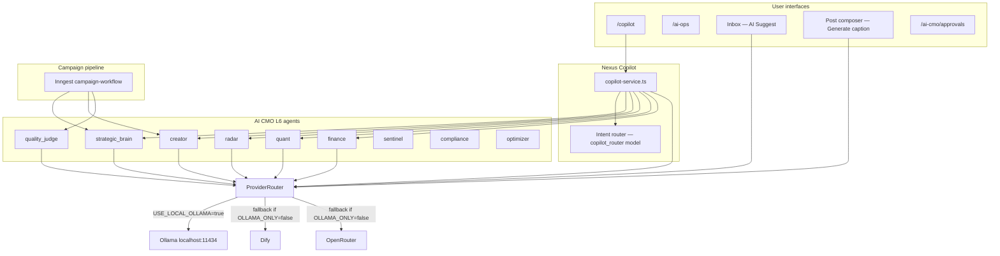

# Ollama Agent Integration — Nexus Social Platform

Local LLM backbone for all AI CMO agents, inbox AI, caption generation, and **Nexus Copilot**.

## Architecture



### Provider order

| `USE_LOCAL_OLLAMA` | `OLLAMA_ONLY` | Chain |
|--------------------|---------------|-------|
| `false` | — | Dify → OpenRouter |
| `true` | `false` | **Ollama → Dify → OpenRouter** |
| `true` | `true` | **Ollama only** (no cloud fallback) |

## Prerequisites

1. **Ollama** installed: [https://ollama.com](https://ollama.com)
2. **RAM/VRAM** — see model recommendations below
3. Nexus app running on **http://localhost:3005**

## Quick start

```powershell
# Terminal 1 — Ollama
ollama serve

# Terminal 2 — pull models (minimum + recommended)
ollama pull llama3.2
ollama pull llama3.1:8b

# Terminal 3 — app
cd e:\nexus-social-platform\nexus-social-app
copy .env.full-stack.example .env.local   # if needed
# Ensure these are set in .env.local:
#   USE_LOCAL_OLLAMA=true
#   OLLAMA_ONLY=true
#   OLLAMA_BASE_URL=http://localhost:11434
npm run dev
```

Verify integration:

```powershell
npm run verify:ollama-agents
```

Open **http://localhost:3005/copilot** and ask: `agent status`

## Environment variables

Copy from `.env.full-stack.example`:

```env
USE_LOCAL_OLLAMA=true
OLLAMA_ONLY=true
OLLAMA_BASE_URL=http://localhost:11434
OLLAMA_MODEL=llama3.2
OLLAMA_TIMEOUT_MS=120000

# Per-agent overrides (optional)
OLLAMA_MODEL_STRATEGIC_BRAIN=llama3.1:8b
OLLAMA_MODEL_CREATOR=llama3.1:8b
OLLAMA_MODEL_QUALITY_JUDGE=llama3.1:8b
OLLAMA_MODEL_INBOX=llama3.1:8b
OLLAMA_MODEL_COPILOT=llama3.1:8b
OLLAMA_MODEL_COMPLIANCE=llama3.1:8b
OLLAMA_MODEL_CAPTION=llama3.2
OLLAMA_MODEL_COPILOT_ROUTER=llama3.2
OLLAMA_MODEL_OPTIMIZER=llama3.2
OLLAMA_MODEL_RADAR=llama3.2
OLLAMA_MODEL_QUANT=llama3.2
OLLAMA_MODEL_SENTINEL=llama3.2
OLLAMA_MODEL_FINANCE=llama3.2
```

**Restart `npm run dev`** after changing `.env.local`.

## Per-agent model map

| Agent role | Default model | Used by |
|------------|---------------|---------|
| `strategic_brain` | llama3.1:8b | Campaign planning, Copilot campaigns |
| `creator` | llama3.1:8b | Content generation, Copilot campaigns |
| `quality_judge` | llama3.1:8b | Quality gate in campaign workflow |
| `inbox` | llama3.1:8b | Inbox AI Suggest, Chatwoot worker, Copilot replies |
| `caption` | llama3.2 | Post composer, Copilot captions |
| `copilot` | llama3.1:8b | General Copilot chat |
| `copilot_router` | llama3.2 | Copilot intent classification |
| `radar` | llama3.2 | Market signals agent, Copilot |
| `quant` | llama3.2 | Analytics insights, Copilot |
| `finance` | llama3.2 | ROI/budget agent, Copilot |
| `optimizer` | llama3.2 | Campaign optimization |
| `sentinel` | llama3.2 | Risk monitoring |
| `compliance` | llama3.1:8b | Policy/compliance checks |

### Hardware guidance

| RAM | Recommended pulls |
|-----|-------------------|
| 8 GB | `llama3.2` only (3B) — Judge/Creator quality reduced |
| 16 GB+ | `llama3.2` + `llama3.1:8b` (recommended) |
| 32 GB+ | Add `llama3.1:70b` for Brain/Judge via env overrides |

## Nexus Copilot

| Surface | Path / endpoint |
|---------|-----------------|
| Web UI | **http://localhost:3005/copilot** |
| Server action | `src/actions/copilot.ts` |
| REST API | `POST /api/v1/copilot/chat` (requires `x-api-key`) |
| Link from AI Ops | **http://localhost:3005/ai-ops** → "Open Copilot" |

### Copilot intents

| Intent | Trigger examples | Backend |
|--------|------------------|---------|
| `campaign_plan` | "launch summer campaign" | Brain + Creator |
| `caption` | "write a caption for…" | `caption` role via Ollama |
| `inbox_reply` | "reply to customer…" | `inbox` role |
| `market_signals` | "competitor trends" | Radar agent |
| `analytics_insight` | "CTR performance" | Quant agent |
| `finance_summary` | "ROI this month" | Finance agent |
| `agent_status` | "ollama status", "agent health" | System + Ollama `/api/tags` |
| `general` | everything else | `copilot` role |

### API example

```bash
curl -X POST http://localhost:3005/api/v1/copilot/chat \
  -H "Content-Type: application/json" \
  -H "x-api-key: YOUR_NEXUS_API_KEY" \
  -d '{"message":"agent status","workspaceId":"11111111-1111-1111-1111-111111111111"}'
```

## Connection points (code)

| Component | File |
|-----------|------|
| Per-agent model resolution | `src/lib/ai/ollama/agent-models.ts` |
| Ollama health check | `src/lib/ai/ollama/ollama-health.ts` |
| Provider router | `src/lib/ai/providers/provider-router.ts` |
| Ollama HTTP client | `src/lib/ai/providers/ollama-provider.ts` |
| Shared LLM wrapper | `src/lib/ai/shared-llm.ts` |
| Copilot orchestrator | `src/lib/ai/copilot/copilot-service.ts` |
| Caption (Ollama-first) | `src/actions/generateCaption.ts` |
| Inbox AI (Ollama-first) | `src/actions/aiReply.ts` |
| Chatwoot worker | `src/jobs/ai-orchestration.ts` |
| Approval UI fix | `src/actions/approval-decision.ts` |
| Verification script | `scripts/verify-ollama-agents.ts` |

## Verification checklist

1. `curl http://localhost:11434/api/tags` — lists pulled models
2. `npm run verify:ollama-agents` — smoke-tests every agent role + Copilot
3. `/copilot` → "agent status" — shows per-agent models
4. `/ai-cmo/approvals` — Approve/Reject works (session auth, no 401)
5. Post composer → Generate caption uses Ollama when enabled
6. Inbox → AI Suggest uses Ollama when enabled

## Model name auto-resolution

Configured names like `llama3.1:8b` and `llama3.2` are **automatically mapped** to whatever tags Ollama reports from `/api/tags`. Examples on your machine:

| Configured | Resolved to |
|------------|-------------|
| `llama3.1:8b` | `mani12maran05/llama3.1:8b` |
| `llama3.2` (not pulled) | falls back to any `llama3.1` 8B model |

Override explicitly in `.env.local` if you prefer a specific tag:

```env
OLLAMA_MODEL_STRATEGIC_BRAIN=llama3.1:8b-instruct-q4_K_M
```

## Performance notes

8B models on CPU can take **60–180 seconds** per call. Set `OLLAMA_TIMEOUT_MS=180000` (or higher) to avoid timeouts on Quality Judge and campaign planning.


| Symptom | Fix |
|---------|-----|
| `Ollama health: down` | Run `ollama serve`; check `OLLAMA_BASE_URL` |
| `model:quality_judge — NOT PULLED` | `ollama pull llama3.1:8b` |
| Slow responses | Lower to `llama3.2`; increase `OLLAMA_TIMEOUT_MS` |
| Falls back to Dify/OpenRouter | Set `OLLAMA_ONLY=true` |
| Copilot empty reply | Check dev server logs; confirm `USE_LOCAL_OLLAMA=true` and restart dev |
| `esbuild platform` error on verify script | Run `npm install` on Windows (don't copy Linux node_modules) |

## Data we need from your Ollama setup

To tune the integration, please provide:

1. **Output of `ollama list`** — which models are already pulled
2. **Endpoint URL** — default `http://localhost:11434` or remote host
3. **RAM/VRAM available** — determines 3B vs 8B vs larger models
4. **Whether `OLLAMA_ONLY=true`** — strict local-only vs cloud fallback
5. **Performance preference** — speed vs quality (affects per-agent model assignments)

Without `llama3.1:8b`, Brain/Creator/Judge will use `llama3.2` (3B) and quality scores may be lower.
