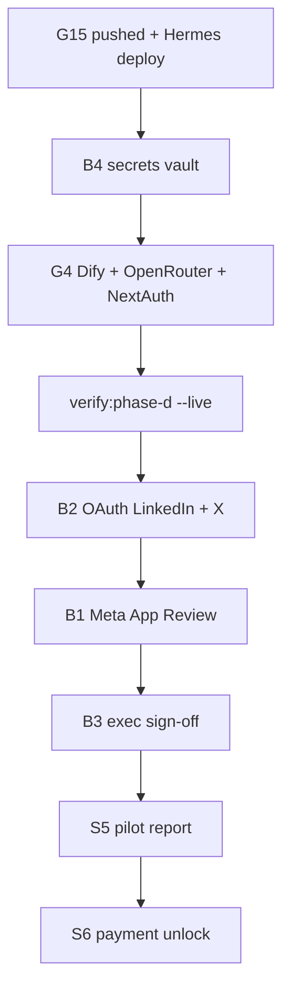

# Phase D — Human & Commercial Gates Integration Guide

**Speckit track:** `/speckit.specify` Phase D  
**Gate verify:** `npm run verify:phase-d` · `npm run verify:phase-d -- --live --report`  
**Authority:** [`GATES-REMAINING.md`](./GATES-REMAINING.md) · [`SECTION-B-CLOSURE.md`](./SECTION-B-CLOSURE.md)

---

## What is built vs what we want

| Gate | Built (code) | Want (operator) | Blocks |
|------|--------------|-----------------|--------|
| **B4** Prod secrets | `.env.production.template`, checklist, `verify:phase-d` | Fill vault on Hermes | All live traffic |
| **G4** LLM + flags | ProviderRouter, feature flags | `DIFY_*`, `OPENROUTER_*`, `NEXTAUTH_*` on VPS | AI campaigns + auth |
| **B2** OAuth UAT | OAuth routes, publishers, worker, UAT scripts | Connect platforms on live URL | Live publish |
| **B1** Meta App Review | Publish guard in worker | Meta submission + DB `approved` | FB/IG publish only |
| **B3** Exec sign-off | Engineering signed in UAT doc | Leadership names | Production certification |
| **S5** Pilot report | `generate:pilot-report` script | Run on prod workspace | Sales PDF |
| **S4** Provision | — (CL-033) | Signed pilot → CLI script | Client onboarding |
| **S6** Pit Crew | — (CL-036) | Payment → admin API | Agency margins |

---

## Integration matrix (alternatives)

### LLM — AI agents (Dify / OpenRouter / Ollama)

| Option | When to use | Env | Verify |
|--------|-------------|-----|--------|
| **A — Dify + OpenRouter (recommended prod)** | `nexussocial.tech` VPS | `USE_LOCAL_OLLAMA=false`, `DIFY_API_KEY`, `OPENROUTER_API_KEY` | `npm run ai:verify` |
| **B — OpenRouter only** | Dify outage / no Dify account | `OPENROUTER_API_KEY`; leave `DIFY_API_KEY` empty | Trigger campaign; check Inngest logs |
| **C — Self-hosted Dify** | Data residency / cost control | `DIFY_BASE_URL=https://your-dify.internal` | `npm run ai:verify` |
| **D — Ollama local** | Dev/UAT only — **not VPS prod** | `USE_LOCAL_OLLAMA=true` | `npm run verify:ollama-agents` |

**Production steps (Option A):**

1. Create [OpenRouter](https://openrouter.ai/keys) key → `OPENROUTER_API_KEY`
2. Publish Dify app → copy app API key → `DIFY_API_KEY` ([`OPS-DIFY-PUBLISH.md`](./OPS-DIFY-PUBLISH.md))
3. Inngest Cloud → sync `https://nexussocial.tech/api/inngest` → `INNGEST_SIGNING_KEY` + `INNGEST_EVENT_KEY`
4. `npm run verify:inngest-cloud`
5. Smoke: POST `/api/v1/ai-cmo/campaigns` → poll job → `completed`

---

### Social — OAuth & publish

| Platform | OAuth built | Publish built | Prod blocker | Alternative if blocked |
|----------|-------------|---------------|--------------|------------------------|
| **LinkedIn** | ✅ | ✅ | B2 connect + B4 secrets | — |
| **X** | ✅ | ✅ | B2 connect + B4 secrets | — |
| **Facebook** | ✅ | ✅ | **B1 Meta App Review** | Use LinkedIn/X for UAT; Lead Ads webhook for leads (no review) |
| **Instagram** | ✅ | ✅ | **B1 Meta App Review** | Same as Facebook |
| **TikTok / Snapchat** | ❌ | graceful skip | P2 backlog | Plan in Creator; manual publish |

#### Option A — Full production (all platforms)

1. Register OAuth apps (Meta, LinkedIn, X developer portals)
2. Set redirect URIs to `https://nexussocial.tech/api/oauth/{platform}/callback`
3. Fill secrets in `.env.production` ([template](../.env.production.template))
4. Deploy worker: `docker compose -f docker-compose.prod.yml up -d` (includes `nexus-social-worker`)
5. **B1:** Submit Meta App Review → [`OPS-META-APP-REVIEW.md`](./OPS-META-APP-REVIEW.md)
6. **B2:** Connect each platform at `https://nexussocial.tech/settings`
7. Schedule test post (+2 min) → confirm `published` in `/calendar`

#### Option B — LinkedIn + X first (skip Meta delay)

1. Steps 1–4 above (LinkedIn + X secrets only)
2. Run OAuth UAT for LinkedIn + X only (T053 partial)
3. Use Meta Lead Ads webhook for lead ingest (no App Review)
4. Complete B1 later for FB/IG publish

#### Option C — Dev/sandbox OAuth (pre-prod)

1. Use `http://localhost:3005` redirect URIs in sandbox apps
2. `npm run dev` + `npm run worker:dev`
3. `npm run uat:t053` or `npm run uat:t053:sandbox` (mock Graph)
4. Dev-only Meta gate: `npx ts-node scripts/t053-t057-status.ts --approve-meta-dev` (**not** real App Review)

---

### B4 — Production secrets (Hermes VPS)

```bash
cd /opt/platform/nexus-social-app
cp .env.production.template .env.production
# Edit with vault values — see OPS-PROD-SECRETS-CHECKLIST.md
docker compose -f docker-compose.prod.yml up -d
```

Verify:

```bash
set -a && source .env.production && set +a
npm run verify:phase-d -- --live --report
```

---

### B3 — Executive sign-off

1. Run `powershell -File scripts/close-section-b.ps1` (automated gates)
2. Fill leadership table in [`UAT-SIGNOFF-RESULTS.md`](./UAT-SIGNOFF-RESULTS.md)
3. Product + CTO + Compliance sign-off dates

---

### Commercial — S5 / S4 / S6

| Step | Command / action | Gate |
|------|------------------|------|
| Pilot PDF | On VPS host (not container): `PILOT_WORKSPACE_ID=<uuid> npm run generate:pilot-report` | S5-OPS |
| Signed pilot | Founder confirms → Eng ships `provision-pilot-client.ts` | S4 (CL-033) |
| Client #1 paid | Invoice cleared → reply **Sprint 6 Ready** | S6-PAY (CL-036) |
| Pit Crew | Eng builds `/admin` provision + margins | S6-ENG (after payment) |

---

## Gate ownership quick reference

| ID | Owner | Runbook |
|----|-------|---------|
| B1 | Product | `OPS-META-APP-REVIEW.md` |
| B2 | QA | `OPS-OAUTH-UAT-RUNBOOK.md` |
| B3 | Leadership | `UAT-SIGNOFF-RESULTS.md` |
| B4 | DevOps | `OPS-PROD-SECRETS-CHECKLIST.md` |
| G4 | DevOps | This doc § LLM |
| S5 | Founder | `generate:pilot-report` |
| S6 | Founder + Eng | CL-036 |

---

## Recommended close-out sequence



1. Deploy (`git pull` + `docker compose up -d`)
2. `verify:phase-d --live --report` → fix all **FAIL**
3. Connect LinkedIn + X (fastest path to live publish)
4. Parallel: Meta App Review submission
5. Leadership sign-off
6. Commercial: pilot report → sale → payment → Sprint 6
