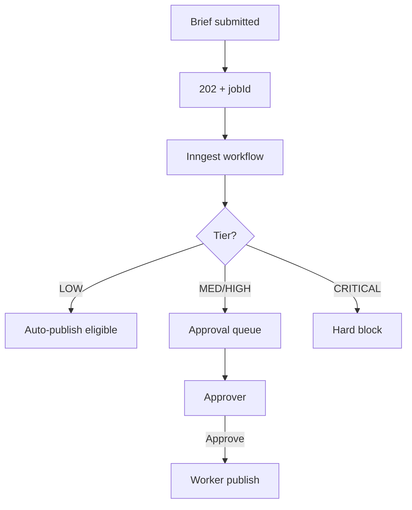

# 4. User Personas & Workflows

← [PRD Index](./README.md) · [05 Use Cases](./05-use-cases.md)

---

## 4.1 Personas

| Persona | Role | Goals | Pain points |
|---------|------|-------|-------------|
| **P1 — Agency Founder** | Operator, sales, delivery | Close pilots, prove ROI, maintain margin | Manual SQL; VPS ops lag |
| **P2 — Enterprise CMO** | Economic buyer | Pipeline influence, compliant campaigns, briefs | Needs board-ready narrative |
| **P3 — Marketing Operator** | Campaign manager | Schedule posts, run AI campaigns | Tool switching |
| **P4 — Compliance reviewer** | Risk approver | Block CRITICAL content | Ungoverned AI |
| **P5 — RevOps admin** | CRM owner | Closed-won sync, attribution | CRM disconnected |
| **P6 — Inbound prospect** | `/enterprise` visitor | Book demo | SaaS signup friction |
| **P7 — SDR / AE** | Lead qualifier | View leads, update status | Scattered leads |

---

## 4.2 Workflow — CMO intelligence brief (P2)

```mermaid
flowchart TD
    A[Login GitHub OAuth] --> B{Workspace?}
    B -->|No| C[Contact founder]
    B -->|Yes| D[/intelligence]
    D --> E[Upload GA4 CSV]
    E --> F[POST /intelligence/ingest]
    F --> G[Anomalies in feed]
    G --> H{Manual brief?}
    H -->|Yes| I[Generate Brief]
    H -->|No| J[Mon 09:00 UTC cron]
    I --> K[Brief card]
    J --> K
    K --> L[Copy to clipboard]
```

---

## 4.3 Workflow — Pilot ROI proof (P1)

```mermaid
flowchart TD
    A[Signed pilot] --> B[Provision workspace]
    B --> C[Seed ABM]
    C --> D[generate:pilot-report on VPS]
    D --> E[30-day data in Supabase]
    E --> F[/ai-cmo/attribution]
    F --> G[Client PDF]
    G --> H{Paid retainer?}
    H -->|Yes| I[Sprint 6 Ready]
    H -->|No| J[Iterate]
```

---

## 4.4 Decision tree — Authentication

```mermaid
flowchart TD
    Start[Visit nexussocial.tech] --> Public{Public?}
    Public -->|/enterprise| Landing[Landing + form]
    Public -->|Protected| Session{Session?}
    Session -->|No| Login[/login]
    Session -->|Yes| WS{Workspace member?}
    WS -->|No| Setup[Setup required]
    WS -->|Yes| Flag{SaaS UI?}
    Flag -->|true| SaaS[Full sidebar]
    Flag -->|false| Ent[Enterprise sidebar]
```

---

## 4.5 Decision tree — AI campaign approval



---

*See also: [09 UI & Navigation](./09-ui-navigation.md)*
