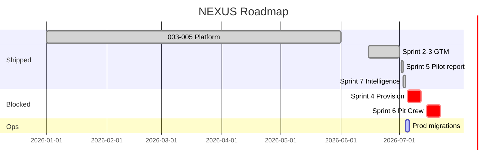

# 16. Implementation Roadmap

← [PRD Index](./README.md) · [PRD Status](./PRD-STATUS.md)

---

## 16.1 Phase timeline

| Phase | Sprints | Deliverable | Status |
|-------|---------|-------------|--------|
| Foundation | 003 / 1–11 | Real integrations | ✅ |
| AI CMO | 004 / 12–17 | 8-agent mesh | ✅ |
| Revenue loop | 005 / 18–19 | ABM, CRM, MENA | ✅ |
| Enterprise GTM | 2–3 | Skin, leads, OAuth | ✅ code; ops partial |
| Lighthouse | 4 | Provision CLI | 🔒 Sales |
| Prove ROI | 5 | Pilot report | ✅ |
| Scale delivery | 6 | Pit Crew | 🔒 Payment |
| Intelligence | 7 | Feed + briefs | ✅ code; DB ops |
| QA hardening | QA | Enterprise harness | ✅ |
| Production gates | B1–B6 | Human + staging | 🟡 |

---

## 16.2 Gantt (as of 2026-07-04)

---

## 16.3 Commit reference

| Era | Commit |
|-----|--------|
| 005 S18–19 | `72f7b91` |
| Sprint 2 | `3e795f2` |
| Sprint 3 | `60f7109` |
| Sprint 5 | `e38d6f6` |
| Sprint 7 | `ebd6222` |
| QA harness | `befc0c3` |

---

## 16.4 Resources

| Role | Responsibility |
|------|----------------|
| Founder/PM | Sales, pilot PDF, client delivery |
| Engineering | `main` implementation |
| Hermes | VPS deploy, migrations, secrets |
| QA | UAT, `qa:enterprise` |
| Leadership | A-GATE-002/003, exec sign-off |

---

## 16.5 Current blockers

| Blocker | Unlocks |
|---------|---------|
| Client #1 not paid | Sprint 6 |
| No signed pilot | Sprint 4 |
| Intelligence tables not on prod | Intelligence E2E |
| B1 Meta App Review | FB/IG publish |
| B4 secrets incomplete | Full OAuth/LLM |

---

## 16.6 Operator P0 checklist

- [ ] Hermes `git pull` through `befc0c3`
- [ ] Apply `20260705_enterprise_leads.sql` (if needed)
- [ ] Apply `20260715_intelligence_feed.sql`
- [ ] Inject LinkedIn, NextAuth, OpenRouter secrets
- [ ] Re-run `qa:enterprise:report` → 0 FAIL

*Tasks: `specs/000-nexus-program/tasks.md`*
