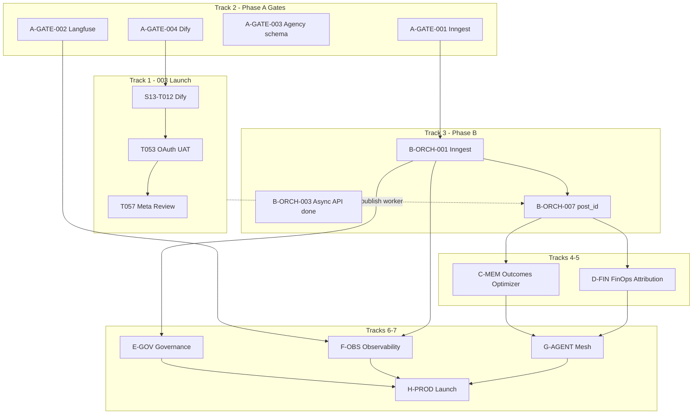

# Master Implementation Plan — All Open Work

**Feature:** 003 Real Integrations + 004 AI CMO PRD v3.0  
**Date:** 2026-06-23  
**Baseline:** Sprint 12–13 complete · partial Sprint 14 (Phase B–E skeleton)  
**Technical how:** [`plan.md`](./plan.md) · [`technical-plan.md`](./technical-plan.md)  
**Execution tracking:** [`implementation-plan.md`](./implementation-plan.md)  
**Repo source of truth:** this file supersedes scattered open-task lists until next sprint closeout

---

## Executive Summary

| Metric | Value |
|--------|-------|
| **Total open checklist items** | **~82** (deduplicated across tracks; see Not Completed Checklist) |
| **003 launch blockers** | 6 (T024, T053–T057) |
| **004 operator blockers** | 1 (S13-T012 Dify publish) |
| **004 leadership gates (Phase A)** | 5 |
| **004 engineering phases B–H** | ~70 tasks (22 partially started in Sprint 14 skeleton) |
| **Production readiness (5k workspaces)** | **Not ready** — audit ~3.5/10 runtime; minimum Phases A–F + Phase H agency migration |

### Critical path (two parallel tracks)

```text
TRACK A — Feature 003 LAUNCH (existing customers, publish/analytics truth)
  Operator UAT (T053/T055/T056) ──► Dify publish (S13-T012) ──► Meta App Review (T057)
  Engineering: T024 Playwright E2E (optional) · T054 CI on main

TRACK B — Feature 004 SCALE (5k workspaces)
  Phase A gates (Inngest, Langfuse, agency schema) ──► Phase B orchestration hardening
       ──► Phase C memory loop + Phase D FinOps (parallel after B1)
       ──► Phase E governance ──► Phase F observability ──► Phase G agents ──► Phase H launch
```

**Subagent `133c587c` partial delivery (2026-06-24, no Inngest/Langfuse):** Redis-based async campaigns (202 + poll), marketing event worker + DLQ, MemoryRepository, Optimizer skeleton, cost ledger + budget stub, evaluation/confidence persistence in workflow deps, draft migrations 000013/000014. **Not applied to Supabase; Inngest, post_id, MV refresh, attribution, approval queue still open.**

---

## Track 1: Feature 003 Launch

**Spec:** `../specs/003-real-integrations-production/tasks.md` (repo root) · **Checklist:** `LAUNCH_CHECKLIST.md`

| ID | Task | Status | Blocker | Owner |
|----|------|--------|---------|-------|
| T024 | Playwright E2E: schedule → worker publish → status `published` | Open (deferred) | Meta sandbox OAuth | Eng |
| T053 | Phase 1 UAT: OAuth → schedule → live publish | Open | Sandbox credentials | Operator |
| T054 | CI schema gate on `main`; zero PGRST205 | Open | Merge to main | Eng / CI |
| T055 | Phase 2 smoke: ingestion → analytics dashboard truth | Open | Published post + worker | Operator |
| T056 | Full-stack walkthrough end-to-end | Open | Docker stack up | Operator |
| T057 | Meta publish until App Review flag `approved` | Open (gate done) | Meta business approval | Business |

### Dify (shared 003/004)

| ID | Task | Status | Blocker | Owner |
|----|------|--------|---------|-------|
| S13-T012 | Publish Dify Strategic Brain + Creator apps | Open | Dify Studio publish | Operator |

**Verification:** `npm run ai:verify` (exit 0) · `npm run verify:staging` · manual steps in LAUNCH_CHECKLIST §8

**Engineering vs operator split**

| Work | Owner |
|------|-------|
| T024 Playwright publish E2E | Engineering |
| T054 CI activation on main | Engineering |
| T053/T055/T056 manual UAT scripts | Operator |
| T057 Meta App Review submission + DB flag | Business / Operator |
| S13-T012 Dify app publish + workspace API key | Operator |

---

## Track 2: Phase A — Leadership Gates

**Source:** `architecture-audit/15-roadmap-phases-A-H.md` · `implementation-plan.md`

| ID | Task | Decision / output | Status | Blocker | Owner |
|----|------|-------------------|--------|---------|-------|
| A-GATE-001 | Inngest approval + Cloud account (CL-002) | Written approval; `npm install inngest` unblocked | Open | Leadership | Eng Leadership |
| A-GATE-002 | Langfuse self-host vs Cloud | Observability stack decision | Open | Leadership | CIO |
| A-GATE-003 | Agency hierarchy sign-off | Approve migration `000014` (`agencies` table) | Open | Product | Product + Eng |
| A-GATE-004 | Dify Brain + Creator publish | `npm run ai:verify` exit 0 | Open | Operator action | Operator |
| A-GATE-005 | PDPL data flow review | Security sign-off for memory/FinOps | Open | Security review | Security |

**Exit criteria:** Decision log updated in `implementation-plan.md` Leadership Decisions table; A-GATE-001 unblocks B-ORCH-001–005.

---

## Track 3: Phase B — Orchestration

**Goal:** Durable async campaigns, event bridge, campaign → post link, DLQ.

### Subagent partial status

| Deliverable | File(s) | Status |
|-------------|---------|--------|
| Async campaign API (202 + poll) | `campaigns/route.ts`, `campaigns/jobs/[jobId]/route.ts`, `campaign-job-store.ts` | **Done** (Redis BRPOP) |
| Worker campaign job consumer | `jobs/campaign-orchestration.ts`, `worker.ts` | **Done** |
| Marketing event consumers | `marketing-event-worker.ts`, `worker.ts` | **Done** |
| Redis DLQ for failed events | `marketing-event-dlq.ts` | **Done** (not Inngest `ai_cmo_failed_jobs`) |
| Inngest install + route | — | **Not started** (blocked A-GATE-001) |
| Campaign → `post_id` via reconciler | — | **Not started** |
| Deprecate legacy BRPOP queue | `jobs/ai-orchestration.ts` | **Not started** |

### Task list

| ID | Task | Depends | Files to touch | Acceptance criteria | Test plan |
|----|------|---------|----------------|---------------------|-----------|
| B-ORCH-001 | Install Inngest + `api/inngest/route.ts` | A-GATE-001 | `package.json`, `src/app/api/inngest/route.ts`, `src/lib/orchestration/inngest-client.ts` | Inngest dev server receives functions; CI allows dep | `npm run typecheck`, Inngest dev smoke |
| B-ORCH-002 | Port `runCampaignWorkflow` to Inngest steps | B-ORCH-001 | `workflows/campaign-workflow.ts`, new Inngest functions | Retries: 3; steps idempotent | Unit + integration with Inngest test harness |
| B-ORCH-003 | Campaign API async (202 + job ID) | — | `campaigns/route.ts` | POST returns 202 + `pollUrl`; no HTTP block >30s | API test / manual curl |
| B-ORCH-004 | Worker registers marketing event consumers | — | `worker.ts`, `marketing-event-worker.ts` | Underperforming + budget events trigger replan | `marketing-event-consumers.test.ts`, worker log |
| B-ORCH-005 | Event bus → orchestration bridge | B-ORCH-002 | `marketing-event-consumers.ts`, Inngest `send` | Replan enqueued within 1 worker cycle | Event publish → replan job exists |
| B-ORCH-006 | Failed job persistence (DLQ) | B-ORCH-002 | Migration 000013 `ai_cmo_failed_jobs` OR keep Redis DLQ + admin API | 0 silent drops after 3 retries | DLQ length query / unit test |
| B-ORCH-007 | Wire campaign → post via reconciler (`post_id` FK) | 003 publish worker | `campaign-service.ts`, `reconciler.ts`, publish queue | `ai_cmo_campaigns.post_id` set; post enters 003 pipeline | Integration: campaign → scheduled post |
| B-ORCH-008 | Deprecate legacy `ai-orchestration` BRPOP | B-ORCH-002 | `jobs/ai-orchestration.ts`, docs | Single orchestration path documented | Regression: 003 publish unchanged |

**Sprint mapping:** S14-T001 (Inngest), S14-T002 (post_id), S14-T003 (consumers — **partial done**)

**npm scripts:** `npm test` · `npm run typecheck` · `npm run build` · run worker: `npm run worker:dev`

---

## Track 4: Phase C — Memory & Optimizer

**Goal:** Closed-loop learning — outcomes → Optimizer → learnings → Brain retrieval.

### Subagent partial status

| Deliverable | Status |
|-------------|--------|
| `MemoryRepository` read path | **Done** — `memory-repository.ts`, wired in `campaign-workflow-deps.ts` |
| Optimizer skeleton | **Done** — `optimizer-agent.ts` writes via reconciler |
| Migration 000013 draft (decision ledger, experiments) | **Draft only** — not applied |
| Outcome ingestion job | **Not started** |
| Qdrant hybrid retrieval | **Not started** |
| Optimizer Inngest/cron trigger | **Not started** |

| ID | Task | Depends | Files | Acceptance | Tests |
|----|------|---------|-------|------------|-------|
| C-MEM-001 | Apply migration 000013 (decision ledger, agent_decisions, experiments) | A-GATE-003 partial | `supabase/migrations/20260624_000013_ai_cmo_sprint14_draft.sql` | `schema:verify:004` extended | `npm run schema:verify:004` |
| C-MEM-002 | MemoryRepository production hardening | C-MEM-001 | `memory-repository.ts` | retrieve returns ranked learnings for workspace | `memory-repository.test.ts` |
| C-MEM-003 | Outcome job: `post_analytics` → `ai_cmo_campaign_outcomes` | B-ORCH-007 | `src/jobs/ai-cmo/sync-outcomes.ts` | 80% campaigns have outcome within 48h of publish | Job unit test + manual |
| C-MEM-004 | Optimizer agent production loop | C-MEM-003 | `optimizer-agent.ts`, worker/Inngest cron | ≥1 learning row per completed campaign | `optimizer-agent.test.ts` |
| C-MEM-005 | Qdrant learning index (optional L3) | C-MEM-002 | Vector store abstraction | Semantic retrieval beyond SQL rank | TBD Sprint 15 |
| C-MEM-006 | Strategy history writes from Brain/Optimizer | C-MEM-004 | `strategic-brain.ts`, reconciler | Rows in `ai_cmo_strategy_history` | Unit test |

**Sprint mapping:** S14-T005 (**partial**), S14-T006 (**partial**)

**Gap IDs closed:** C6, H1, H2, M1

---

## Track 5: Phase D — FinOps & Attribution

**Goal:** Cost tracking, budget caps, attribution MV refresh.

### Subagent partial status

| Deliverable | Status |
|-------------|--------|
| `recordAgentCost` on Brain/Creator | **Done** |
| `checkBudgetPolicy` stub | **Done** (graceful if `ai_cmo_budget_policies` missing) |
| `ai_cmo_budget_policies` table | **Draft in 000013** — not applied |
| MV refresh cron | **Not started** |
| Attribution ingestion | **Not started** |
| Unified cost view MV | **Not started** |

| ID | Task | Depends | Files | Acceptance | Tests |
|----|------|---------|-------|------------|-------|
| D-FIN-001 | Apply budget_policies section of 000013 | C-MEM-001 | migration 000013 | Table queryable; RLS | `schema:verify:004` |
| D-FIN-002 | Agent cost middleware (complete) | — | `finops/cost-ledger.ts`, agents | 100% agent calls log to ledger | `cost-ledger.test.ts` |
| D-FIN-003 | Pre-flight budget at orchestration step 0 | D-FIN-001 | `budget-policy.ts`, `campaign-orchestration.ts` | 0 workflows start over cap | `budget-policy.test.ts` |
| D-FIN-004 | MV refresh cron (cost + attribution) | — | `src/jobs/ai-cmo/refresh-mvs.ts`, `worker.ts` | Hourly REFRESH; dashboards not stale | Worker integration |
| D-FIN-005 | Attribution event ingestion | B-ORCH-007 | reconciler → `ai_cmo_attribution_events` | UTM + webhook events persisted | Unit test |
| D-FIN-006 | Unified credit/cost reporting MV | D-FIN-002 | migration + SQL | Joins 003 `ai_credit_ledger` + 004 cost | SQL verify |

**Sprint mapping:** S14-T004, S14-T007 (**partial**), S14-T008

**Gap IDs closed:** C3, H9, M12

---

## Track 6: Phase E — Governance & Quality

**Goal:** Approval queue, LLM-as-Judge, structured policy, confidence persistence.

### Subagent partial status

| Deliverable | Status |
|-------------|--------|
| `persistEvaluationViaReconciler` + `updateCampaignConfidenceViaReconciler` | **Done** in `campaign-workflow-deps.ts` |
| Human approval queue table + UI | **Not started** |
| LLM-as-Judge job | **Not started** |
| Structured ContentPiece policy pipeline | **Not started** |
| PII scrubber for memory | **Not started** |

| ID | Task | Depends | Files | Acceptance | Tests |
|----|------|---------|-------|------------|-------|
| E-GOV-001 | `ai_cmo_approval_requests` table + API | C-MEM-001 | migration 000013+, API routes | CRITICAL never auto-publishes | API test |
| E-GOV-002 | Structured ContentPiece extraction | — | `content-quality-engine.ts`, policy | Regex replaced with typed fields | Policy tests |
| E-GOV-003 | Expand POLICY_RULES (MENA PDPL) | — | `policy-engine.ts` | Compliance agent ruleset baseline | `policy-engine.test.ts` |
| E-GOV-004 | LLM-as-Judge evaluation job | B-ORCH-002 | `src/jobs/ai-cmo/llm-judge.ts` | Post-Creator eval rows in `ai_cmo_evaluations` | Unit test |
| E-GOV-005 | 8-dimension schema extensions | C-MEM-001 | migration | Eval dimensions populated | Schema verify |
| E-GOV-006 | Cannibalization + EEAT gates | — | `content-quality-engine.ts` | Gates block or flag in workflow | Quality tests |
| E-GOV-007 | Confidence persist on all campaigns | — | `campaign-service.ts` | `calibrated_confidence` on campaign row after workflow | campaign-service tests |
| E-GOV-008 | Approval inbox UI (minimal) | E-GOV-001 | settings or admin page | Operator can approve/reject | Manual UAT |

**Sprint mapping:** S16-T003 (partial overlap)

**Gap IDs closed:** C8, H3, H6, H11, H13, H14

---

## Track 7: Phases F–H (Observability, Agent Mesh, Productization, DR)

### Phase F — Observability & Resilience (not started)

| ID | Task | Depends | Owner | Gap |
|----|------|---------|-------|-----|
| F-OBS-001 | OTel SDK (API + worker + agents) | A-GATE-002 | Eng | — |
| F-OBS-002 | Langfuse integration | F-OBS-001 | Eng | — |
| F-OBS-003 | Sentry agent error boundaries | — | Eng | — |
| F-OBS-004 | `circuit-breaker.ts` on Dify/OpenRouter | — | Eng | H7 |
| F-OBS-005 | `/admin/ai-ops` dashboard | F-OBS-002 | Eng | H10 |
| F-OBS-006 | Redis stream lag monitoring | B-ORCH-004 | Eng | M13 |
| F-OBS-007 | Per-workspace rate limits (service-role) | — | Eng | **C7** |
| F-OBS-008 | SLO alerting rules | F-OBS-005 | Eng | — |

**Sprint mapping:** S16-T004, S16-T005

### Phase G — Agent Mesh (not started)

| ID | Task | Depends | Owner | Gap |
|----|------|---------|-------|-----|
| G-AGENT-001 | Radar → event bus | C-MEM-003, D-FIN-003 | Eng | H5 |
| G-AGENT-002 | Channel Risk heatmap API | — | Eng | M6 |
| G-AGENT-003 | Quant agent | — | Eng | M7 |
| G-AGENT-004 | Sentinel anomaly detection | F-OBS-005 | Eng | M8 |
| G-AGENT-005 | Finance agent (Stripe pipeline) | D-FIN-006 | Eng | M5 |
| G-AGENT-006 | Portfolio S&OP scenarios | — | Eng | M4 |
| G-AGENT-007 | Event-driven replan production | B-ORCH-005 | Eng | — |

**Sprint mapping:** S15-T001–T004, S16-T001–T002

### Phase H — Productization & Launch (draft only)

| ID | Task | Depends | Owner | Gap |
|----|------|---------|-------|-----|
| H-PROD-001 | Apply migration 000014 (`agencies`) | A-GATE-003 | Eng | **C4** |
| H-PROD-002 | Tenant/agency/brand UI | H-PROD-001 | Eng | M11 |
| H-PROD-003 | White-label in explainability | — | Eng | — |
| H-PROD-004 | Playwright AI CMO smoke E2E | B-ORCH-007 | Eng | M15 |
| H-PROD-005 | LAUNCH_CHECKLIST extension | — | Eng | — |
| H-PROD-006 | DR tabletop + Redis HA | — | Ops + Eng | — |
| H-PROD-007 | Load test 500 concurrent workspaces | B–F complete | Eng | — |
| H-PROD-008 | Production readiness sign-off | H-PROD-004–007 | Leadership | — |

**Sprint mapping:** S17-T001–T005 · draft SQL: `20260624_000014_agencies_hierarchy_draft.sql`

**Additional gap backlog (Medium/Low):** M2–M3, M9–M10, M14, L1–L6 — schedule in Sprints 15–17 or Phase F/H as noted in `02-gap-analysis-matrix.md`.

---

## Dependency Graph



---

## Suggested Sprint Sequence (Sprints 14–17)

| Sprint | Weeks (est.) | Primary tracks | Key outcomes |
|--------|--------------|----------------|--------------|
| **14** | 2–3 | A (close gates) + B + C/D partial | Inngest OR document Redis fallback; post_id wired; 000013 applied; outcomes job; FinOps MV cron |
| **15** | 2–3 | E + F partial + G partial | Approval queue; LLM-as-Judge; circuit breakers; Radar + Channel Risk |
| **16** | 2–3 | F + G + H prep | AI Ops dashboard; Finance/Portfolio agents; agency migration prep |
| **17** | 2–3 | H + 003 launch hardening | Hierarchy UI; E2E smoke; load test; production sign-off |

**Parallel work:** Track 1 (003 UAT + Meta) runs entire time without blocking 004 engineering except B-ORCH-007 dependency on 003 publish worker.

---

## Testing Matrix

| Track | npm / scripts | When |
|-------|---------------|------|
| **All** | `npm run typecheck` | Every PR |
| **All** | `npm test` | Every PR (current baseline: 94+ after Sprint 14 skeleton tests) |
| **All** | `npm run build` | Every PR |
| **003 + 004 DB** | `npm run schema:verify` | Migrations touching 003 |
| **004 DB** | `npm run schema:verify:004` | After 000013+ applied |
| **003 launch** | `npm run ai:verify` | Staging gate |
| **003 launch** | `npm run verify:staging` | Pre-release |
| **003 launch** | `npm run preflight` | Full stack |
| **003 UAT** | `npm run walkthrough` | T056 |
| **003 E2E** | `npx playwright test e2e/smoke.spec.ts` | T024/T053 adjunct |
| **004 worker** | `npm run worker:dev` | B-ORCH-004, C-MEM-003, D-FIN-004 |
| **004 E2E** | Playwright AI CMO smoke (S17) | H-PROD-004 |
| **004 load** | `load-tests/` (TBD) | H-PROD-007 |

---

## Not Completed Checklist (all task IDs)

### Feature 003 (`specs/003-real-integrations-production/tasks.md`)

| ID | Status | Blocker | Owner |
|----|--------|---------|-------|
| T024 | Open | Meta sandbox OAuth | Eng |
| T053 | Open | Sandbox credentials | Operator |
| T054 | Open | Merge to main | Eng |
| T055 | Open | Needs published post | Operator |
| T056 | Open | Full-stack compose | Operator |
| T057 | Open | Meta App Review | Business |

### Feature 004 — Sprint tasks (`tasks.md`)

| ID | Status | Blocker | Owner |
|----|--------|---------|-------|
| S13-T012 | Open | Dify publish | Operator |
| S14-T001 | Open | A-GATE-001 | Eng |
| S14-T002 | Open | 003 publish path | Eng |
| S14-T003 | **Partial** | Production soak | Eng |
| S14-T004 | Open | — | Eng |
| S14-T005 | **Partial** | 000013 not applied | Eng |
| S14-T006 | **Partial** | Outcome job missing | Eng |
| S14-T007 | **Partial** | 000013 policies | Eng |
| S14-T008 | Open | — | Eng |
| S15-T001 | Open | S14 events | Eng |
| S15-T002 | Open | — | Eng |
| S15-T003 | Open | B-ORCH-005 | Eng |
| S15-T004 | Open | C-MEM-002 | Eng |
| S16-T001 | Open | D-FIN-006 | Eng |
| S16-T002 | Open | — | Eng |
| S16-T003 | Open | — | Eng |
| S16-T004 | Open | — | Eng |
| S16-T005 | Open | A-GATE-002 | Eng |
| S17-T001 | Open | H-PROD-001 | Eng |
| S17-T002 | Open | E-GOV-004 | Eng |
| S17-T003 | Open | — | Eng |
| S17-T004 | Open | B-ORCH-007 | Eng |
| S17-T005 | Open | F-OBS-001 | Eng |

### Phase A gates

| ID | Status | Blocker | Owner |
|----|--------|---------|-------|
| A-GATE-001 | Open | Leadership | Eng Leadership |
| A-GATE-002 | Open | Leadership | CIO |
| A-GATE-003 | Open | Product sign-off | Product |
| A-GATE-004 | Open | Dify Studio | Operator |
| A-GATE-005 | Open | Security review | Security |

### Phase B (B-ORCH)

| ID | Status | Blocker | Owner |
|----|--------|---------|-------|
| B-ORCH-001 | Open | A-GATE-001 | Eng |
| B-ORCH-002 | Open | B-ORCH-001 | Eng |
| B-ORCH-003 | **Done** (Redis) | Inngest optional upgrade | Eng |
| B-ORCH-004 | **Partial** | Soak test | Eng |
| B-ORCH-005 | Open | B-ORCH-002 | Eng |
| B-ORCH-006 | **Partial** (Redis DLQ) | Inngest table optional | Eng |
| B-ORCH-007 | Open | — | Eng |
| B-ORCH-008 | Open | B-ORCH-002 | Eng |

### Phase C (C-MEM)

| ID | Status | Blocker | Owner |
|----|--------|---------|-------|
| C-MEM-001 | Open | Leadership on 000013 | Eng |
| C-MEM-002 | **Partial** | C-MEM-001 | Eng |
| C-MEM-003 | Open | B-ORCH-007 | Eng |
| C-MEM-004 | **Partial** | C-MEM-003 | Eng |
| C-MEM-005 | Open | — | Eng |
| C-MEM-006 | Open | C-MEM-004 | Eng |

### Phase D (D-FIN)

| ID | Status | Blocker | Owner |
|----|--------|---------|-------|
| D-FIN-001 | Open | C-MEM-001 | Eng |
| D-FIN-002 | **Partial** | — | Eng |
| D-FIN-003 | **Partial** | D-FIN-001 | Eng |
| D-FIN-004 | Open | — | Eng |
| D-FIN-005 | Open | B-ORCH-007 | Eng |
| D-FIN-006 | Open | D-FIN-002 | Eng |

### Phase E (E-GOV)

| ID | Status | Blocker | Owner |
|----|--------|---------|-------|
| E-GOV-001 | Open | C-MEM-001 | Eng |
| E-GOV-002 | Open | — | Eng |
| E-GOV-003 | Open | — | Eng |
| E-GOV-004 | Open | B-ORCH-002 | Eng |
| E-GOV-005 | Open | C-MEM-001 | Eng |
| E-GOV-006 | Open | — | Eng |
| E-GOV-007 | **Partial** | Workflow coverage | Eng |
| E-GOV-008 | Open | E-GOV-001 | Eng |

### Phase F (F-OBS) — all Open, Owner: Eng

F-OBS-001 through F-OBS-008

### Phase G (G-AGENT) — all Open, Owner: Eng

G-AGENT-001 through G-AGENT-007

### Phase H (H-PROD) — all Open; H-PROD-001 draft SQL exists

H-PROD-001 through H-PROD-008

### Critical / High gaps (from audit matrix) — remediation open

| ID | Phase | Status |
|----|-------|--------|
| C1–C8 | B–H | Open (C5 partial via Redis 202) |
| H1–H14 | B–H | Open (H14 partial) |
| M1–M15 | Various | Open (M14 = S13-T012) |
| L1–L6 | Future | Open |

---

## Notion Sync

**Status (2026-06-23):** Notion Implementation Plan updated via MCP with tech stack summary and links to `plan.md` / `technical-plan.md`.

- Notion page: [Implementation Plan: AI CMO Architecture Audit → Phases A–H](https://app.notion.com/p/3886f21f521a81299df5c6803bfc713a)
- Repo mirror: `specs/004-ai-cmo-master-prd-v3/implementation-plan.md`
- Open tasks: sync from this file (`IMPLEMENT_PLAN_ALL_OPEN.md`) — do not duplicate Done items

---

## Top 5 Critical Path Items

1. **A-GATE-001 / S14-T001 — Inngest approval** — Blocks production-grade durable orchestration (C1, H8); Redis fallback is interim only.
2. **T057 / Meta App Review** — Blocks Facebook/Instagram production publish; engineering gate complete.
3. **B-ORCH-007 / S14-T002 — Campaign → `post_id` reconciler link** — Closes AI CMO → 003 publish loop (H4); unblocks outcomes and attribution.
4. **A-GATE-004 / S13-T012 — Dify publish** — Blocks `ai:verify`, staging preflight, and live Brain/Creator without OpenRouter fallback.
5. **C-MEM-001 / D-FIN-001 — Apply migration 000013** — Unblocks budget policies, decision ledger, approval queue schema (C3, C6, C8, M1).

---

## Document History

| Date | Change |
|------|--------|
| 2026-06-24 | Initial master plan; incorporates subagent `133c587c` partial Phase B–E skeleton |
