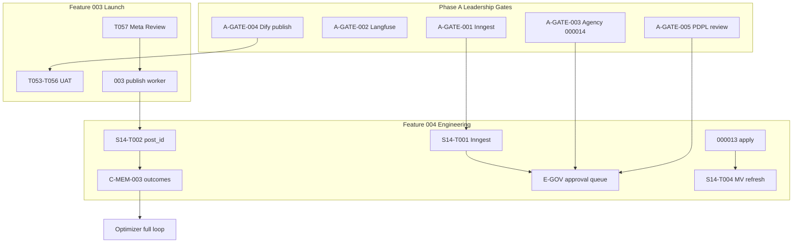

# Cross-Artifact Analysis — Nexus Social (Features 003 + 004)

**Date:** 2026-06-24 (speckit.analyze refresh)  
**Workspace:** `nexus-social-app`  
**Merged inputs:** subagent `7de3b795` (specify), speckit.clarify pass (CL-008–CL-022 complete), architecture-audit 01–16, `IMPLEMENT_PLAN_ALL_OPEN.md`, repo verification run 2026-06-24

**Verification run (2026-06-24):**

```text
npm test              → 107 passed (31 files)
npm run schema:verify → 18/18 (003)
npm run schema:verify:004 → 11/11 (004)
npm run typecheck     → pass
npm run build         → pass
```

---

## 1. Executive Project Status

| Dimension | Feature 003 (Launch) | Feature 004 (AI CMO) | Whole Platform |
|-----------|----------------------|----------------------|----------------|
| **Task completion** | **56/62** (90%) | **29/34** explicit sprint tasks (85%); ~**40%** of Phase B–H open work | **~55%** launch track · **~38%** scale track |
| **FR / US coverage** | N/A (003 uses US1–US11) | **12/55 FR done** (22%) · **22/55 FR partial+** (40%) · **2/20 US done** · **7/20 US partial** | **~35%** runtime (audit modules A–W) |
| **Tests** | Included in 107 suite | 31 files; ai-cmo, events, sync, governance covered | **107** unit tests; **0** Playwright E2E (T024 deferred) |
| **Schema** | **18/18** live | **11/11** live (000011–000012); **000013/000014 draft** | 29 tables verified; 2 draft migrations |
| **Launch readiness** | **Pilot-ready** (engineering) | **Demo-ready** (single-workspace) | See verdict below |

### Launch readiness verdict

| Track | Score (0–10) | Verdict |
|-------|--------------|---------|
| **003 staging / pilot UAT** | **8.0** | Engineering complete; **blocked on operator UAT (T053–T056) + Meta App Review (T057)** |
| **004 internal demo** | **4.5** | Brain/Creator + async campaigns work; **no publish loop, no approval queue, no Inngest** |
| **004 production @ 5k workspaces** | **3.5** | Audit baseline 3.1; +0.4 for Sprint 14 partial (event worker, DLQ, FinOps stubs) — **NOT READY** |
| **Combined platform go-live** | **6.0** | Safe for **controlled pilot** on 003 paths; **not** for autonomous AI CMO at agency scale |

**Critical path:** Operator UAT + Dify publish (S13-T012) → Meta approval → B-ORCH-007 (`post_id`) → A-GATE-001 (Inngest) → Phase C–E exit → Phase H agency migration.

---

## 2. Cross-Artifact Consistency Matrix

| Artifact A | Artifact B | Consistent? | Drift notes |
|------------|------------|-------------|-------------|
| `tasks.md` [x] vs code | `src/lib/ai-cmo/`, `worker.ts`, migrations | **Mostly yes** | S14-T002 (`post_id`) marked open — confirmed no FK wiring in `campaign-service.ts` |
| `tasks.md` vs `IMPLEMENT_PLAN_ALL_OPEN.md` | Sprint 14 partial | **Yes** | Both agree 6/10 S14 items done; Inngest/post_id/attribution/MV open |
| `spec.md` FR status vs code | Implementation paths | **Yes** | FR-004, FR-024, FR-025, FR-022 match code |
| `spec.md` vs `analysis.md` (prior) | Test count | **No** | Old analysis: 94 tests; **current: 107** (+13 from Sprint 14 modules) |
| `LAUNCH_CHECKLIST.md` vs repo | Test count | **No** | Checklist header still says **94 tests** — stale |
| `architecture-audit/16` vs repo | Sprint 14 progress | **No** | Doc says "event bus not in worker" — **closed** (`marketing-event-worker.ts` in `worker.ts`) |
| `architecture-audit/02` gap matrix | Runtime % | **No** | C2, C5 partially closed; C3/C6/H1/H8/H14 partially closed — matrix not refreshed |
| `architecture-audit/02` vs `spec.md` | FinOps runtime | **No** | Gap says 0%; `cost-ledger.ts` + `budget-policy.ts` exist (~35% per spec) |
| `clarifications.md` vs clarify task | CL-008–CL-022 | **Yes** | CL-008–CL-022 + Open Questions added 2026-06-24 |
| `user-stories.md` vs `spec.md` traceability | US-001–US-020 | **Yes** | Status labels align |
| `plan.md` vs `tasks.md` | Sprint 14 scope | **Yes** | Deferred section matches |
| `constitution.md` vs code | Reconciler-only writes | **Yes** | Agents use `campaign-service.ts` → reconciler |
| Notion Feature 004 vs repo | Requirements snapshot | **Mostly yes** | Updated by `7de3b795`; missing this analyze refresh |
| Notion task DB vs `tasks.md` | Task counts | **Unknown** | Manual sync required — query returned DB `33b8c931` but not reconciled this run |
| `003/tasks.md` vs `LAUNCH_CHECKLIST` | 56/62 | **Yes** | 6 open: T024, T053–T057 |
| `IMPLEMENT_PLAN` (~82 open) vs `tasks.md` | Granularity | **Expected drift** | IMPLEMENT_PLAN decomposes phases into ~82 checklist items; tasks.md has 34 sprint lines |

**Consistency issues found: 7 material drifts** (test count ×2, audit stale ×3, Notion partial ×1, IMPLEMENT granularity ×1 expected).

---

## 3. Requirements Coverage

### 3.1 Functional requirements (FR-001–FR-055)

| Status | Count | IDs (summary) |
|--------|-------|---------------|
| **Done** | 12 | FR-004, FR-008, FR-022, FR-024, FR-025 + NFR-001, NFR-002, NFR-011, NFR-012 (ongoing) |
| **Partial** | 10 | FR-001, FR-003, FR-005, FR-009, FR-011, FR-016, FR-017, FR-021, FR-028, FR-032, FR-035, FR-036, FR-045, FR-048, FR-052 |
| **Not built** | 30 | FR-002, FR-006–FR-007, FR-010, FR-013–FR-015, FR-018–FR-020, FR-023, FR-026–FR-027, FR-029–FR-031, FR-033–FR-034, FR-037–FR-044, FR-046–FR-047, FR-049–FR-051, FR-053–FR-055 |
| **Draft / blocked** | 3 | FR-012 (000013), FR-049 (000014), FR-002 (A-GATE-001) |

**FR coverage:** **22% fully done** · **40% with any implementation** · **55% missing or draft-only**

### 3.2 Non-functional requirements (NFR-001–NFR-012)

| Status | Count |
|--------|-------|
| Done | 3 (NFR-001, NFR-002, NFR-011) |
| Partial | 2 (NFR-006, NFR-012) |
| Not built / not measured | 7 |

**NFR coverage: 25% done · 42% partial+ · 58% open**

### 3.3 User stories (US-001–US-020)

| Status | Count | Stories |
|--------|-------|---------|
| **Done** | 2 | US-001, US-008 |
| **Partial** | 7 | US-002, US-005, US-006, US-007, US-009, US-011, US-015 |
| **Not built** | 11 | US-003, US-004, US-010, US-012–US-014, US-016–US-020 |

**US coverage: 10% done · 45% partial+ · 55% not built**

### 3.4 Coverage % by module

| Module | FR range | Coverage % | Notes |
|--------|----------|------------|-------|
| **Orchestration** | FR-001–008 | **45%** | Redis async + worker consumers; Inngest + `post_id` open |
| **Memory** | FR-009–015 | **25%** | Schema + MemoryRepository read; no outcome job |
| **Governance** | FR-016–023 | **35%** | Policy/quality engines; no approval queue or Judge |
| **Agents** | FR-024–031 | **30%** | Brain + Creator only |
| **FinOps** | FR-032–038 | **25%** | Cost hooks + budget stub; 000013 not applied |
| **Observability** | FR-039–044 | **0%** | Phase F not started |
| **SEO** | FR-045–047 | **15%** | Quality engine only |
| **Multi-tenant** | FR-048–052 | **30%** | 000011 live; no agencies UI |
| **DR** | FR-053–055 | **0%** | Documentation only in audit |

---

## 4. Gap Analysis (vs audit `02-gap-analysis-matrix.md`)

### Closed or materially improved since 2026-06-23 audit

| Gap ID | Title | Prior state | Current state (2026-06-24) |
|--------|-------|-------------|----------------------------|
| **C2** | Worker ↔ event bus | Missing | **Closed** — `startMarketingEventConsumer` in `worker.ts` |
| **C5** | Async campaign API | Sync POST | **Closed** — 202 + poll (`S14-T008`) |
| **C6** | Memory retrieval | `[]` stub | **Partial** — `memory-repository.ts` wired in workflow deps |
| **H1** | Optimizer agent | Missing | **Partial** — skeleton + reconciler writes |
| **H8** | DLQ | console.error | **Partial** — Redis DLQ (`marketing-event-dlq.ts`) |
| **H14** | Confidence persistence | API only | **Partial** — workflow deps + S14-T009 |
| **M14** | Dify unpublished | Open | **Still open** — S13-T012 operator action |

### Still open — critical (release blockers for 5k workspaces)

| Gap ID | Title | Blocker for |
|--------|-------|-------------|
| **C1** | Durable orchestration (Inngest) | FR-002, US-009, scale |
| **C3** | FinOps runtime + budget caps | US-007; needs 000013 apply |
| **C4** | Agency hierarchy | US-011; 500 agencies target |
| **C7** | Service-role blast radius | FR-043; enterprise security |
| **C8** | Human approval queue | US-004, FR-017, NFR-006 |
| **H2** | Outcome ingestion | US-005 closed loop |
| **H3** | LLM-as-Judge | US-020 |
| **H4** | Campaign → post link | **US-003** — top P1 gap |
| **H9** | MV refresh cron | US-006 |
| **M1** | Decision ledger | FR-012; migration 000013 draft |

Full matrix: [architecture-audit/02-gap-analysis-matrix.md](./architecture-audit/02-gap-analysis-matrix.md)

---

## 5. Risk Register — Top 10

| ID | Risk | Severity | Mitigation status |
|----|------|----------|-------------------|
| **R1** | Inngest not installed — no durable retries/idempotency at scale | **High** | **Open** — CL-008 pending; A-GATE-001 |
| **R2** | Campaign → publish loop broken (`post_id` never set) | **High** | **Open** — CL-015 contract defined; B-ORCH-007 |
| **R3** | Meta App Review blocks production Meta/IG publish | **High** | **Gate implemented** (T057); CL-020 business decision pending |
| **R4** | Migration 000013 not applied — budget policies + decision ledger missing | **Medium** | **Open** — draft SQL exists; operator apply needed |
| **R5** | Dify apps unpublished — Brain/Creator rely on OpenRouter fallback | **Medium** | **Open** — CL-011; S13-T012 operator action |
| **R6** | Cross-tenant RLS leak via agency roll-up | **High** | **Partial** — CL-010; agency layer untested (000014) |
| **R7** | Redis SPOF for events + queues | **Medium** | **Open** — CL-012/CL-018; single instance today |
| **R8** | No observability — cannot meet 99.9% SLO | **High** | **Open** — CL-009; A-GATE-002; Phase F not started |
| **R9** | CRITICAL content auto-publish without approval queue | **High** | **Partial** — CL-014; policy engine blocks; no persistent queue (C8) |
| **R10** | Documentation drift causes wrong launch decisions | **Medium** | **Improving** — clarifications complete; LAUNCH_CHECKLIST + audit 16 still need refresh |

---

## 6. Dependency Graph



**Blocking chains:**

1. **003 live publish:** T057 (Meta) → T053 UAT → optional T024 E2E  
2. **004 publish loop:** 003 publish worker + **B-ORCH-007** (`post_id`) — **no 004 task completes US-003 without this**  
3. **004 durable scale:** A-GATE-001 → S14-T001 → B-ORCH-002 → event bridge (B-ORCH-005)  
4. **004 FinOps enforcement:** 000013 apply → budget_policies table → FR-035/036 hard block  
5. **004 agency scale:** A-GATE-003 → 000014 apply → hierarchy UI (Phase H)

---

## 7. Feature 003 Launch Track — T024, T053–T057

| ID | Task | Status | Detail |
|----|------|--------|--------|
| **T024** | Playwright E2E: schedule → worker publish → `published` | **Open (deferred)** | Engineering optional; Meta sandbox OAuth complicates automation; manual UAT (T053) is primary gate |
| **T053** | Phase 1 UAT: OAuth → schedule → live publish | **Open** | **Operator** — requires sandbox OAuth credentials + running worker |
| **T054** | CI schema gate on `main`; zero PGRST205 | **Open** | Workflows exist (`.github/workflows/supabase-migrations.yml`); needs merge + first green run on main |
| **T055** | Phase 2 smoke: ingestion → analytics truth | **Open** | **Operator** — needs published post + 6h analytics sync or manual trigger |
| **T056** | Full-stack walkthrough E2E | **Open** | **Operator** — `npm run walkthrough` / Docker full-stack |
| **T057** | Meta publish until App Review `approved` | **Open (gate ready)** | Migration 000010 + SettingsHub banner; set flag after Meta business approval |

**003 launch blockers: 6 tasks — all operator/business except T024/T054**

---

## 8. Feature 004 Sprint Track — Sprints 12–14

### Sprint 12 — **Complete** (12/12)

T001–T012: hierarchy, event bus, reconciler, orchestration stub, schemas, policy/quality, tests, CI gates.

### Sprint 13 — **Complete code** (11/12)

| Done | Open |
|------|------|
| S13-T001–S13-T011 (Dify client, Brain, Creator, confidence, explainability, campaign API, consumers, tests, 000012 applied) | **S13-T012** — Publish Dify Strategic Brain + Creator apps (`npm run ai:verify`) |

### Sprint 14 — **Partial** (6/10 explicit tasks)

| Done | Open |
|------|------|
| S14-T003 Event consumers in worker + Redis DLQ | **S14-T001** Inngest install (A-GATE-001) |
| S14-T005 MemoryRepository + Optimizer skeleton | **S14-T002** Wire reconciler → publish worker (`post_id`) |
| S14-T006 FinOps runtime writes (partial) | **S14-T004** MV refresh cron |
| S14-T008 Async campaign API (202 + poll) | **S14-T007** Attribution ingestion |
| S14-T009 Eval/confidence persistence | |
| S14-T010 Draft migration 000013 | **Apply 000013 to Supabase** (operator) |

### Phases F–H — **Not started**

S15 (external intel), S16 (governance scale), S17 (hierarchy UI + launch hardening) — all open per `tasks.md` and `IMPLEMENT_PLAN_ALL_OPEN.md`.

---

## 9. Testing & Quality Posture

| Gate | Status | Notes |
|------|--------|-------|
| Unit tests (`npm test`) | **107/107 pass** | 31 files; +13 tests since last analysis |
| Typecheck | **Pass** | |
| Production build | **Pass** | Next.js 16.2.9 |
| Schema verify 003 | **18/18** | |
| Schema verify 004 | **11/11** | Does not include 000013 tables |
| Playwright E2E | **None** | T024 deferred |
| AI CMO smoke E2E | **None** | M15 in gap matrix |
| Load test 5k workspaces | **None** | Phase H gate |
| RLS integration tests | **Partial** | Unit tests; no dedicated agency RLS suite |
| `npm run ai:verify` | **Unknown** | Requires Dify publish (S13-T012) |
| CI on main | **Pending** | T054 |

**Quality verdict:** Strong unit-test foundation for Sprint 12–14 modules; **weak E2E, observability, and load validation** for launch.

---

## 10. Documentation Health

| Document | Role | Freshness |
|----------|------|-----------|
| **`spec.md`** | Requirements SoT (FR/US) | **Current** — 2026-06-24 (`7de3b795`) |
| **`user-stories.md`** | US acceptance SoT | **Current** |
| **`tasks.md`** | Sprint checkbox SoT | **Current** — S14 partial accurate |
| **`IMPLEMENT_PLAN_ALL_OPEN.md`** | Master open-work (~82 items) | **Current** — 2026-06-24 |
| **`implementation-plan.md`** | Phase A–H technical plan | **Mostly current** |
| **`clarifications.md`** | Decision log | **Current** — CL-001–CL-022 + Open Questions (2026-06-24) |
| **`analysis.md`** (this file) | Cross-artifact analyze | **Current** — this refresh |
| **`architecture-audit/02`** | Gap matrix | **Stale** — pre-Sprint 14 partial |
| **`architecture-audit/16`** | 5k readiness | **Stale** — worker/event/FinOps updates missing |
| **`LAUNCH_CHECKLIST.md`** | 003 operator runbook | **Stale** — says 94 tests |
| **`constitution.md`** | Governance rules | **Current** |
| **`convergence.md`** | 003/004 boundaries | **Current** |
| **Notion Feature 004** | Stakeholder mirror | **Partial** — needs analyze snapshot |
| **Notion Status Dashboard** | Executive mirror | **Manual sync** — update this run |

**Recommended doc refresh (next pass):** `LAUNCH_CHECKLIST.md` test count, `architecture-audit/02` + `16`.

---

## 11. Notion vs Repo Drift

| Item | Repo | Notion | Drift |
|------|------|--------|-------|
| FR/US counts | 55 FR, 20 US, 107 tests | Feature 004 page updated 2026-06-24 | Analyze snapshot not yet on Status Dashboard |
| Sprint 14 progress | 6/10 done | Unknown task-level sync | **Manual reconcile** against DB `33b8c931` |
| Open work count | ~82 (IMPLEMENT_PLAN) | Implementation Plan pages exist | Granularity may differ |
| Clarifications | CL-001–CL-022 | Not updated | **Add Clarifications summary (this run)** |

**Action:** Update Status Dashboard via MCP (this run). Reconcile Feature 003 Tasks DB against `specs/003-real-integrations-production/tasks.md` manually or via `database-query` skill.

---

## 12. Recommended Next 5 Actions (Critical Path)

1. **Operator: Complete 003 UAT (T053, T055, T056) + publish Dify apps (S13-T012)** — unblocks demo credibility and `ai:verify` gate shared by 003/004.  
2. **Engineering: B-ORCH-007 / S14-T002 — wire `ai_cmo_campaigns.post_id` → 003 `posts` via reconciler** — closes US-003; unlocks outcome ingestion.  
3. **Operator: Apply migration 000013** (`RUN_IN_SQL_EDITOR_004_000013_only.sql`) — enables budget policies, decision ledger, extended schema verify.  
4. **Leadership: A-GATE-001 Inngest approval** — unblocks S14-T001 and durable orchestration (FR-002); Redis path is pilot-only.  
5. **Business: Meta App Review (T057)** — unblocks production Meta/IG publish for agency clients.

---

## Appendix A — Prior subagent merge notes

| Subagent | Deliverable | Merged into this analyze |
|----------|-------------|--------------------------|
| `7de3b795` | `spec.md`, `user-stories.md`, `README.md`, Notion FR/US section | FR/US counts, traceability, current-state tables |
| `cf0cd4a9` | `clarifications.md` CL-008+ | **Superseded** — CL-008–CL-022 completed in this clarify pass |

## Appendix B — Key implemented paths (repo skim)

| Path | Purpose |
|------|---------|
| `src/lib/ai-cmo/` | Brain, Creator, Optimizer, campaign-service, FinOps |
| `src/lib/sync/reconciler.ts` | SoR/SoI write path |
| `src/lib/events/marketing-event-bus.ts` | Redis Streams event bus |
| `src/lib/events/marketing-event-worker.ts` | Production consumer |
| `src/bin/worker.ts` | publish-due-posts, analytics sync, campaign-orchestration, marketing events |
| `supabase/migrations/20260624_000011_*` | Hierarchy (applied) |
| `supabase/migrations/20260624_000012_*` | Foundation (applied) |
| `supabase/migrations/20260624_000013_*` | Sprint 14 draft (**not applied**) |
| `supabase/migrations/20260624_000014_*` | Agencies draft (**not applied**) |

## Appendix C — Clarification cross-references (CL-001–CL-022)

| CL | Topic | Relevant gaps/FRs |
|----|-------|-------------------|
| CL-001 | Redis Streams event bus | C2 closed, Q module |
| CL-002 | Inngest scaffold (interim) | Superseded by CL-008 pending |
| CL-003 | Campaign vs posts mapping | H4, FR-007, US-003 |
| CL-004 | Hierarchy backfill | K module, FR-048 |
| CL-005 | Dify runtime only | FR-008, FR-024/025 |
| CL-006 | 003 regression boundary | NFR-012 |
| CL-007 | 000011/000012 split | Schema verify |
| CL-008 | Inngest vs Temporal vs Redis | C1, C5, FR-002, R1 — **pending leadership** |
| CL-009 | Langfuse vs OTel-only | FR-039–044, R8 — **pending leadership** |
| CL-010 | `agencies` vs extend `tenants` | C4, FR-049, R6 — **pending leadership** |
| CL-011 | Dify app topology | M14, FR-024/025 — resolved |
| CL-012 | Redis Streams vs Kafka long-term | M13, Q module — resolved |
| CL-013 | Memory pgvector vs Qdrant hybrid | C6, FR-009 — resolved |
| CL-014 | Approval queue storage/UI | C8, FR-017, US-004 — resolved |
| CL-015 | Campaign → post_id wiring | H4, US-003, R2 — resolved (impl open) |
| CL-016 | FinOps block vs warn | C3, FR-035/036 — **pending leadership** |
| CL-017 | SEO / programmatic pages | FR-045–047 — deferred |
| CL-018 | Multi-region DR v1 scope | FR-053–055 — resolved |
| CL-019 | PDPL/GDPR residency | FR-050, A-GATE-005 — **pending leadership** |
| CL-020 | Meta App Review vs manual token | T057, Track 1 — **pending leadership** |
| CL-021 | AI-to-human approval ratio | FR-016, NFR-006 — **pending leadership** |
| CL-022 | 5k workspace gate criteria | Phase H, H-PROD-008 — resolved |

**Pending leadership decisions:** 7 (CL-008, CL-009, CL-010, CL-016, CL-019, CL-020, CL-021). See [clarifications.md §Open Questions for Leadership](./clarifications.md).

---

**Report summary:** **7 consistency drifts** · **FR 40% partial+ / 22% done** · **Launch readiness 6.0/10 (pilot)** · **5k scale 3.5/10 (not ready)** · **CL-008–CL-022: 15 new clarifications, 7 pending leadership**
