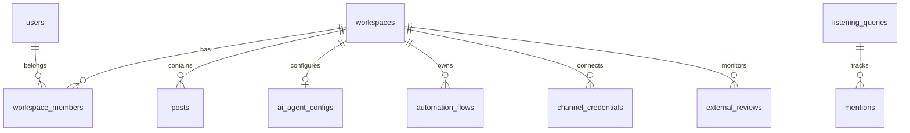

# Data Model: Nexus Social Platform

Schema for Track A hardening and Track B SMM features.

---

## 1. Core Tables (essential_bootstrap.sql)

### workspaces
| Column | Type | Notes |
|--------|------|-------|
| id | UUID PK | |
| name | TEXT | Display name |
| slug | TEXT UNIQUE | URL-safe identifier |
| branding | JSONB | logo_url, primary_color, accent_color |
| created_at | TIMESTAMPTZ | |

### users
| Column | Type | Notes |
|--------|------|-------|
| id | UUID PK | FK → auth.users |
| email | TEXT UNIQUE | |
| has_completed_onboarding | BOOLEAN | Tour completion |
| created_at | TIMESTAMPTZ | |

### workspace_members
| Column | Type | Notes |
|--------|------|-------|
| id | UUID PK | |
| user_id | UUID FK | → users |
| workspace_id | UUID FK | → workspaces |
| role | TEXT | owner \| admin \| member |
| UNIQUE | (user_id, workspace_id) | |

### posts
| Column | Type | Notes |
|--------|------|-------|
| id | UUID PK | |
| workspace_id | UUID FK | |
| status | TEXT | draft \| scheduled \| published \| failed |
| platforms | TEXT[] | |
| content | JSONB | `{ text: string }` |
| scheduled_at | TIMESTAMPTZ | nullable |

---

## 2. Schema Patch Tables (schema_patch.sql)

### ai_agent_configs
| Column | Type | Notes |
|--------|------|-------|
| workspace_id | UUID PK FK | |
| dify_app_id | TEXT | |
| dify_dataset_id | TEXT | |
| dify_app_api_key | TEXT | Per-tenant RAG auth |
| is_active | BOOLEAN | |
| is_globally_disabled | BOOLEAN | Kill switch |
| traffic_allocation_percentage | INT | Canary 0–100 |
| daily_token_limit | INT | |

**Auto-provision**: `ensureDefaultAiAgentConfig()` on workspace create and first AI settings load.

### automation_flows
| Column | Type | Notes |
|--------|------|-------|
| id | UUID PK | |
| workspace_id | UUID FK | |
| name | TEXT | |
| trigger_type | TEXT | comment \| dm \| mention |
| flow_json | JSONB | React Flow nodes/edges |
| is_active | BOOLEAN | |

### channel_credentials
| Column | Type | Notes |
|--------|------|-------|
| id | UUID PK | |
| workspace_id | UUID FK | |
| channel_type | TEXT | whatsapp \| sms |
| chatwoot_inbox_id | INT UNIQUE | |
| phone_number | TEXT | |
| is_active | BOOLEAN | |

### listening_queries / mentions / external_reviews
Reputation module — see `reputation_schema.sql` and `schema_patch.sql`.

---

## 3. Auth Metadata (Supabase Auth — no migration)

| Field | Storage | Used by |
|-------|---------|---------|
| full_name | user.user_metadata | Dashboard welcome, profile settings |
| email | auth.users | Login, team list |

---

## 4. Client-Side Preferences (no migration)

| Key | Storage | Used by |
|-----|---------|---------|
| NEXT_LOCALE | Cookie | next-intl (en/es) |
| nexus-theme | localStorage | light/dark toggle |
| nexus_tour_step | localStorage | Onboarding tour progress |

---

## 5. Computed Notifications (Phase 1 — no table)

Derived at runtime from:

| Source table | Condition | Notification type |
|--------------|-----------|-------------------|
| posts | status = draft | Draft needs review |
| posts | status = scheduled, scheduled_at > now | Upcoming post |
| external_reviews | status = pending | New review |

**Phase 2D**: Add `user_notifications` table for persistence and mark-read.

---

## 6. Entity Relationships



---

## 7. RLS Summary

- **posts, workspace_members, ai_agent_configs**: member-scoped via `is_workspace_member()` or workspace_members join
- **Admin actions**: server-side role check (owner/admin) before mutation
- **Service role**: used in server actions for cross-table reads (notifications, dashboard aggregates)

---

## 8. Migration Order

```text
1. essential_bootstrap.sql     # Core tables + RLS
2. schema_patch.sql            # SMM feature tables + columns
3. reputation_schema.sql       # Optional full reputation (if not in patch)
4. sprint10_schema.sql         # If automation_flows missing from patch
5. apply-migrations.ps1 chain  # Full production deploy
```
