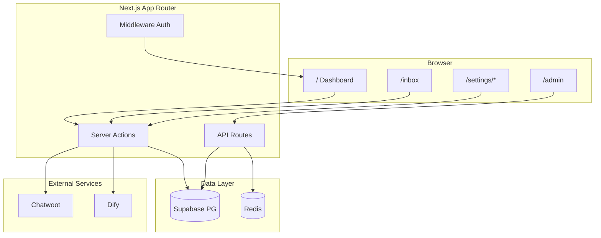

# Implementation Plan: Nexus Social Platform Completion

**Branch**: `001-production-readiness-hardening` | **Date**: 2026-06-21 | **Spec**: [spec.md](./spec.md)

**Scope**: Two coordinated tracks — **Track A** (production hardening, complete) and **Track B** (SMM product gaps, Option B — in progress).

---

## Summary

Nexus Social is an **AI-native SMM + omnichannel inbox** platform (Next.js 16, Supabase, Redis, Chatwoot, Dify). Track A hardened security, workers, and telemetry. Track B closes the gap between the **consumer-social user guide** and the **actual product**, delivering dashboard, settings, team admin, notifications, and demo-ready inbox without building Feed/Groups/RSVP (Option C rejected).

**Technical approach**: Extend existing App Router structure; server actions for mutations; `schema_patch.sql` for incremental Supabase tables; Chatwoot integration for live inbox; Vitest + Playwright + Cypress + k6 for verification.

---

## Technical Context

| Dimension | Value |
|-----------|--------|
| **Language/Version** | TypeScript 5, Node 20, Next.js 16.2.9 (Turbopack) |
| **Primary Dependencies** | `@supabase/supabase-js`, `@supabase/ssr`, `ioredis`, `react-query`, `zustand`, `next-intl`, Chatwoot REST, Dify API |
| **Storage** | Supabase PostgreSQL (RLS + service role admin), Redis queues, Supabase Storage |
| **Testing** | Vitest (unit), Playwright + Cypress (E2E), k6 (load/smoke) |
| **Target Platform** | Dockerized Linux; local dev on Windows via `localhost:3000` |
| **Performance Goals** | Webhook enqueue < 200ms p95; dashboard load < 2s; health API < 500ms |
| **Constraints** | Multi-tenant workspace isolation; fail-closed when Redis down; use `localhost` not `127.0.0.1` |
| **Scale/Scope** | Agency workspaces, 5–50 seats, 10k posts/workspace |

---

## Constitution Check

*GATE: Must pass before implementation. Re-checked after design.*

| Principle | Track A | Track B | Status |
|-----------|---------|---------|--------|
| **Multi-tenancy** | Workspace-scoped Dify keys, RLS | Team roles, workspace-scoped dashboard/notifications | ✅ Pass |
| **Cryptographic security** | HMAC refund tokens, API key hashing | Password change via Supabase Auth | ✅ Pass |
| **Operational observability** | OTEL, Sentry, `/api/health` | Admin console health tiles | ✅ Pass |
| **Test before ship** | quickstart.md scenarios | USER_GUIDE + E2E smoke | ✅ Pass |
| **Simplicity (YAGNI)** | No BullMQ | No consumer Feed/Groups (Option C rejected) | ✅ Pass |

---

## Architecture Overview



---

## Project Structure

### Documentation (this feature)

```text
specs/001-production-readiness-hardening/
├── spec.md                 # Production readiness user stories (Track A)
├── plan.md                 # This file
├── research.md             # Technical decisions (Track A + B)
├── data-model.md           # Schema patches & entities
├── quickstart.md           # Validation scenarios
├── contracts/              # Interface contracts
│   ├── api-routes.md
│   ├── server-actions.md
│   └── ui-routes.md
├── tasks.md                # Track A tasks (complete)
└── tasks-smm.md            # Track B remaining tasks
```

### Source Code (Track B — implemented)

```text
nexus-social-app/src/
├── app/
│   ├── page.tsx                    # Dashboard home
│   ├── admin/page.tsx              # Admin health console
│   ├── inbox/page.tsx
│   └── settings/
│       ├── layout.tsx              # Settings tab nav
│       ├── profile/page.tsx
│       ├── security/page.tsx
│       ├── preferences/page.tsx
│       └── team/page.tsx
├── actions/
│   ├── dashboard.ts
│   ├── user-settings.ts
│   ├── team-management.ts
│   └── notifications.ts
├── components/
│   ├── dashboard/
│   ├── settings/
│   ├── NotificationBell.tsx
│   └── inbox/InboxDemoBanner.tsx
└── sql/
    ├── essential_bootstrap.sql
    └── schema_patch.sql
```

**Structure Decision**: Single Next.js monolith under `nexus-social-app/`. No new microservices. Background workers remain in `src/bin/`.

---

## Track A: Production Readiness Hardening — COMPLETE

All tasks in [tasks.md](./tasks.md) are marked complete (T001–T024).

| User Story | Outcome |
|------------|---------|
| US1 Secure AI orchestration | Redis queue + worker + per-workspace Dify keys |
| US2 Secure approvals | HMAC magic links |
| US3 API gateway | SHA-256 key hash + Redis rate limits |
| US4 Feedback logs | Fixed webhook schema queries |
| US5 AI evaluation | Cron + LLM-as-judge job |

**Verification**: [quickstart.md](./quickstart.md) sections 1–4.

---

## Track B: SMM Product Completion (Option B) — IN PROGRESS

### B1. Dashboard & navigation — DONE

| Deliverable | Route | Status |
|-------------|-------|--------|
| Welcome + KPIs + quick actions | `/` | ✅ |
| Sidebar Dashboard link | `/` | ✅ |
| Onboarding tour step 0 | `#dashboard-welcome` | ✅ |

### B2. Settings hub — DONE

| Tab | Route | Status |
|-----|-------|--------|
| Integrations | `/settings` | ✅ |
| Profile | `/settings/profile` | ✅ |
| Security | `/settings/security` | ✅ |
| Preferences (locale + theme) | `/settings/preferences` | ✅ |
| Team | `/settings/team` | ✅ |

### B3. Admin & notifications — DONE

| Deliverable | Route | Status |
|-------------|-------|--------|
| Health console | `/admin` | ✅ |
| Notification bell | Navbar | ✅ |
| USER_GUIDE.md | docs | ✅ |

### B4. Inbox demo mode — DONE

| Deliverable | Status |
|-------------|--------|
| Demo conversations when Chatwoot down | ✅ |
| Message thread normalization | ✅ |
| Demo send + toast | ✅ |
| Demo banner | ✅ |

### B5. Database schema patch — USER ACTION REQUIRED

Run once in Supabase SQL Editor:

1. `nexus-social-app/src/sql/essential_bootstrap.sql`
2. `nexus-social-app/src/sql/schema_patch.sql`

Creates: `ai_agent_configs`, `automation_flows`, `external_reviews`, `listening_queries`, `channel_credentials`, etc.

### B6. Remaining work — see [tasks-smm.md](./tasks-smm.md)

| Priority | Item |
|----------|------|
| P1 | Live Chatwoot inbox (env + inbox mapping seed) |
| P1 | Global search (posts, conversations, settings) |
| P2 | Email invite flow (Supabase invite + auto membership) |
| P2 | Persistent notifications table + mark-read |
| P2 | Password reset / forgot password UI |
| P3 | Reports builder (real data vs mock widgets) |
| P3 | SSO OAuth config form (beyond docs page) |

---

## Phase Plan (Execution Order)

### Phase 0 — Research ✅

See [research.md](./research.md). All NEEDS CLARIFICATION resolved.

### Phase 1 — Design & Contracts ✅

- [data-model.md](./data-model.md)
- [contracts/](./contracts/)
- [quickstart.md](./quickstart.md)

### Phase 2 — Implementation

| Phase | Track | Duration est. | Status |
|-------|-------|---------------|--------|
| 2A | Production hardening | 2 weeks | ✅ Complete |
| 2B | SMM core (dashboard, settings, admin) | 1 week | ✅ Complete |
| 2C | Schema + seed + inbox live | 3 days | 🔄 In progress |
| 2D | Search, invites, persistent notifications | 1 week | ⏳ Planned |
| 2E | Test hardening + CI gate | 3 days | ⏳ Planned |

### Phase 3 — Validation

```powershell
cd nexus-social-app
npm run seed:walkthrough
npm run test
npx playwright test e2e/smoke.spec.ts
npm run load-test
npx cypress run --spec "cypress/e2e/critical_path.cy.ts"
```

---

## Complexity Tracking

No constitution violations. Option C (consumer social network) was explicitly rejected to avoid scope explosion (~6 months additional work for Feed, Profile, Groups, Events, Notifications social graph).

---

## Completion Report

| Artifact | Path |
|----------|------|
| Implementation plan | `specs/001-production-readiness-hardening/plan.md` |
| Research | `specs/001-production-readiness-hardening/research.md` |
| Data model | `specs/001-production-readiness-hardening/data-model.md` |
| Contracts | `specs/001-production-readiness-hardening/contracts/` |
| Quickstart | `specs/001-production-readiness-hardening/quickstart.md` |
| SMM tasks | `specs/001-production-readiness-hardening/tasks-smm.md` |
| User guide | `nexus-social-app/USER_GUIDE.md` |

**Next command**: `/speckit.implement` to execute remaining tasks (T035–T064) in [tasks.md](./tasks.md).

**Optional hook**: `/speckit.agent-context.update` — refresh agent context after plan changes.
