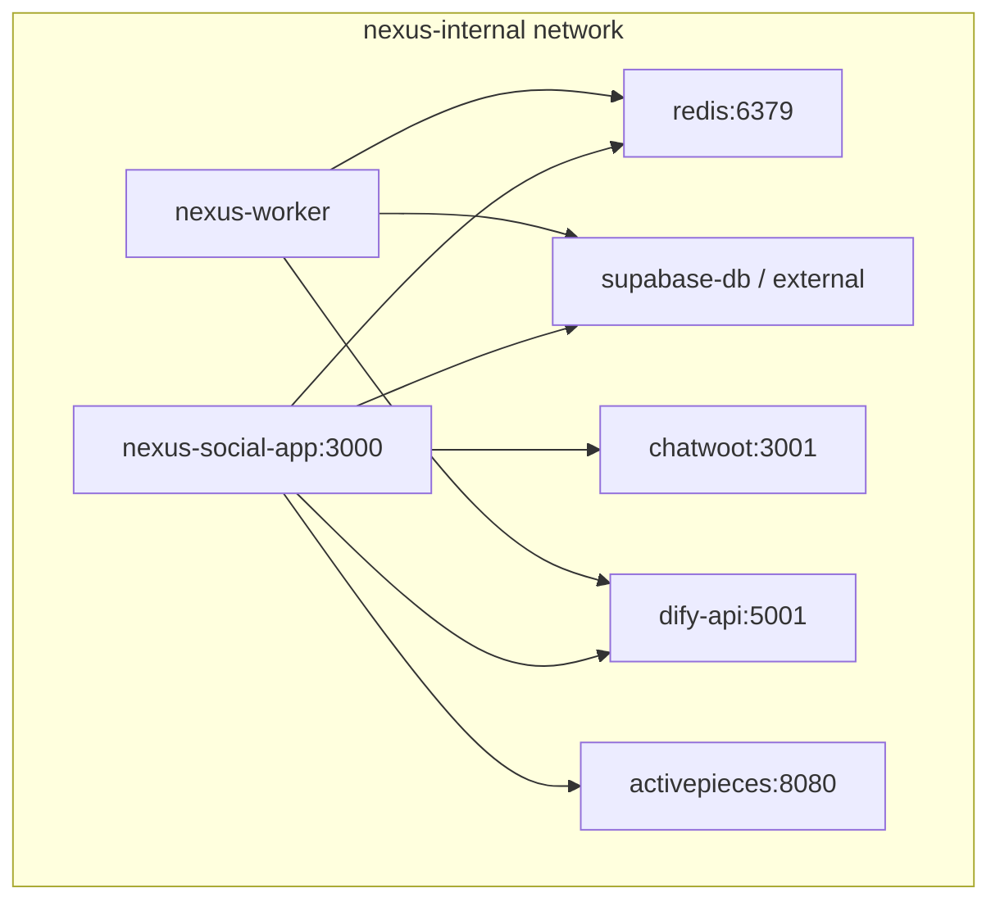

# Implementation Plan: Real Integrations & Production Readiness


**Branch**: `003-real-integrations-production` | **Date**: 2026-06-23 | **Spec**: [spec.md](./spec.md)


**Input**: Feature specification from [specs/003-real-integrations-production/spec.md](./spec.md)


**Context**: Nexus Social is ~70% demo-ready ("Potemkin Village") — polished UI, disconnected backend. This plan closes the gap to production SMM SaaS by implementing four expert epics plus reputation, AI, and incremental UX, **prioritizing Epic 1 + 3 before any new UI**.


> Merged from `specs/003-production-saas/plan.md` (2026-06-23 consolidation).

> **Implementation status (2026-06-24):** Phases 0–3 complete. Phase 4 complete — **65/65 tasks**. Automated gates: `npm run phase4:uat` (133 tests, T053 sandbox, T057 staging gate, publish E2E). Optional production: live OAuth `npm run uat:t053`, Meta App Review for production IG/FB.

---


## Summary


Transform `nexus-social-app` from a demo shell into a **production-capable SMM orchestrator** by:


1. **Epic 1** — Real publishing via `PublisherAdapter` pattern, OAuth token storage, Redis worker cron

2. **Epic 3** — Supabase CLI migration pipeline, CI dry-run, PostgREST reload (parallel with Epic 1)

3. **Epic 2** — `post_analytics` ingestion from Meta Graph Insights v21

4. **Epic 4** — `docker-compose.full-stack.yml` unifying Chatwoot, Dify, Activepieces

5. **Phase 3** — Reputation listening, AI market analysis (Dify + worker), UX parity pass


**Technical approach**: Extend existing Next.js 16 + Redis BRPOP worker architecture (no BullMQ migration); consolidate schema into `supabase/migrations/`; extract `scripts/publish-facebook-post.ts` logic into production publishers; remove `DEMO_ANALYTICS` in production.


---


## Technical Context


| Dimension | Choice | Rationale |

|-----------|--------|-----------|

| **App framework** | Next.js 16 (App Router, Turbopack) | Already in `nexus-social-app`; server actions for mutations; API routes for OAuth callbacks |

| **Database** | Supabase PostgreSQL + RLS | Multi-tenant workspace model exists; service role for workers |

| **Auth / OAuth** | Supabase Auth + custom OAuth callbacks | Session for users; encrypted tokens in `workspace_social_connections` |

| **Queue / workers** | Redis + `ioredis` BRPOP (existing `src/bin/worker.ts`) | AI orchestration already uses this pattern; add publish + analytics cron loops — **reject BullMQ** for now (001/002 research: FIFO sufficient) |

| **Publishing APIs** | Meta Graph API **v21.0**, LinkedIn Marketing API, X API v2 | `publish-facebook-post.ts` proves Meta path; v21 is current stable Graph version |

| **AI** | Dify published apps + worker orchestration + OpenRouter fallback | Per-tenant `ai_agent_configs`; extend tool proxies for analytics/market data |

| **Inbox** | Chatwoot (Docker) | Already integrated; unchanged in this epic |

| **Automation** | Activepieces (Docker) | Webhook trigger from social events post-publish |

| **Migrations** | Supabase CLI (`supabase db push`, ordered `supabase/migrations/`) | Replaces scattered root SQL files causing PGRST205 |

| **CI/CD** | GitHub Actions: migration dry-run, Dify verify, Vitest/Playwright gates | Epic 3 deliverable |

| **Container orchestration** | Docker Compose `nexus-internal` network | Epic 4; extends `docker-compose.prod.yml` pattern |

| **Testing** | Vitest (unit), Playwright (E2E publish path), integration scripts | Per-phase strategy below |

| **Target platform** | Docker Linux (staging); Vercel + standalone worker (production option) | Workers MUST NOT run in serverless |

| **Performance goals** | Publish worker processes due posts within 60s of `scheduled_at`; analytics sync completes 500 posts/workspace in < 10 min | SMM table stakes |

| **Constraints** | No new UI/mobile until Epic 1+3 done; Meta App Review = business blocker for prod Instagram | Expert strategic guidance |

| **Scale/scope** | Agency workspaces, 3 platforms Phase 1 (Meta/LinkedIn/X), 6h analytics cadence | Phased platform expansion |


---


## Constitution Check


*GATE: Must pass before Phase 1 implementation. Re-check after Epic 1+3.*


| Principle (from 002/001) | Epic 1–4 Requirement | Status |

|--------------------------|----------------------|--------|

| **Multi-Tenancy First** | `workspace_social_connections`, `post_analytics` scoped by `workspace_id` + RLS | **PLANNED** |

| **Security by Default** | OAuth tokens encrypted; publish worker uses service role only | **PLANNED** |

| **Fail-Closed Operations** | Publish failures → `failed` + `publish_error`; analytics errors surface in UI | **PLANNED** |

| **Observability** | OTEL spans on publish/sync jobs; Sentry on Graph API errors | **PLANNED** |

| **Test-Gated Launch** | E2E publish path + migration dry-run in CI | **PLANNED** |


**Gate decision:** Proceed — Epic 3 runs **in parallel** with Epic 1 because schema tables are prerequisites for connections and analytics.


---


## Gap Assessment (Current → Target)


| Area | Current state | Target state |

|------|---------------|--------------|

| Social connections | JSON in `workspaces.branding.social_accounts` (cosmetic) | `workspace_social_connections` with encrypted OAuth tokens |

| Publishing | Manual `npm run facebook:publish` script; no scheduler | Worker cron → `PublisherAdapter` → platform APIs |

| Post status | `published` set locally without external ID | `external_post_id`, `publish_error`, permalink |

| Analytics | `DEMO_ANALYTICS` fallback in dev; RPC may 404 | `post_analytics` + Graph Insights; no prod fallback |

| Schema | 21+ scattered SQL files; 1 migration in `supabase/migrations/` | Ordered CLI migrations; CI dry-run |

| Docker | `docker-compose.prod.yml` (app+redis+worker only) | Full-stack compose with Chatwoot/Dify/Activepieces |

| Reputation | UI reads `listening_queries`/`external_reviews` — tables may 404 | Migrations + ingestion worker |

| Dify | Unpublished app breaks AI | CI `verify-dify.ts` gate |


---


## Architecture


### Publishing Pipeline (Epic 1)


```mermaid

flowchart TB

  subgraph ui [Next.js App]

    Settings["Settings / OAuth Connect"]

    Calendar["Calendar / Create Post"]

    OAuthCB["/api/oauth/{platform}/callback"]

  end


  subgraph db [(Supabase PG)]

    Posts["posts"]

    Conn["workspace_social_connections"]

  end


  subgraph worker [Redis Worker]

    Cron["publish-due-posts loop<br/>every 60s"]

    Adapter["PublisherAdapter"]

    Meta["MetaPublisher"]

    LI["LinkedInPublisher"]

    X["XPublisher"]

  end


  subgraph ext [Platform APIs]

    Graph["Meta Graph v21"]

    LinkedInAPI["LinkedIn API"]

    XAPI["X API v2"]

  end


  Settings --> OAuthCB

  OAuthCB --> Conn

  Calendar --> Posts

  Cron --> Posts

  Cron --> Conn

  Cron --> Adapter

  Adapter --> Meta

  Adapter --> LI

  Adapter --> X

  Meta --> Graph

  LI --> LinkedInAPI

  X --> XAPI

  Meta --> Posts

  LI --> Posts

  X --> Posts

```


### Analytics Sync (Epic 2)


```mermaid

flowchart LR

  subgraph worker [Worker Cron]

    Sync["sync-analytics<br/>every 6h"]

  end


  subgraph db [(Supabase)]

    Posts["posts<br/>external_post_id"]

    PA["post_analytics"]

  end


  subgraph api [Platform APIs]

    Insights["Graph Insights v21"]

  end


  subgraph ui [Dashboard]

    Analytics["/analytics"]

  end


  Sync --> Posts

  Sync --> Insights

  Sync --> PA

  PA --> Analytics

```


### Full-Stack Compose (Epic 4)





---


## Data Model Changes


See [data-model.md](./data-model.md) for full DDL. Summary:


### New tables


| Table | Purpose |

|-------|---------|

| `workspace_social_connections` | Encrypted OAuth tokens, platform account IDs, expiry, scopes |

| `post_analytics` | Per-post metrics synced from platform APIs |

| `post_publish_attempts` | Optional audit trail of publish retries (recommended) |


### Alterations to `posts`


| Column | Type | Notes |

|--------|------|-------|

| `publish_error` | TEXT nullable | Human-readable failure from platform API |

| `external_post_id` | TEXT nullable | Platform-native post ID |

| `external_permalink` | TEXT nullable | Link to live post |

| `published_at` | TIMESTAMPTZ nullable | Actual publish timestamp |


### Reputation (Phase 3)


| Table | Status |

|-------|--------|

| `listening_queries` | Migrate from scattered SQL — workspace-scoped keywords/handles |

| `mentions` | FK to `listening_queries` |

| `external_reviews` | Competitor/review site entries |


### Token encryption


```typescript

// lib/crypto/token-vault.ts — AES-256-GCM

encryptToken(plaintext, TOKEN_ENCRYPTION_KEY) → { ciphertext, iv, tag }

decryptToken(payload, TOKEN_ENCRYPTION_KEY) → plaintext

```


**RLS**: All new tables use `workspace_members` join pattern from 002 data model.


---


## API & Worker Job Design


### Epic 1 — Publishing


| Component | Path | Responsibility |

|-----------|------|----------------|

| OAuth start | `GET /api/oauth/meta/start` | Redirect to Meta OAuth with workspace state |

| OAuth callback | `GET /api/oauth/meta/callback` | Exchange code, encrypt token, upsert connection |

| LinkedIn/X | `/api/oauth/linkedin/*`, `/api/oauth/x/*` | Same pattern |

| `PublisherAdapter` | `src/lib/publishers/adapter.ts` | `publish(post, connection): PublishResult` |

| `MetaPublisher` | `src/lib/publishers/meta.ts` | Extract from `scripts/publish-facebook-post.ts` |

| `LinkedInPublisher` | `src/lib/publishers/linkedin.ts` | UGC Posts API |

| `XPublisher` | `src/lib/publishers/x.ts` | POST /2/tweets |

| Worker job | `src/jobs/publish-due-posts.ts` | Query due posts, fan-out per platform, update status |

| Worker registration | `src/bin/worker.ts` | Add 60s interval loop alongside AI BRPOP |


**Job pseudocode**:


```typescript

// Every 60s in worker

const due = await supabaseAdmin.from('posts')

  .select('*, workspace_social_connections(*)')

  .eq('status', 'scheduled')

  .lte('scheduled_at', new Date().toISOString())

  .limit(50);


for (const post of due) {

  for (const platform of post.platforms) {

    const adapter = getPublisher(platform);

    const result = await adapter.publish(post, connection);

    // update external_post_id or publish_error

  }

}

```


### Epic 2 — Analytics


| Component | Path | Responsibility |

|-----------|------|----------------|

| Sync job | `src/jobs/sync-analytics.ts` | Query `posts` with `external_post_id`, fetch insights |

| Meta insights | `src/lib/analytics/meta-insights.ts` | `/{post-id}/insights?metric=...` |

| Cron | `src/bin/worker.ts` | 6h interval (`SYNC_ANALYTICS_INTERVAL_MS`) |

| Server action | `src/actions/getAnalytics.ts` | Join `post_analytics`; **remove prod demo fallback** |


### Epic 3 — DevOps


| Component | Path | Responsibility |

|-----------|------|----------------|

| Migrations | `supabase/migrations/20260623_*.sql` | Ordered, idempotent where possible |

| Consolidation | Script or manual ordering | Merge `essential_bootstrap.sql`, `schema_patch.sql`, root `*_schema.sql` |

| CI workflow | `.github/workflows/supabase-migrations.yml` | `supabase db push --dry-run` |

| Post-migrate | `supabase/migrations/*_notify_pgrst.sql` | `NOTIFY pgrst, 'reload schema';` |

| Config | `supabase/config.toml` | Linked to project |


### Epic 4 — Docker


| File | Services |

|------|----------|

| `docker-compose.full-stack.yml` (repo root) | web, worker, redis, chatwoot, dify (api+web+worker), activepieces, optional local supabase |

| Network | `nexus-internal` (bridge) |

| Env | `.env.full-stack.example` with internal hostnames |


### Phase 3 — Reputation & AI


| Component | Responsibility |

|-----------|----------------|

| `src/jobs/sync-listening.ts` | Poll Meta/Brand24/custom scraper for `listening_queries` |

| `src/jobs/sync-reviews.ts` | Google Places / Trustpilot API → `external_reviews` |

| Dify tools | Extend `contracts/ai-tool-proxies.md` — `get_workspace_analytics`, `get_competitor_mentions` |

| OpenRouter fallback | `src/lib/ai/openrouter.ts` when Dify unavailable |


---


## Phased Implementation Plan


### Phase 1 — Epic 1 + Epic 3 (Weeks 1–4) — **START HERE**


**Goal**: Real publishing to Meta (Facebook Page first) + trustworthy schema.


| Week | Epic 1 | Epic 3 |

|------|--------|--------|

| 1 | Migration: `workspace_social_connections`, `posts` columns | Consolidate bootstrap SQL → `20260623_000001_baseline.sql` |

| 2 | `token-vault.ts`, Meta OAuth routes | Migration: reputation tables; NOTIFY pgrst |

| 3 | `MetaPublisher` + `publish-due-posts` worker | GitHub Actions dry-run workflow |

| 4 | E2E: schedule → publish → verify on Page | Document `supabase db reset` in quickstart |


**Exit criteria (SC-001, SC-003)**: Facebook post publishes automatically; no PGRST205 on reputation routes.


**User stories satisfied**: US1 (partial Meta), US4, US5


---


### Phase 2 — Epic 2 + Epic 4 (Weeks 5–7)


**Goal**: Real analytics + one-command full stack.


| Week | Epic 2 | Epic 4 |

|------|--------|--------|

| 5 | `post_analytics` migration; `sync-analytics` job | Draft `docker-compose.full-stack.yml` |

| 6 | Meta Insights integration; remove prod demo fallback | Wire Chatwoot + Dify health checks |

| 7 | Analytics dashboard wired to real data | Activepieces + README full-stack guide |


**Exit criteria (SC-004, SC-006)**: Dashboard shows synced metrics; compose up succeeds.


**User stories satisfied**: US6, US7, US8


**Platform expansion**: LinkedIn + X publishers (Epic 1 remainder)


---


### Phase 3 — Reputation + AI + UX (Weeks 8–10)


**Goal**: Differentiators and table-stakes polish — **only after Phase 1–2**.


| Workstream | Deliverables |

|------------|--------------|

| Reputation | `sync-listening`, `sync-reviews` jobs; competitor config UI (existing pages) |

| AI | Dify tool proxies for analytics/market; CI verify gate; RAG ingest of `post_analytics` |

| UX | Calendar drag-drop polish, composer preview, analytics charts — **no new routes** |


**User stories satisfied**: US9, US10, US11


---


## Testing Strategy


### Phase 1


| Layer | Tests |

|-------|-------|

| Unit | `MetaPublisher` mock Graph responses; `token-vault` round-trip |

| Integration | OAuth callback with test tokens (Meta sandbox Page) |

| E2E | Playwright: connect account → create scheduled post → assert `published` within 2 min |

| Schema | `supabase db reset` in CI; smoke query all app-referenced tables |


### Phase 2


| Layer | Tests |

|-------|-------|

| Unit | `meta-insights.ts` response parsing |

| Integration | Sync job writes `post_analytics` for test post |

| E2E | Analytics page shows non-demo counts after publish |

| Compose | Script: `docker compose -f docker-compose.full-stack.yml config` + health wait |


### Phase 3


| Layer | Tests |

|-------|-------|

| Unit | Listening query matcher; Dify tool proxy handlers |

| E2E | Reputation page loads mentions; AI chat cites analytics tool output |

| Visual | Manual UX checklist vs Buffer/Hootsuite table stakes |


---


## Deployment & Migration Strategy (Epic 3)


### Migration ordering


```text

supabase/migrations/

├── 20260623_000001_baseline.sql          # workspaces, posts, members (from essential_bootstrap)

├── 20260623_000002_ai_billing.sql        # ai_agent_configs, credit ledger

├── 20260623_000003_reputation.sql        # listening_queries, mentions, external_reviews

├── 20260623_000004_social_connections.sql # workspace_social_connections

├── 20260623_000005_post_analytics.sql    # post_analytics + posts columns

└── 20260623_000006_notify_pgrst.sql      # NOTIFY pgrst, 'reload schema'

```


### Production deploy sequence


1. **Pre-deploy**: `supabase db push --dry-run` in CI (must pass)

2. **Deploy**: `supabase db push` against production project

3. **Post-deploy**: PostgREST reload (automatic via NOTIFY or manual `pgrst reload`)

4. **App deploy**: Web + worker with new env vars (`TOKEN_ENCRYPTION_KEY`, Meta app credentials)

5. **Verify**: `scripts/verify-dify.ts`; `/api/health`; smoke publish in staging


### Rollback


- Migrations are forward-only; rollbacks require compensating migration

- Feature flags: `PUBLISHING_ENABLED=false` disables worker publish loop without redeploy


### Environment variables (new)


```text

TOKEN_ENCRYPTION_KEY=          # 32-byte hex for AES-256-GCM

META_APP_ID=

META_APP_SECRET=

META_OAUTH_REDIRECT_URI=

LINKEDIN_CLIENT_ID=

LINKEDIN_CLIENT_SECRET=

X_CLIENT_ID=

X_CLIENT_SECRET=

PUBLISHING_ENABLED=true

SYNC_ANALYTICS_INTERVAL_MS=21600000

```


---


## Risks & Mitigations


| ID | Risk | Impact | Mitigation |

|----|------|--------|------------|

| R1 | Meta App Review delayed | No prod Instagram/Facebook for customers | Sandbox tokens for dev/staging; document timeline; LinkedIn/X as interim |

| R2 | Token expiry mid-publish | Silent failures | Store `expires_at`; refresh flow; surface `publish_error` + reconnect UX |

| R3 | Graph API rate limits | Analytics sync incomplete | Batch with backoff; prioritize last 30 days; store `sync_error` on row |

| R4 | Migration consolidation breaks existing DBs | Production outage | Idempotent `IF NOT EXISTS`; dry-run CI; staging apply first |

| R5 | Worker not deployed | Posts never publish | Epic 4 compose includes worker; health check verifies publish loop heartbeat |

| R6 | Scope creep (new UI) | Delays Epic 1 | Enforce expert constraint in PR review; UX stories deferred to Phase 3 |

| R7 | Scattered SQL reintroduced | PGRST205 returns | Lint/check: no new root-level `*_schema.sql`; migrations only |

| R8 | Dify unpublished | AI agent broken | CI gate; deploy blocker |


---


## Project Structure


### Documentation (this feature)


```text

specs/003-real-integrations-production/

├── spec.md              # Requirements & user stories (11 US, FR-001–FR-040)

├── plan.md              # This file

├── research.md          # Technology decisions

├── data-model.md        # Schema DDL reference

├── quickstart.md        # Phase 1 E2E validation

├── checklists/

│   └── requirements.md  # Spec quality checklist

└── tasks.md             # Implementation tasks (/speckit.tasks)

```


### Source code (new/modified paths)


```text

nexus-social-app/

├── src/

│   ├── lib/

│   │   ├── publishers/

│   │   │   ├── adapter.ts

│   │   │   ├── meta.ts

│   │   │   ├── linkedin.ts

│   │   │   └── x.ts

│   │   ├── analytics/

│   │   │   └── meta-insights.ts

│   │   └── crypto/

│   │       └── token-vault.ts

│   ├── jobs/

│   │   ├── publish-due-posts.ts

│   │   ├── sync-analytics.ts

│   │   ├── sync-listening.ts      # Phase 3

│   │   └── sync-reviews.ts        # Phase 3

│   ├── app/api/oauth/

│   │   ├── meta/start/route.ts

│   │   ├── meta/callback/route.ts

│   │   ├── linkedin/...

│   │   └── x/...

│   └── bin/worker.ts              # Add publish + analytics loops

├── supabase/

│   ├── config.toml

│   └── migrations/                # Ordered migrations (Epic 3)

└── scripts/

    └── publish-facebook-post.ts   # Deprecated → MetaPublisher


docker-compose.full-stack.yml      # Repo root (Epic 4)

.github/workflows/

└── supabase-migrations.yml        # Epic 3 CI

```


**Structure decision**: All publishing logic lives in `nexus-social-app` — no new microservice. Reuse existing worker process.


---


## Dependencies Between Phases


```text

Epic 3 (schema) ──parallel──► Epic 1 (publishing)

        │                              │

        └──────────┬───────────────────┘

                   ▼

            Epic 2 (analytics) ──requires──► external_post_id from Epic 1

                   │

                   ▼

            Epic 4 (docker) ──optional parallel with Epic 2

                   │

                   ▼

            Phase 3 (reputation + AI + UX)

```


**Prerequisite**: Complete remaining `001-production-readiness-hardening` security items (webhook sigs, auth gates) before production OAuth goes live.


---


## Complexity Tracking


| Violation | Why Needed | Simpler Alternative Rejected Because |

|-----------|------------|-------------------------------------|

| Encrypted token column vs Supabase Vault | Full control; works on self-hosted Supabase | Vault secrets API not always available on CE |

| Separate publish loop vs inline cron | Reuses proven worker pattern; survives serverless web deploy | Vercel cron cannot hold long Graph API calls reliably |

| Consolidated 003 spec (merged folders) | 002 = full vision; 003 = production gap closure | Duplicate 003 folders caused spec drift during implement |


---


## Post-Design Constitution Re-Check


After Phase 1:


| Principle | Expected state |

|-----------|----------------|

| Multi-Tenancy | Connections and analytics scoped by workspace_id + RLS |

| Security | Tokens encrypted; OAuth state parameter prevents CSRF |

| Fail-Closed | publish_error visible; no silent demo analytics in prod |

| Observability | Spans on publish/sync; Graph errors in Sentry |

| Test-Gated | E2E publish + migration CI green |


---


## Open topics (Phase 4 + deferred)

| ID | Topic | Owner | Next step |
|----|-------|-------|-----------|
| T024 | Playwright publish E2E | Engineering | Deferred until Meta sandbox OAuth stable; use T053 manual UAT |
| T053 | Live OAuth → publish UAT | Operator | `npm run dev` + `worker:dev`; connect LinkedIn/X; schedule 2 min ahead |
| T054 | CI schema gate on main | CI | Merge PR; confirm `supabase-migrations.yml` dry-run green |
| T055 | Analytics ingestion smoke | Operator | After publish, verify `/analytics` shows ingested or empty — never demo |
| T056 | Full-stack walkthrough | Operator | `docker compose -f docker-compose.full-stack.yml up -d` + `npm run walkthrough` |
| T057 | Meta App Review | Business | Set `meta_app_review_status = 'approved'` after Meta approval |

---

## Next Command

Complete **Phase 4 manual UAT** (T053–T057) when OAuth sandbox credentials and Dify publish are ready. Track in [tasks.md](./tasks.md).


