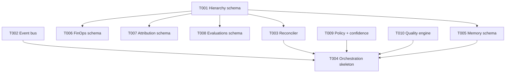

# Gap Analysis & Risk Register: AI CMO PRD v3.0

**Date:** 2026-06-23  
**Baseline:** Feature 003 launch-ready (56/62 tasks, typecheck + 51 tests green)

## Gap Analysis: PRD Modules A–W vs Codebase

| Module | PRD Requirement | Current State (pre-Sprint 12) | Post-Sprint 12 |
|--------|-----------------|-------------------------------|----------------|
| A Orchestration | Inngest workflows | None | Skeleton + README stub |
| B Memory | learnings, outcomes, strategy_history | None | SQL + RLS |
| C Policy | Risk-based governance | None | policy-engine.ts |
| D Quality | EEAT/uniqueness gates | None | content-quality-engine.ts |
| E FinOps | cost_ledger | ai_credit_ledger only (credits) | ai_cmo_cost_ledger + MV |
| F Attribution | Multi-touch events | post_analytics (network metrics) | ai_cmo_attribution_events + MV |
| G Optimizer | Closed-loop agent | None | Deferred Sprint 13 |
| H Revenue agent | CRM pipeline | None | Deferred Sprint 16 |
| I Compliance MENA | Regional rules | Partial in policy rules | Policy rules only |
| J Knowledge Hub | 11 source types | Dify datasets partial | Deferred Sprint 13 |
| K Hierarchy | Tenant→Brand→Campaign | workspaces only | tenants, brands, campaigns |
| L Evaluations | LLM-as-judge schema | None | ai_cmo_evaluations |
| M BCP | Circuit breakers | None | Deferred Sprint 17 |
| N AI Ops Dashboard | Agent metrics UI | analytics pages (003) | Schema only |
| O Attribution models | First/last/multi-touch | None | Events table; models Sprint 13 |
| P SoR/SoI | Reconciler | Direct Supabase writes | reconciler.ts |
| Q Event Bus | Real-time triggers | Redis cache only | marketing-event-bus.ts |
| R Horizons | Strategic/tactical/ops | None | Deferred Sprint 14 |
| S Calibrated confidence | Weighted formula | None | calibrated-confidence.ts |
| T Channel Risk | Competitor agent | reputation/listening (003) | Event types only |
| U Explainability | Persona outputs | None | Deferred Sprint 15 |
| V Portfolio S&OP | Executive layer | None | Deferred Sprint 16 |
| W Decision Ledger | decision→outcome→lesson | audit_logs partial | learnings table maps here |

## Conflicts with Feature 003

| Area | 003 Owns | 004 Adds | Mitigation |
|------|----------|----------|------------|
| Publishing | posts, workers, OAuth | Campaign metadata only | post_id FK; no publisher changes |
| Analytics | post_analytics, insights sync | Attribution events (marketing funnel) | Separate tables; no RPC changes |
| Schema CI | verify-schema REQUIRED_TABLES | New migrations 000011+ | Do not add to REQUIRED until deployed |
| Workers | publish-due-posts, sync-analytics | Event consumers (future) | Separate worker entrypoints Sprint 13 |
| AI | OpenRouter captions, Dify verify | Policy/quality gates | Opt-in before publish Sprint 13 |

**Rule:** 004 = AI CMO OS backbone; 003 = launch integrations. No regression on 003 test suite.

## Risk Register

| ID | Risk | Severity | Mitigation |
|----|------|----------|------------|
| R1 | Inngest not installed blocks full orchestration | Medium | Interface stub + README; workflow as pure functions |
| R2 | Hierarchy migration orphans data | High | Default tenant + brand backfill in migration |
| R3 | Reconciler adds latency to hot paths | Medium | <100ms target; not wired to publish worker yet |
| R4 | Materialized views stale | Low | Refresh job deferred; document REFRESH in Sprint 13 |
| R5 | Redis unavailable breaks event bus | Medium | Graceful no-op + in-memory test transport |
| R6 | ai_cmo_* table proliferation | Low | Map campaigns to posts; single migration file |
| R7 | Cross-tenant RLS leak via brands | High | RLS via workspace_members join; unit tests |
| R8 | Schema verify fails on new tables | Low | New tables optional in verify-schema until prod apply |

## Sprint 12 Dependency Graph

**Critical path:** T001 → T003 → T004 (orchestration consumes hierarchy + reconciler + policy/quality).

## Test Coverage Plan

| Module | Test file |
|--------|-----------|
| Event bus | `src/lib/events/__tests__/marketing-event-bus.test.ts` |
| Reconciler | `src/lib/sync/__tests__/reconciler.test.ts` |
| Policy engine | `src/lib/governance/__tests__/policy-engine.test.ts` |
| Calibrated confidence | `src/lib/evaluation/__tests__/calibrated-confidence.test.ts` |
| Content quality | `src/lib/quality/__tests__/content-quality-engine.test.ts` |
